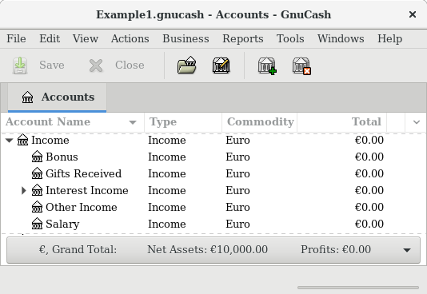
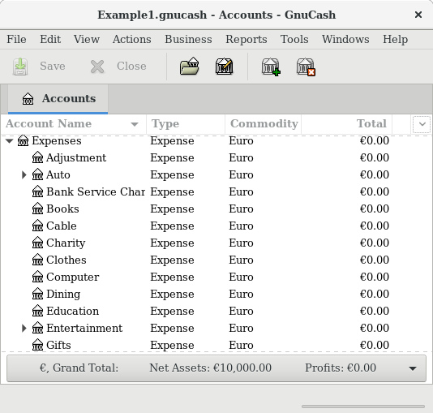
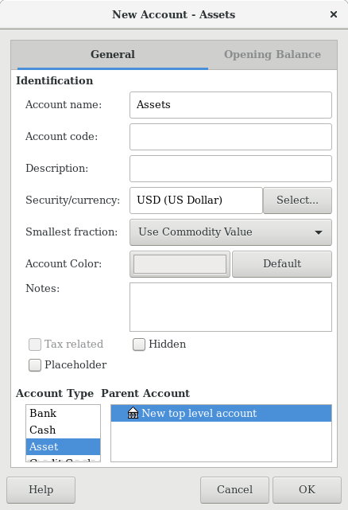
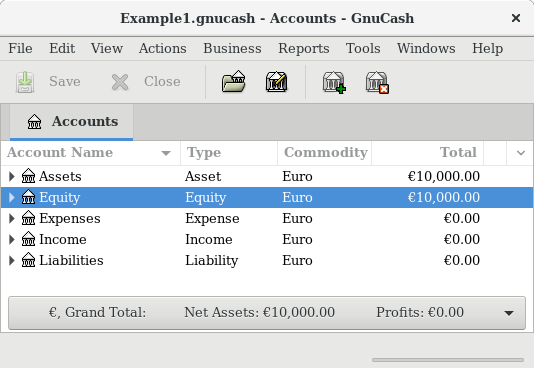
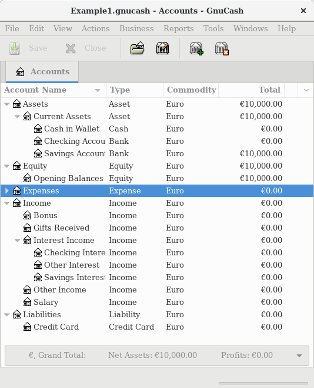

.. _chapter_accts:

Accounts
========

This section discusses some useful concepts for organizing your
accounts. Since GnuCash does not impose any specific account tree
layout, you are free to design your account structure in any manner you
wish. However, there are a few basic accounting concepts which you will
probably want to follow when designing your accounts to maximize their
utility.

.. _accts-concepts1:

Basic Accounting Concepts
-------------------------

As we saw in the previous chapter, accounting is based on 5 basic
account types: Assets, Liabilities, Equity, Income and Expenses. We will
now expand on our understanding of these account types, and show how
they are represented in GnuCash. But first, let’s divide them into 2
groups, the balance sheet accounts and the income and expense accounts.
As the name says the balance sheet accounts can be summarized in the
balance of what you own and owe *at a point in the time*, while the
income and expense accounts can be summarized in the Profit & Loss
report, which shows the *change of values in a period of time* like the
economic year

Let’s have a quick look at the Accounting Equation (*Assets -
Liabilities = Equity + (Income - Expenses)*) again as a reminder, before
we go deeper into each account type.

|The basic accounts relationships|

.. _accts-bsa2:

Balance Sheet Accounts
~~~~~~~~~~~~~~~~~~~~~~

The three so-called *Balance Sheet Accounts* are Assets, Liabilities,
and Equity. Balance Sheet Accounts are used to track the things you own
or owe.

Assets is the group of things that you own. Your assets could include a
car, cash, a house, stocks, or anything else that has convertible value.
Convertible value means that theoretically you could sell the item for
cash.

Liabilities is the group of things on which you owe money. Your
liabilities could include a car loan, a student loan, a mortgage, your
investment margin account, or anything else which you must pay back at
some time.

Equity is the same as "net worth." It represents what is left over after
you subtract your liabilities from your assets. It can be thought of as
the portion of your assets that you own outright, without any debt.

.. _accts-ie2:

Income and Expense Accounts
~~~~~~~~~~~~~~~~~~~~~~~~~~~

The two Income and Expense Accounts are used to increase or decrease the
value of your accounts. Thus, while the balance sheet accounts simply
*track* the value of the things you own or owe, income and expense
accounts allow you to *change* the value of these accounts.

Income is the payment you receive for your time, services you provide,
or the use of your money. When you receive a paycheck, for example, that
check is a payment for labor you provided to an employer. Other examples
of income include commissions, tips, dividend income from stocks, and
interest income from bank accounts. Income will always increase the
value of your Assets and thus your Equity.

Expense refers to money you spend to purchase goods or services provided
by someone else *for early consumption*. Examples of expenses are a meal
at a restaurant, rent, groceries, gas for your car, or tickets to see a
play. Expenses will always decrease your Equity. If you pay for the
expense immediately, you will decrease your Assets, whereas if you pay
for the expense on credit you increase your Liabilities.

.. _accts-types1:

GnuCash Accounts
----------------

This section will show how the GnuCash definition of an account fits
into the view of the 5 basic accounting types.

But first, let’s begin with a definition of an account in GnuCash. A
GnuCash account is an entity which contains other sub-accounts, or that
contains transactions. Since an account can contain other accounts, you
often see account trees in GnuCash, in which logically associated
accounts are grouped together within a common parent account.

A GnuCash account must have a unique name (that you assign) and one of
the predefined GnuCash “account types”. There are a total of 12 account
types in GnuCash. These 12 account types are based on the 5 basic
accounting types; the reason there are more GnuCash account types than
basic accounting types is that this allows GnuCash to perform
specialized tracking and handling of certain accounts. There are 6 asset
accounts (*Cash*, *Bank*, *Stock*, *Mutual Fund*, *Accounts Receivable*,
and *Other Assets*), 3 liability accounts (*Credit Card*, *Accounts
Payable*, and *Liability*), 1 equity account (*Equity*), 1 income
account (*Income*), and 1 expense account (*Expenses*).

These GnuCash account types are presented in more detail below.

.. _accts-gc-bsa2:

Balance Sheet Accounts
~~~~~~~~~~~~~~~~~~~~~~

The first balance sheet account we will examine is *Assets*, which, as
you remember from the previous section, refers to things you own.

To help you organize your asset accounts and to simplify transaction
entry, GnuCash supports several types of asset accounts:

1. Cash Use this account to track the money you have on hand, in your
   wallet, in your piggy bank, under your mattress, or wherever you
   choose to keep it handy. This is the most *liquid*, or easily traded,
   type of asset.

2. Bank This account is used to track your cash balance that you keep in
   institutions such as banks, credit unions, savings and loan, or
   brokerage firms - wherever someone else safeguards your money. This
   is the second most *liquid* type of account, because you can easily
   convert it to cash on hand.

3. Stock Track your individual stocks and bonds using this type of
   account. The stock account’s register provides extra columns for
   entering number of shares and price of your investment. With these
   types of assets, you may not be able to easily convert them to cash
   unless you can find a buyer, and you are not guaranteed to get the
   same amount of cash you paid for them.

4. Mutual Fund This is similar to the stock account, except that it is
   used to track funds. Its account register provides the same extra
   columns for entering share and price information. Funds represent
   ownership shares of a variety of investments, and like stocks they do
   not offer any guaranteed cash value.

   GnuCash treats account types Stock and Mutual Fund the same.

5. Accounts Receivable (A/Receivable) This is typically a business use
   only account in which you place outstanding debts owed to you. It is
   considered an asset because you should be able to count on these
   funds arriving.

   Transactions involving an Accounts Receivable account should not be
   added, changed or deleted in any way other than by using

   -  post/unpost bill/invoice/voucher or

   -  process payment

6. Asset No matter how diverse they are, GnuCash handles many other
   situations easily. The account type “Asset”, covers all assets not
   listed above.

   GnuCash treats account types Cash, Bank and Asset the same.

   Accounts are repositories of information used to track or record the
   kinds of actions that occur related to the purpose for which the
   account is established.

   For businesses, activities being tracked and reported are frequently
   subdivided more finely than what has been considered thus far. For a
   more developed treatment of the possibilities, please read the
   descriptions presented in :ref:`chapter_other_assets` of this
   Guide.

   For personal finances a person can follow the business groupings or
   not, as they seem useful to the activities the person is tracking and
   to the kind of reporting that person needs to have to manage their
   financial assets. For additional information, consult
   :ref:`chapter_other_assets` of this Guide.

The second balance sheet account is *Liabilities*, which as you recall,
refers to what you owe, money you have borrowed and are obligated to pay
back some day. These represent the rights of your lenders to obtain
repayment from you. Tracking the liability balances lets you know how
much debt you have at a given point in time.

GnuCash offers three liability account types:

1. Credit Card Use this to track your credit card receipts and reconcile
   your credit card statements. Credit cards represent a short-term loan
   that you are obligated to repay to the credit card company. This type
   of account can also be used for other short-term loans such as a line
   of credit from your bank.

2. Accounts Payable (A/Payable) This is typically a business use only
   account in which you place bills you have yet to pay.

   Transactions involving an Accounts Payable account should not be
   added, changed or deleted in any way other than by using

   -  post/unpost bill/invoice/voucher or

   -  process payment

3. Liability Use this type of account for all other loans, generally
   larger long-term loans such as a mortgage or vehicle loan. This
   account can help you keep track of how much you owe and how much you
   have already repaid.

   GnuCash treats account types Credit Card and Liability the same.

.. tip::

   Liabilities in accounting act in an opposite manner from assets:
   *credits* (right-column value entries) increase liability account
   balances and *debits* (left-column value entries) decrease them. (See
   note later in this chapter)

The final balance sheet account is *Equity*, which is synonymous with
“net worth”. It represents what is left over after you subtract your
liabilities from your assets, so it is the portion of your assets that
you own outright, without any debt. In GnuCash, use this type of account
as the source of your opening bank balances, because these balances
represent your beginning net worth.

There is usually only a single GnuCash equity account, called naturally
enough, Equity. For companies, cooperatives etc. you can create a
subaccount for each partner.

.. tip::

   In equity accounts, credits increase account balances and debits
   decrease them. (See note later in this chapter)

.. note::

   The accounting equation that links balance-sheet accounts is Assets =
   Liabilities + Equity or rearranged Assets - Liabilities = Equity. So,
   in common terms, the *things you own* minus the *things you owe*
   equals your *net worth*.

.. _accts-gc-ie2:

Income and Expense Accounts
~~~~~~~~~~~~~~~~~~~~~~~~~~~

*Income* is the payment you receive for your time, services you provide,
or the use of your money. In GnuCash, use an Income type account to
track these.

.. tip::

   Credits increase income account balances and debits decrease them. As
   described in :ref:`basics-accounting1`, credits represent money
   transferred *from* an account. So in these special income accounts,
   when you transfer money *from* (credit) the income account to another
   account, the balance of the income account *increases*. For example,
   when you deposit a paycheck and record the transaction as a transfer
   from an income account to a bank account, the balances of both
   accounts increase.

*Expenses* refer to money you spend to purchase goods or services
provided by someone else. In GnuCash, use an Expense type account to
track your expenses.

.. tip::

   Debits increase expense account balances and credits decrease them.
   (See note later in this chapter.)

.. note::

   When you subtract total expenses from total income for a time period,
   you get net income. This net income is then added to the balance
   sheet as retained earnings, which is a type of Equity account.

Below are the standard Income and Expense accounts after selecting
Common Accounts in the assistant for creating a new Account Hierarchy
(Actions > New Account Hierarchy...).

|Default income accounts|

|Some default expense accounts|

.. _accts-other-types:

Other Account Types
~~~~~~~~~~~~~~~~~~~

There are some special other account types.

*Trading* Multiple currency transactions have splits in “Trading”
accounts to make the transaction balance in each currency as well as in
total value. See :ref:`chapter_currency` for more information.

*Money Market* and *Credit Line* are used only in the OFX importer,
apparently for completeness with the specification.

.. _accts-examples1:

Putting It All Together
-----------------------

Let’s go through the process of building a common personal finance
*chart of accounts* using the information we have learned from this
chapter. A chart of accounts is simply a new GnuCash file in which you
group your accounts to track your finances. In building this chart of
accounts, the first task is to divide the items you want to track into
the basic account types of accounting. This is fairly simple, let’s go
through an example.

.. _accts-examples-situation2:

Simple Example
~~~~~~~~~~~~~~

Let us assume you have a checking and a savings account at a bank, and
are employed and thus receive a paycheck. You have a credit card (Visa),
and you pay monthly utilities in the form of rent, phone, and
electricity. Naturally, you also need to buy groceries. For now, we will
not worry about how much money you have in the bank, how much you owe on
the credit card, etc. We want to simply build the framework for this
chart of accounts.

Your assets would be the bank savings and checking account. Your
liabilities are the credit card. Your Equity would be the starting
values of your bank accounts and credit card (we do not have those
amounts yet, but we know they exist). You have income in the form of a
salary, and expenses in the form of groceries, rent, electricity, phone,
and taxes (Federal, Social Security, Medicare) on your salary.

.. _accts-examples-toplevel2:

The Basic Top Level Accounts
~~~~~~~~~~~~~~~~~~~~~~~~~~~~

Now, you must decide how you want to group these accounts. Most likely,
you want your *Assets* grouped together, your *Liabilities* grouped
together, your *Equity* grouped together, your *Income* grouped
together, and your *Expenses* grouped together. This is the most common
way of building a GnuCash chart of accounts, and it is highly
recommended that you always begin this way.

Start with a clean GnuCash file by selecting File > New File from the
menu. The New Account Hierarchy Setup assistant will start. Press Cancel
to close the assistant as we don’t want to use one of the predefined
accounts structure; instead we will build a basic starting account
structure from scratch. In the empty GnuCash window select View > New
Accounts Page from the menu: the Accounts tab will open. Finally select
Actions > New Account....

Now you are ready to build this basic starting account structure

1. Account name Assets (account type Asset, parent account New top level
   account)

   |Creating an Assets account|

2. Account name Liabilities (account type Liability, parent account New
   top level account)

3. Account name Equity (account type Equity, parent account New top
   level account)

4. Account name Income (account type Income, parent account New top
   level account)

5. Account name Expenses (account type Expenses, parent account New top
   level account)

When you have created the top-level accounts, the main Account page in
GnuCash should look like below.

|The Basic Top-level Accounts|

.. _accts-examples-organization2:

Making Sub-Accounts
~~~~~~~~~~~~~~~~~~~

You can now add to this basic top-level tree structure by inserting some
real transaction-holding sub-accounts. Notice that the tax accounts are
placed within a sub-account named *Taxes*. You can make sub-accounts
within sub-accounts. This is typically done with a group of related
accounts (such as tax accounts in this example).

.. tip::

   Instead of selecting Actions > New Account... from the menu, you can
   alternatively create a new sub-account of an account by right
   clicking on the main account’s name and selecting the New Account...
   entry. This will open a dialog similar to the one depicted in `The
   Basic Top Level Accounts <#accts-examples-toplevel2>`__ where the new
   sub-account will be already set as a child of the main account.

1.  Account name Cash (account type Cash, parent account *Assets*)

2.  Account name Checking (account type Bank, parent account *Assets*)

3.  Account name Savings (account type Bank, parent account *Assets*)

4.  Account name Visa (account type Credit Card, parent account
    *Liabilities*)

5.  Account name Salary (account type Income, parent account *Income*)

6.  Account name Phone (account type Expense, parent account *Expenses*)

7.  Account name Electricity (account type Expense, parent account
    *Expenses*)

8.  Account name Rent (account type Expense, parent account *Expenses*)

9.  Account name Groceries (account type Expense, parent account
    *Expenses*)

10. Account name Taxes (account type Expense, parent account *Expenses*)

11. Account name Federal (account type Expense, parent account
    *Expenses:Taxes*)

12. Account name Social Security (account type Expense, parent account
    *Expenses:Taxes*)

13. Account name Medicare (account type Expense, parent account
    *Expenses:Taxes*)

14. Account name Opening Balance (account type Equity, parent account
    *Equity*)

After you have created these additional sub-accounts, the end result
should look like below

|The Basic Chart of Accounts|

Save this chart of accounts with the name ``gcashdata_3``, as well as
``gcashdata_3emptyAccts``, as we will continue to use them in the later
chapters.

You have now created a chart of accounts to track a simple household
budget. With this basic framework in place, we can now begin to populate
the accounts with transactions. The next chapter will cover this subject
in greater detail.

.. |The basic accounts relationships| image:: figures/basics_AccountRelationships.png

