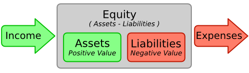
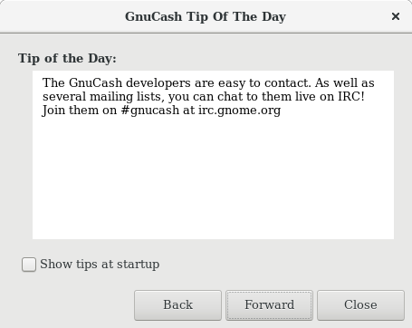
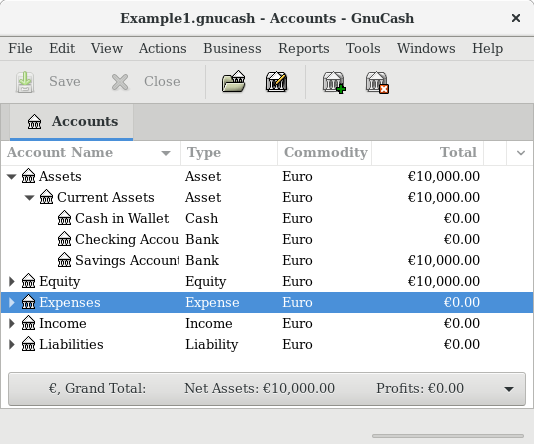
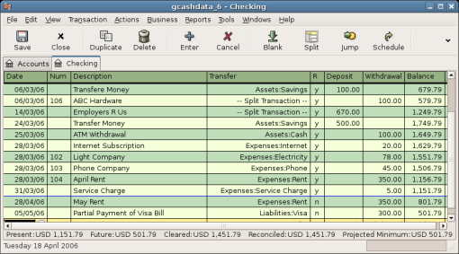

.. _chapter_basics:

The Basics
==========

This chapter will introduce some of the basics of using GnuCash. It is
recommended that you read through this chapter, before starting to do
any real work with GnuCash. Next chapters will begin to show you hands
on examples.

.. _basics-accounting1:

Accounting Concepts
-------------------

GnuCash is easy enough to use that you do not need to have a complete
understanding of accounting principles to find it useful. However, you
will find that some basic accounting knowledge will prove to be
invaluable as GnuCash was designed using these principles as a template.
It is highly recommended that you understand this section of the guide
before proceeding.

.. _basics-accounting52:

The 5 Basic Accounts
~~~~~~~~~~~~~~~~~~~~

Basic accounting rules group all finance related things into 5
fundamental types of “accounts”. That is, everything that accounting
deals with can be placed into one of these 5 accounts:

*Assets*
   Things you own

*Liabilities*
   Things you owe

*Equity*
   Overall net worth

*Income*
   Increases the value of your accounts

*Expenses*
   Decreases the value of your accounts

It is clear that it is possible to categorize your financial world into
these 5 groups. For example, the cash in your bank account is an asset,
your mortgage is a liability, your paycheck is income, and the cost of
dinner last night is an expense.

.. _basics-accountingequation2:

The Accounting Equation
~~~~~~~~~~~~~~~~~~~~~~~

With the 5 basic accounts defined, what is the relationship between
them? How does one type of account affect the others? Firstly, equity is
defined by assets and liability. That is, your net worth is calculated
by subtracting your liabilities from your assets:

.. math:: Assets - Liabilities = Equity

Furthermore, you can increase your equity through income, and decrease
equity through expenses. This makes sense of course, when you receive a
paycheck you become “richer” and when you pay for dinner you become
“poorer”. This is expressed mathematically in what is known as the
Accounting Equation:

.. math:: Assets - Liabilities = Equity + (Income - Expenses)

This equation must always be balanced, a condition that can only be
satisfied if you enter values to multiple accounts. For example: if you
receive money in the form of income you must see an equal increase in
your assets. As another example, you could have an increase in assets if
you have a parallel increase in liabilities.

   The basic accounts relationships

.. _basics-debits-credits:

Debits and Credits
~~~~~~~~~~~~~~~~~~

The use of debits and credits in accounting and their effect on accounts
of different types is often confusing when first encountered in
acccounting. The accounting equation introduced above is the key to
understanding which accounts types are debited or credited and when.
First of all we need to rearrange the expanded form a little bit with
Assets on the left hand side of the equal sign and transposing any
account type with a negative sign to the other side to obtain:

.. math::  Assets + Expenses = Liabilities + Equity + Income

With the accounting equation in this form, the accounts on the left hand
side of the equal sign are known as *debit balance accounts* in
accounting practice, that is the normal positive balance for these
accounts is increased by *debit* entries to accounts of these types.
Conversely credit entries to accounts of these types will decrease the
balance of accounts of these types.

Similarly, the account types on the right hand side of the equal sign
are known as *credit balance accounts*, that is the normal positive
balance for these account types is increased by *credit* entries to the
accounts of these types. Again debit entries to accounts of these types
will reduce the balance in the account.

.. table:: Summary of effect of debits (Dr) and credits (Cr) on the
balance of accounts of the 5 account types

   ============ ========================= ========
   Account Type Effect on Account Balance 
   ============ ========================= ========
   Assets       Increase                  Decrease
   Expenses                               
   Liabilities  Decrease                  Increase
   Equity                                 
   Income                                 
   ============ ========================= ========

.. _basics-accountingdouble2:

Double Entry
~~~~~~~~~~~~

The accounting equation is the very heart of a double entry accounting
system. For every change in value of one account in the Accounting
Equation, there must be a balancing change in another. This concept is
known as the Principle of Balance, and is of fundamental importance for
understanding GnuCash and other double entry accounting systems. When
you work with GnuCash, you will always be concerned with at least 2
accounts, to keep the accounting equation balanced.

Balancing changes (or transfers of money) among accounts are done by
debiting one account and simultaneously crediting another. Accounting
debits and credits do not mean “decrease” and “increase”. Debits and
credits each increase certain types of accounts and decrease others as
described in the previous section. In asset and expense accounts, debits
increase the balance and credits decrease the balance. In liability,
equity and income accounts, credits increase the balance and debits
decrease the balance.

In traditional double-entry accounting, the left column in the register
is used for debits, while the right column is used for credits.
Accountants record increases in asset and expense accounts on the debit
(left) side, and they record increases in liability, revenue, and equity
accounts on the credit (right) side. GnuCash follows this convention in
the register.

.. note::

   This accounting terminology can be confusing to new users, which is
   why GnuCash allows you to use the common terms Deposit and
   Withdrawal. If you prefer the formal accounting terms, you can change
   the account register column headings to use them in the Accounts tab
   under Preferences (see the GnuCash Help Manual for more information
   on setting preferences).

.. warning::

   Common use of the words *debit* and *credit* does not match how
   accountants use these words. In common use, *credit* generally has
   positive associations; in accounting, *credit* means *affecting the
   right column* of the ledger sheet of an account. This is associated
   with a *decrease* in asset and expense, but an *increase* of income,
   liability and equity accounts.

   For more details see
   ` <https://en.wikipedia.org/wiki/Debits_and_credits>`__.

.. _basics-entry1:

Data Entry Concepts
-------------------

When entering data in GnuCash, you should be aware of the 3 levels of
organization in which GnuCash divides your data: files, accounts and
transactions. These levels are presented in their order of complexity,
one file contains many accounts and one account contains many
transactions. This division is fundamental to understanding how to use
GnuCash.

.. _basics-files2:

Files
~~~~~

GnuCash stores information at the highest level in files. A file can be
stored on your computer either as a single XML file (in all versions of
GnuCash), or in a SQL database (in GnuCash version 2.4 and higher).

.. note::

   SQL is pronounced “sequel”, so in spoken and written language we
   would say “a SQL database”.

With the XML file format, GnuCash stores your data in an XML data file,
usually in compressed format (although this can be changed in the
General tab of the GnuCash Preferences).

With SQL storage, GnuCash stores your data in a SQL database under the
database application you select (SQLite3, MySQL or PostgreSQL).

You will need one main file or database for each set of accounts you are
maintaining. To learn how to create and manage GnuCash files, see
`Storing your financial data <#basics-files1>`__.

.. note::

   If you think you might need more than one set of accounts, you might
   want to consult a professional accountant or bookkeeper before
   proceeding. Most users will probably have only one data file.

Backup files and log files are automatically generated by GnuCash when
appropriate. Backup and log files are described in `Backing Up and
Recovering Data <#basics-backup1>`__.

.. _basics-accounts2:

Accounts
~~~~~~~~

An account keeps track of what you own, owe, spend or receive. Each
GnuCash file can contain any number of accounts, and each account can
contain many sub-accounts up to an arbitrary number of levels. This
simple feature gives GnuCash much of its power in managing your
finances, as you will see in later chapters.

Examples of accounts include: checking accounts, savings accounts,
credit card accounts, mortgages, and loans. Each GnuCash account tracks
the activity for that “real” account, and can inform you of its status.

In addition, accounts are also used to categorize the money you receive
or spend. For example, you can create expense accounts to track the
money you pay on utilities or groceries. Even though these are not
accounts that receive statements, they allow you to determine how much
money is being spent in each of these areas.

Accounts will be covered in more detail in `??? <#chapter_accts>`__.

.. _basics-transactions2:

Transactions
~~~~~~~~~~~~

A transaction represents the movement of money among accounts. Whenever
you spend or receive money, or transfer money between accounts, that is
a transaction.

Examples of transactions are: paying a phone bill, transferring money
from savings to checking, buying a pizza, withdrawing money, and
depositing a paycheck. `??? <#chapter_txns>`__ goes more in depth on how
to enter transactions.

In `double entry accounting <#basics-accountingdouble2>`__, transactions
always involve at least two accounts–a source account and a destination
account. GnuCash manages this by inserting a line into the transaction
for every account that is affected, and recording the amounts involved
in each line. A line within a transaction that records the account and
amount of money involved is called a split. A transaction can contain an
arbitrary number of splits.

.. note::

   Splits in transactions will be covered in
   `??? <#txns-registers-multiaccount2>`__

.. _basics-running-gnucash:

Running GnuCash
---------------

GnuCash can be run from your desktop main menu by selecting the
associated menu entry.

Alternatively it can be run from a command line prompt with the command
``gnucash``.

During start up, GnuCash will display the Splash Screen, where some
information about the program (version number, build, etc.) and the
loading process are displayed.

.. _basics-welcome-to-gnucash:

Welcome to GnuCash dialog
~~~~~~~~~~~~~~~~~~~~~~~~~

The very first time you open GnuCash, you will see the Welcome to
GnuCash! screen. This dialog includes three choices:

-  Create a new set of accounts - Runs the New Account Hierarchy Setup
   assistant (see `New Account Hierarchy
   Setup <#basics-acct-hierarchy>`__). Select this option if you want to
   be assisted in creating a set of accounts.

-  Import my QIF files - Runs the Import QIF Files assistant (see
   `??? <#importing-qif>`__). Select this option if you already have
   Quicken files (``.qif`` files) and wish to import them into GnuCash.

-  Open the new user tutorial - Opens the GnuCash Tutorial and Concepts
   Guide. Select this option if you are completely new to GnuCash and
   accounting concepts.

.. note::

   It is possible to access each of these items after you have left this
   screen, but the Welcome to GnuCash! screen will not reappear. To
   create a new set of accounts, see `New Account Hierarchy
   Setup <#basics-acct-hierarchy>`__. To import QIF files, see
   `??? <#importing-qif>`__.

.. _basics-acct-hierarchy:

New Account Hierarchy Setup
~~~~~~~~~~~~~~~~~~~~~~~~~~~

The *New Account Hierarchy Setup* assistant helps you to create a set of
GnuCash accounts. It will appear if you choose Create a new set of
accounts in the Welcome to GnuCash! menu, or when you select File > New.

This assistant will create a new blank GnuCash file and guide you
through the creation of a *Chart of Accounts*. There are several steps
in the assistant, which are outlined below.

1. The first screen briefly describes what this assistant does.

2. New Book Options allows you to set different attributes for your file
   that affect the file as a whole. This screen has four tabs: Accounts,
   Budgeting, Business, and Counters. These items are explained
   elsewhere in the Guide, and can be changed at a later point.

3. Choose Currency sets the default currency for new accounts. This is
   based on the computer locale settings, and can be modified later in
   the Accounts tab under Preferences (see
   `??? <#configuring-preferences-accounts>`__).

4. Choose accounts to create allows you to create an initial set of
   accounts. These can be edited as needed afterward. The screen is
   divided into three parts.

   -  The left upper portion has a list of Categories for commonly used
      hierarchies of accounts. Select from this list the types of
      accounts you wish to use. You can select as many of the categories
      of accounts as you wish.

   -  The left lower section has a Category Description that displays a
      detailed description of the category currently highlighted.

   -  The right side has a list of the Accounts that will be created
      from a selected category. Note that the accounts listed here are
      *only* the selected category; your final data file will include
      *all* of the accounts for all of the selected Categories.

5. Setup selected accounts lists all the accounts you selected on Choose
   accounts to create, and allows you to enter opening balances and to
   designate *Placeholder* accounts.

   .. note::

      Equity accounts do not have opening balances, so the opening
      balance value for this kind of account is locked and set to zero.

   .. note::
      :name: placeholder-acct

      *Placeholder* accounts are used to create a hierarchy of accounts
      and normally do not have transactions or opening balances.

   -  The left side of the screen has a list of Account Names. Select an
      account by "clicking" once in the Account Names column with the
      account highlighted. This will open the account name for changes.

   -  The right side of the screen has a check-box to make an account a
      Placeholder and a box to add the Opening Balance for the selected
      account. Again a single click in the Opening Balance or
      Placeholder column will open the field for changes.

6. Finish account setup is the last screen and gives you a final option
   to cancel the process.

   .. warning::

      If you choose to cancel, any selections you have made up to this
      point will be lost.

.. _basics-tip2:

Tip of the Day
~~~~~~~~~~~~~~

GnuCash provides a Tip of the Day screen to give helpful hints for using
the program:

|The Tip of the Day|

These tips provide useful information for beginning users. To view more
of the tips, click Forward to continue. If you do not wish to see this
screen box on start-up, deselect the box next to Show tips at startup.
When you have finished viewing the helpful tips, click Close to close
the Tip of the Day screen.

.. _basics-main2:

Account Tree Window
~~~~~~~~~~~~~~~~~~~

You should now see the Accounts window, which appears as shown below.
The exact layout of the account tree will depend on which default
accounts you selected during the New Account Hierarchy Setup. In this
example, the Common Accounts are shown.

|The Account Tree Window|

The Account Tree window (also known as a Chart of Accounts, or CoA)
provides an overview of the data contained in the current file. It
contains a list of account names and their current balances.

From this window, you can open the register of any account either by
double-clicking the account name, right clicking the account name and
selecting Open Account from the menu, or by using the Open button on the
toolbar. GnuCash allows you to have as many account registers open as
you wish. For more information on using account registers, see `Account
Register Window <#basics-register2>`__.

.. tip::

   Clicking the small triangle to the left of an account that has
   children will expand the tree view showing child accounts.

At the top of this window is the *Titlebar*, which displays the file
name for this set of accounts (once you have saved the file.) Below that
is the *Menubar*. You can access the menu options by either clicking on
these menu headings or by using shortcuts and access keys (see `Menu
Shortcuts <#basics-shortcut2>`__). Next is the *Toolbar*, which contains
buttons for the most common functions.

The account tree appears below the *Toolbar*. Once you have started
creating accounts, the account names will appear in the account tree.
You can customize which headings show up by using the small down-arrow
at the far right just above the account tree.

At the bottom is the *Statusbar*, which tells you information about what
you own (Net Assets) and how much money you have made (Profits).

.. _basics-register2:

Account Register Window
~~~~~~~~~~~~~~~~~~~~~~~

Account Register windows are used to enter and edit your account data.
As the name suggests, they look similar to a checkbook register.

|The Checking Account Register|

`??? <#chapter_txns>`__ explains more about account register windows and
how to enter data into them. For now, note that the parts of an account
register window are similar to the parts of the account tree window
described earlier. The *Titlebar* at the top contains the account name.
Below that, the *Menubar* contains menu options related to the account
register. *Toolbar* buttons simplify common data entry functions. The
*Statusbar* at the bottom of the window, displays some account balances
covered in `??? <#chapter_txns>`__. At the bottom of the account
register window, information appears about the current location of the
cursor.

.. note::

   In the register windows, you can resize the various columns that
   GnuCash displays, *but keep in mind that the Description and Balance
   columns behave differently from other columns*.

   The Description column is designed to expand automatically to fill
   all unused horizontal screen space. Therefore you should set the
   widths of all your other columns before setting the Description
   column width.

   The Balance column must be resized by double-clicking on the column
   heading.

.. _basics-toolbar2:

Toolbar Buttons
~~~~~~~~~~~~~~~

Both the account tree window and the account register window contain
*Toolbar* buttons. These buttons provide quick access to common
functions such as Save and Open in the account tree window and Record
and Delete in the account register window. If you are not sure what a
button does, move the mouse pointer over that button, and you should see
a description of the function appear.

Here is a summary of the account tree window buttons:

Save
   Save the current file to disk

Close
   Close the current notebook page

Open, Edit, New and Delete
   These are functions related to accounts. They are discussed in
   `??? <#chapter_accts>`__.

Register-specific buttons are discussed in `??? <#chapter_txns>`__.

.. _basics-tabbar:

Tab Bar
~~~~~~~

GnuCash uses a tabbed model that allows you to open multiple account
registers and reports simultaneously. Each open window (which can
include account registers, reports, or Scheduled Transactions windows)
is given a tab on this bar that you can click to view that window. Tabs
can be configured in Preferences to appear along any side of the GnuCash
window.

To see the full name for a tab, hover the mouse pointer over an account
window tab.

If more screens are open than can be displayed across the screen, some
tabs will not display. You can move through all tabs by clicking the
arrows on either end of the tab bar. A complete list of tabs can be
viewed by right-clicking the Tab Bar and any tab can be selected by
clicking it.

.. _basics-options2:

Menu Items
~~~~~~~~~~

The account tree window and the account register window both contain
menu headings in a *Menubar*. Clicking on a menu heading brings up the
menu items for that heading.

You can click on the account tree menu headings and then move the mouse
pointer over the menu items to see what they do. As the pointer moves
over a menu item, a description of the item appears in the lower
left-hand corner of the window (inside the *Statusbar*). To select a
menu item, click on it.

You can also access the most common menu items in a window by
right-clicking the mouse anywhere in that window. In the account tree
window, this will bring up a list of account items. In the account
register window, this will bring up a list of transaction items.

Other ways of accessing menu items are through keyboard shortcuts and
access keys, described next.

.. _basics-shortcut2:

Menu Shortcuts
~~~~~~~~~~~~~~

All of the menu items have access keys which are marked by underlined
characters in the menu names. Pressing the Alt key with the underlined
character in the menu heading will bring up the menu items for that
heading. Once the menu items are displayed, type the underlined
character in the menu item to activate it. For example, typing Alt+ +F
in the main window brings up the File menu, then typing S will save the
file. Access keys are fixed and cannot be changed by users.

Some of the more commonly used menu items also have shortcut keys that
directly activate the command without having to traverse the menu
structure. These shortcuts typically use the Ctrl key, although they can
use any key combination. Menu shortcuts are displayed at the end of each
menu item.

.. _basics-files1:

Storing your financial data
---------------------------

.. _basics-files1-overview:

Overview
~~~~~~~~

GnuCash offers several formats for storing your financial data. The
default file storage format is XML, while SQL storage is available in
SQLite, MySQL, and PostgreSQL formats. Users can choose a file format
for new files from File > Save and for existing files from File > Save
As... dialogs.

The XML storage format is a text file that by default is compressed,
which is a preference that is set at Edit > Preferences General Compress
files. SQLite storage is also available, and stores your data in a
single file on your system, like the XML format. However, internally, an
SQLite file is managed as a database. The MySQL and PostgreSQL storage
options require access to a MySQL or PostgreSQL database server and the
installation of additional database drivers on your machine.

.. tip::

   Users can change the format at any time by using File > Save As....
   This will create a copy of the data file in the selected format.

.. _basics-files-storage-comparison:

Storage Comparison and Recommendations
~~~~~~~~~~~~~~~~~~~~~~~~~~~~~~~~~~~~~~

Each storage format has benefits and shortcomings that users should
consider for their needs and abilities. See the
`#basics-storage-comparison-table <#basics-storage-comparison-table>`__
below for further details.

The XML format is the most stable and established, and for this reason,
it is recommended for most users. SQL storage was added for the 2.4
release and has become an increasingly popular choice for users. The
SQLite format allows users to realize the benefits of SQL storage
without the overhead of installing or managing a full DBMS. MySQL and
PostgreSQL require the installation of MySQL and PostgreSQL DBMS,
respectively, and are best maintained only by experienced database
administrators.

.. note::

   Use of a SQL back end for storage implies to many that GnuCash has
   fully implemented DBMS features, including multi-user and incremental
   data manipulation. However, GnuCash does not currently implement
   these features, although it is a long term goal of the development
   team.

.. _basics-storage-comparison-tblsect:

Storage Comparison Table
~~~~~~~~~~~~~~~~~~~~~~~~

.. table:: Storage Comparison

   +--------------+------------+--------------+------------+------------+
   |              | XML        | SQLite       | MySQL      | PostgreSQL |
   +==============+============+==============+============+============+
   | Availability | Built-in   | Depends on   |            |            |
   |              |            | pa           |            |            |
   |              |            | ckaging [5]_ |            |            |
   +--------------+------------+--------------+------------+------------+
   | File         | gnucash    | N/A [6]_     |            |            |
   | extension    |            |              |            |            |
   +--------------+------------+--------------+------------+------------+
   | Additional   | None       | MySQL        | PostgreSQL |            |
   | software     |            |              |            |            |
   +--------------+------------+--------------+------------+------------+
   | Additional   | None       | Database     |            |            |
   | expertise    |            | A            |            |            |
   |              |            | dministrator |            |            |
   +--------------+------------+--------------+------------+------------+
   | Compression  | gzip       | N/A          |            |            |
   +--------------+------------+--------------+------------+------------+
   | File Save    | On command | On commit    |            |            |
   +--------------+------------+--------------+------------+------------+
   | Multi-user   | No         | No           | No         | No         |
   +--------------+------------+--------------+------------+------------+

.. _basics-create-data:

Creating a file
~~~~~~~~~~~~~~~

To create a new GnuCash file do the following:

1. From the GnuCash *Menubar*, choose File > New File. The New Account
   Hierarchy setup assistant will start.

   .. note::

      If you are running GnuCash for the first time, you will be
      presented with the Welcome to GnuCash! screen. This screen is
      described in detail in the GnuCash manual.

2. Set your preferences in the assistant and move through the screens
   with the Forward, Cancel and Previous buttons.

.. _basics-store-data:

Saving data
~~~~~~~~~~~

Follow these steps to save the file under your preferred name:

1. Choose File > Save As... from the *Menubar* or select the Save
   *Toolbar* button. GnuCash will bring up the save window.

2. Select the Data Format of the file you are saving from the drop down
   list. The default selection is XML but if you have set up a database
   back end you can change to that format.

   Depending on the selected Data Format the window can change as
   described in the following.

3. 

   -  If you selected XML or sqlite3 you will see a screen like this:

      .. figure:: figures/basics_SaveXML.png
         :alt: Save screen when XML or sqlite3 is selected.
         :width: 510px

         Save screen when XML or sqlite3 is selected.

      Type your chosen filename in the Name field. It is not necessary
      to specify an extension when you write the file name. GnuCash will
      automatically add the extension ``.gnucash`` to the file.

      .. note::

         The ``.gnucash`` extension was introduced in the 2.3 series of
         GnuCash. For already existing files, the extension will never
         be changed. So if you open an existing file named
         ``Myoldfile``, that name won’t be changed if the file is saved.
         You might use the Save As... command and give the file a new
         name in order to have it saved with the extension ``.gnucash``.

      Select the path where the file will be saved by browsing the tree
      in the lower panes.

      .. tip::

         Click on the Create Folder button to create a new folder with a
         custom name in the selected path.

   -  If you selected mysql or postgres Data Format you will see a
      screen like this:

      .. figure:: figures/basics_SaveSQL.png
         :alt: Save screen when mysql or postgres is selected.
         :width: 510px

         Save screen when mysql or postgres is selected.

      Enter in this window the Database Connection information: Host,
      Database, Username and Password.

      .. warning::

         Saving to mysql or postgres requires the proper permissions in
         that database, that is you need to have the permissions to
         create a new database with the given database name, or you need
         to have write access to an existing database with the given
         database name.

4. Click the Save As button to save the file.

If you are keeping track of finances for a single household, you need
only one file. But if you are also tracking business finances or want to
keep data separate for some reason, then you will need more than one
file.

Before ending each GnuCash session, be sure to save your data changes
using File > Save or the Save *Toolbar* button.

.. note::

   As it is very important to save your data frequently to avoid losing
   them for whatever reason, GnuCash is able to automatically save the
   opened file every a certain amount of time. This interval can be set
   in the General tab under Edit > Preferences (GnuCash > Preferences on
   MacOS). Keep in mind that this option is relevant only if you are
   saving in XML format. If you are working with a database, the Save
   button and the Save menu entry will be grayed out because changes are
   stored right away.

.. _basics-open-data:

Opening data
~~~~~~~~~~~~

To open an existing file or database, select File > Open from the menu.
In the window that will open, select the Data Format. If you selected
File choose the file you want to open by browsing the folders in the
lower panes. Else, enter the required Database Connection information.

.. tip::

   GnuCash keeps a list of the recently opened files. Open the File menu
   and you will see listed the names of recently opened files. Click on
   the one you want to load to open it.

.. _basics-expt-acct:

Duplicating an Account Hierarchy
~~~~~~~~~~~~~~~~~~~~~~~~~~~~~~~~

In some cases, it might be useful to duplicate the structure of an
existing data file in a new file. For example, you might want to try out
new accounting techniques without corrupting your actual accounting
data, or you might need to follow accounting guidelines that require you
to close your books at the end of the year and begin each year with a
fresh set of books.

GnuCash allows you to create an empty copy of your Chart of Accounts
simply by selecting File > Export > Export Accounts. When you select
this command, you are asked to provide the name for the new empty file,
and GnuCash creates a new data file that contains only your account
hierarchy (that is, there is no transaction data). Once saved, the new
file can be opened like any other GnuCash data file as described above.

.. _basics-backup1:

Backing Up and Recovering Data
------------------------------

GnuCash creates several types of files to help ensure that your data is
not lost. If you look in the folder where your saved file resides, you
may see other files generated by GnuCash with the following extensions:
``.gnucash``, ``.log``, ``.LCK``, ``.LNK`` in the same directory as your
primary data file. What each of these files does is presented below.

.. note::

   The following sections are relevant only if you are saving your
   financial data in the XML format

::

         $ ls
         myfile.gnucash
         myfile.gnucash.20100414185747.gnucash
         myfile.gnucash.20100414223248.log
         myfile.gnucash.20100415114340.gnucash
         myfile.gnucash.20100415154508.log
         myfile.gnucash.20100415173322.gnucash
         myfile.gnucash.20100415194251.log
         myfile.gnucash.7f0982.12093.LNK
         myfile.gnucash.LCK
       

.. _basics-backupxac2:

Backup file (.gnucash)
~~~~~~~~~~~~~~~~~~~~~~

Each time you save your data file, a backup copy will also be saved with
the extension ``.YYYYMMDDHHMMSS.gnucash``. This backup file is a
complete copy of your previous data file, and the filename format refers
to the data file, year, month, day and time of the backup. For example,
the filename ``myfile.gnucash.20100414185747.gnucash`` indicates this is
a backup copy of the file ``myfile`` saved in the year 2010, April 14,
at 6:57:47 p.m.

To restore an old backup file, simply open the
``.YYYYMMDDHHMMSS.gnucash`` file with the date to which you wish to
return. Be sure to save this file under a different name.

.. note::

   ``.YYYYMMDDHHMMSS.xac`` instead of the actual extension
   ``.YYYYMMDDHHMMSS.gnucash``. So if you upgrade from the 2.2 series to
   the 2.4 series, you may end up with both ``.YYYYMMDDHHMMSS.xac`` and
   ``.YYYYMMDDHHMMSS.gnucash`` backup files in your directory.

.. _basics-backuplog2:

Log file (.log)
~~~~~~~~~~~~~~~

Each time you open and edit a file in GnuCash, GnuCash creates a log
file of changes you have made to your data file. The log file uses a
similar naming format as the backup files: ``.YYYYMMDDHHMMSS.log``. Log
files are not a full backup of your data file - they simply record
changes you have made to the data file in the current GnuCash session.

In case you exit GnuCash inadvertently, possibly due to a power outage
or a system wide crash, it is possible to recover most of your work
since the last time you saved your GnuCash file using this log file.
This is the procedure:

1. Open the last saved GnuCash file.

2. Go to File > Import > Replay GnuCash .log file and select the one
   .log file with the same date as the saved file you just opened. Make
   sure that you picked the right .log file, or you will possibly wreak
   havoc in your accounts.

Log replaying will recover any transaction affecting the balance entered
since the last save, including those created from scheduled transactions
and business features (invoices, bills, etc.).

.. warning::

   Changes to the scheduled transactions, invoices or bills themselves
   are NOT recovered, and their transactions that were recovered may not
   be properly associated with them, and should thus be double-checked.
   Especially for business transactions, you may have to delete and
   re-create some of them. If you do not, although the balance will be
   correct, some reports may not.

.. _basics-backuplock2:

Lock files (.LNK and .LCK)
~~~~~~~~~~~~~~~~~~~~~~~~~~

You may occasionally see ``.LNK`` and ``.LCK`` files appear. These do
not store any data, but they are created to prevent more than one user
from opening the same file at the same time. These files are
automatically created when you open the file, to lock it so no one else
can access it. When you close your GnuCash session or open another file,
GnuCash unlocks the first data file by deleting the ``.LCK`` and
``.LNK`` files.

If GnuCash crashes while you have a data file open, the ``.LCK`` and
``.LNK`` files are not deleted. The next time you try to open GnuCash,
you will get a warning message that the file is locked. The warning
message appears because the ``.LNK`` and ``.LCK`` files are still in
your directory. It is safe to choose Yes to open the file, but you
should delete the ``.LNK`` and ``.LCK`` files (using a terminal window
or your file manager). Once those files are deleted, you will not get
the warning message again unless GnuCash crashes.

.. _basics-backupmanage2:

File Management
~~~~~~~~~~~~~~~

So which files should you keep around? Keep your main data file, of
course. It’s a good idea to keep some of the more recent
``.YYYYMMDDHHMMSS.gnucash`` backup files, but you can safely delete the
``.log`` files since they are not complete copies of your data.

.. note::

   If you upgraded from a GnuCash version prior to 2.4, you may also
   have backup files in the old ``.xac`` format. For these files you can
   apply the same principle described above for
   ``.YYYYMMDDHHMMSS.gnucash`` backup files.

You should also delete any ``.LCK`` and ``.LNK`` files that you see
after closing GnuCash. If you decide to back up your data file to
another disk manually, it’s enough to back up the main data file - not
the ``.YYYYMMDDHHMMSS.gnucash`` backup files.

.. note::

   By default GnuCash will automatically delete any ``.log`` and
   ``.YYYYMMDDHHMMSS.gnucash`` backup files that are older than 30 days.
   You can change this behavior in the GnuCash preferences in the
   General tab under Edit > Preferences (GnuCash > Preferences on
   MacOS).

.. _basics-migrate-settings:

Migrating GnuCash data
----------------------

Sometimes you may need to move your financial data and GnuCash settings
to another machine. Typical use cases are when you buy a new computer or
if you want to use the same settings over two different operating
systems in a dual boot configuration.

.. _migrate-financial:

Migrating financial data
~~~~~~~~~~~~~~~~~~~~~~~~

Migrating GnuCash financial data is a as simple as copying ``.gnucash``
files with a file manager if you know where they are saved. If you can’t
remember where a file is stored but you can open it directly within
GnuCash, save it in the desired path from within GnuCash.

All other files in the folder are either backups or log files. It won’t
do any harm to copy them too, but it’s not likely to do any good,
either.

.. _migrate-prefs:

Migrating preferences data
~~~~~~~~~~~~~~~~~~~~~~~~~~

Preferences are stored in three different locations: one for GnuCash
preferences, one for reports, and one for online banking settings.
Preferences are managed by gsettings, reports are managed by GnuCash
itself, and online banking is managed by aqbanking. If you do not use
online banking, then you will not have this folder on your machine.

Where the GnuCash preferences are stored varies depending on your
operating system (see `table_title <#App-sett-loc>`__,
`table_title <#Report-loc>`__, and `table_title <#OB-sett-loc>`__). To
back up and transfer your entire installation, you must copy these
preferences as well.

.. table:: Application Settings Locations

   +------------------+--------------------------------------------------+
   | Operating system | folder                                           |
   +==================+==================================================+
   | Unix             | GnuCash preferences are stored in dconf. You can |
   |                  | use the commands ``dconf dump /org/gnucash/`` on |
   |                  | the old machine and ``dconf load /org/gnucash/`` |
   |                  | on the new machine to migrate your preferences.  |
   +------------------+--------------------------------------------------+
   | Mac OSX          | ``~/Library/Preferences/gnucash.plist``          |
   +------------------+--------------------------------------------------+
   | Windows          | The preferences are stored in the Windows        |
   |                  | registry                                         |
   |                  | ``HKEY_CURRENT_USER/software/GSettings``         |
   +------------------+--------------------------------------------------+

.. table:: Saved Reports Locations

   +------------------+--------------------------------------------------+
   | Operating system | folder                                           |
   +==================+==================================================+
   | Unix             | ``~/.local/share/gnucash/``  [9]_                |
   +------------------+--------------------------------------------------+
   | Mac OSX          | ``~/Library/Application Support/gnucash``        |
   +------------------+--------------------------------------------------+
   | Windows          | ``Documents and Settings/Username/.gnucash`` or  |
   |                  | ``Users/Username/.gnucash``                      |
   +------------------+--------------------------------------------------+

.. table:: Online Banking Settings Locations

   ================ ==============================================
   Operating system folder
   ================ ==============================================
   Unix             ``~/.aqbanking``
   Mac OSX          ``~/.aqbanking``
   Windows          ``Documents and Settings/Username/.aqbanking``
   ================ ==============================================

.. note::

   On Unix and Mac OSX, these folders will generally not display in the
   file manager. You must set the file manager to show hidden files and
   folders to see them.

.. tip::

   On Unix and Mac OSX, the ~ symbol means the ``home`` folder.

.. _basics-together1:

Putting It All Together
-----------------------

.. note::

   This section begins a tutorial that will continue throughout this
   book. At the end of each chapter, you will see a Putting It All
   Together section that walks you through examples to illustrate
   concepts discussed in that section. Each Putting It All Together
   section builds on the previous one, so be sure to save your file for
   easy access.

Let’s get started!

1. First, let’s create a file to store your real data. Open GnuCash and
   select File > New File from the *Menubar*. This will start the New
   Account Hierarchy Setup assistant that allows you to create several
   accounts at once.

   .. note::

      If you are running GnuCash for the first time, you will be
      presented with the Cannot find default values screen which is
      described in details in the GnuCash manual.

   .. figure:: figures/basics_NewAccountHierarchySetup.png
      :alt: New Account Hierarchy Setup: Introduction
      :width: 510px

      New Account Hierarchy Setup: Introduction

   The first screen of the assistant gives you a description of what the
   assistant does. Click the Forward button to proceed to the next
   screen.

2. In the second screen, set the New Book Options on the different tabs,
   then press the Forward button. You can also update these options
   later using File > Properties. For details of these options, see the
   GnuCash Help manual, chapter Customizing GnuCash, Book Options.

   .. figure:: figures/basics_NewBookOpts.png
      :alt: New Account Hierarchy Setup: Book Options
      :width: 510px

      New Account Hierarchy Setup: Book Options

3. In the third screen, select the currency to use for the new accounts
   from the dropdown list. Then press the Forward button.

   .. note::

      The currency you select here, will be assigned to all the accounts
      created in this assistant.

   .. figure:: figures/basics_NewAccountHierarchySetup_currency.png
      :alt: New Account Hierarchy Setup: Currency Selection
      :width: 510px

      New Account Hierarchy Setup: Currency Selection

4. In the fourth screen select the Common Accounts group in the
   Categories pane. Then press the Forward button to proceed.

   .. note::

      If you want, you can select one or more of the predefined
      account-groups here. For more information on account types, see
      `??? <#accts-types1>`__.

   .. figure:: figures/basics_NewAccountHierarchySetup_Accounts.png
      :alt: New Account Hierarchy Setup: Account Selection
      :width: 510px

      New Account Hierarchy Setup: Account Selection

5. In the fifth screen you will be able to set an Opening Balance on
   each of the accounts, as well as indicate if the account should be a
   Placeholder. As these features will be described in next chapters,
   leave all as configured by GnuCash and click Forward to open the last
   screen of the assistant.

   .. figure:: figures/basics_NewAccountHierarchySetup_Setup.png
      :alt: New Account Hierarchy Setup: Account Setup
      :width: 510px

      New Account Hierarchy Setup: Account Setup

6. In the last screen of the assistant, click Apply to create all the
   accounts and leave the assistant.

   .. figure:: figures/basics_NewAccountHierarchySetup_Finish.png
      :alt: New Account Hierarchy Setup: Finish
      :width: 510px

      New Account Hierarchy Setup: Finish

7. After pressing Apply in the previous window, you will be presented
   with the save dialog. Select the XML Data Format, Name the file as
   ``gcashdata_1``, select the folder where to save the file (remember
   it as the data file will be used in the tutorials throughout this
   manual), and finally press the Save as button.

   Your main window should now look something like this:

   .. figure:: figures/basics_EmptyAccounts.png
      :alt: Tutorial: Starting Account View of the Test File
      :width: 510px

      Tutorial: Starting Account View of the Test File

.. [1]
   SQLite relies on an additional package and driver (called libdbi and
   libdbd-sqlite3, respectively), which are installed by default on Mac
   OS and Windows. Linux users may need to manually install these for
   SQLite.

   MySQL and PostgreSQL may require the installation of additional
   software drivers (libdbd-mysql and libdbd-pgsql).

.. [2]
   MySQL and PostgreSQL place data within their own storage system.

.. [3]
   SQLite relies on an additional package and driver (called libdbi and
   libdbd-sqlite3, respectively), which are installed by default on Mac
   OS and Windows. Linux users may need to manually install these for
   SQLite.

   MySQL and PostgreSQL may require the installation of additional
   software drivers (libdbd-mysql and libdbd-pgsql).

.. [4]
   MySQL and PostgreSQL place data within their own storage system.

.. [5]
   SQLite relies on an additional package and driver (called libdbi and
   libdbd-sqlite3, respectively), which are installed by default on Mac
   OS and Windows. Linux users may need to manually install these for
   SQLite.

   MySQL and PostgreSQL may require the installation of additional
   software drivers (libdbd-mysql and libdbd-pgsql).

.. [6]
   MySQL and PostgreSQL place data within their own storage system.

.. [7]
   Up to GnuCash 2.6.21 it was ``~/.gnucash/``

.. [8]
   Up to GnuCash 2.6.21 it was ``~/.gnucash/``

.. [9]
   Up to GnuCash 2.6.21 it was ``~/.gnucash/``

