.. _chapter_bus_features:

Business Features
=================

.. _bus-intro:

Introduction to Business Features
---------------------------------

The accounting needs of a business are quite different from that of a
person. Businesses have customers that owe money, vendors which are owed
money, employee payroll, more complex tax laws, etc. GnuCash offers
business oriented features to facilitate these needs.

*Accounts Receivable* (A/R) are used by businesses to record sales for
which they are not immediately paid. This is represented on the balance
sheet as an asset, because the expectation is that you will receive
payment soon.

*Accounts Payable* (A/P) record bills that businesses have received, but
may not pay until later. This is represented on the balance sheet as a
liability because you will have to pay for them.

A/R and A/P accounts are used primarily when you have a lot of bills and
receipts flowing in and out, and do not want to lose track of them just
because you do not pay or get paid right away. For most home users, A/R
and A/P are too complicated to be worthwhile.

.. _bus_setup:

Business Setup
--------------

To set up GnuCash to handle accounts receivable or accounts payable for
a company, these preliminary steps must be done.

-  Build an appropriate Account Hierarchy.

-  Set up Sales Tax Tables.

-  Enter the company information in GnuCash.

-  Set Business Preferences.

-  Set up Billing Terms.

.. _bus-setupacct:

Account Setup
~~~~~~~~~~~~~

There are many different ways to set up a business account hierarchy.
You can start with the Business Accounts setup which is available from
the New Account Hierarchy assistant, or you could build one manually. To
access the prebuilt Business Accounts, start GnuCash and click on File >
New File and proceed until you see the list of available accounts,
select Business Accounts.

The prebuilt Business Account hierarchy will not meet your needs
exactly. You will need make adjustments to the hierarchy so that it will
meet your particular needs. It should be close enough, however, that it
is recommended you begin with it.

To use GnuCash’s integrated accounts receivable system, you must first
set up a special account (usually a sub-account under Assets) to hold
transactions for receivables. This account must be defined with account
type *A/Receivable*. GnuCash will use this account to place transactions
related to the integrated accounts receivable system.

To use GnuCash’s integrated accounts payable system, you must first set
up an account (usually a sub-account under Liabilities) to hold
transactions for payables. This account must be defined with account
type *A/Payable*. GnuCash will use this account to place transactions
related to the integrated accounts payable system.

::

   Basic A/R and A/P Account Hierarchy:

   -Assets
      -Accounts Receivable
      -Checking
   -Expenses
     ...(as required)
   -Income
      -Sales
   -Liabilities
     -Accounts Payable
     -Tax
         -Tax on Purchases
         -Tax on Sales
     

You need to add additional accounts to this hierarchy for it to be
useful.

.. note::

   You do not need to create an individual A/R account for each
   customer. GnuCash keeps track of customers internally and provides
   per-customer reports based on the internal tracking. The same applies
   to A/P and vendors.

.. note::

   If you deal with customers in more than one currency you will need a
   separate Accounts Receivable account *for each currency*.

   If you deal with vendors in more than one currency you will need a
   separate Accounts Payable account *for each currency*.

.. note::

   Transactions involving an Accounts Receivable or Accounts Payable
   account should not be added, changed or deleted in any way other than
   by using Post/Unpost Bill/Invoice/Voucher or Process Payment!

.. _bus-setuptaxtables:

Setting up Sales Tax Tables
~~~~~~~~~~~~~~~~~~~~~~~~~~~

Sales Tax Tables can used to determine the tax for customer invoices (or
vendor bills).

A tax table entry can be assigned to an invoice line or bill line.

Set up distinct tax tables for customers and vendors.

The default invoice tax table entry can be assigned to each customer and
the default bill tax table entry can be assigned to each vendor.

The default tax table entry for new customers or new vendors can be
specified in the *Book Options* window which can be accessed by File >
Properties > Business tab.

Sales Tax Tables are maintained using the *Sales Tax Table* editor which
is accessed via menu Business > Sales Tax Table.

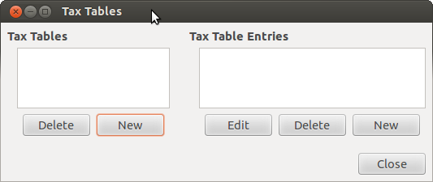

   Sales Tax Tables Editor

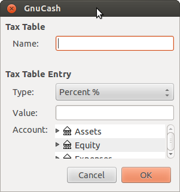

   New Sales Tax Table Entry

-  Name This is the tax table name.

-  Type Either Percent % or Value $.

-  Value This is the percentage or value depending on Type.

-  Account This is the account to which tax will be posted. For tax
   collected from customers, this should probably be a Liability account
   as it must be payed to the government. For tax paid to vendors, if
   tax laws allow tax paid to vendors to offset tax collected from
   customers, this should probably also be a Liability account (even
   though it will usually have a debit balance) so that the net tax owed
   to the government can be easily observed.

   If you set up Tax on Purchases and Tax on Sales as subaccounts of
   Liabilities:Tax then the net tax will be rolled up and can be seen in
   the GnuCash Accounts tab.

   *If unsure about tax law requirements, get professional advice.*

The following charts illustrate sample tax tables and may be used as
starting points to determine the setup appropriate for a particular
jurisdiction.

.. table:: Sample Tax Table Entries for EU country (e.g. 21% / 6% / 0%
Belgium, 20% / 5% / 0% UK etc.) (2017)

   +----------------------+----------------------+----------------------+
   | Tax Table            | Tax Table Entries    | Percentage or Amount |
   |                      | [Asset/Liability]    |                      |
   +======================+======================+======================+
   | Standard VAT Sales   | VAT:Sales:Standard   | 21%                  |
   |                      | [L]                  |                      |
   +----------------------+----------------------+----------------------+
   | Reduced VAT Sales    | VAT:Sales:Reduced    | 6%                   |
   |                      | [L]                  |                      |
   +----------------------+----------------------+----------------------+
   | Zero-Rated VAT Sales | VAT:Sales:Zero [L]   | 0%                   |
   +----------------------+----------------------+----------------------+
   | EC Sales             | VAT:Sales:EC [L]     | 21%                  |
   +----------------------+----------------------+----------------------+
   | VAT:Sales:Reverse EC | -21%                 |                      |
   | [L]                  |                      |                      |
   +----------------------+----------------------+----------------------+
   | Standard VAT         | VA                   | 21%                  |
   | Purchases            | T:Purchases:Standard |                      |
   |                      | [A]                  |                      |
   +----------------------+----------------------+----------------------+
   | Reduced VAT          | V                    | 6%                   |
   | Purchases            | AT:Purchases:Reduced |                      |
   |                      | [A]                  |                      |
   +----------------------+----------------------+----------------------+
   | Zero-Rated VAT       | VAT:Purchases:Zero   | 0%                   |
   | Purchases            | [A]                  |                      |
   +----------------------+----------------------+----------------------+

.. table:: Sample Tax Table Entries for Australia (2017)

   +----------------------+----------------------+----------------------+
   | Tax Table            | Tax Table Entries    | Percentage or Amount |
   |                      | [Asset/Liability]    |                      |
   +======================+======================+======================+
   | Standard GST Sales   | GST:Sales:Standard   | 10%                  |
   |                      | [L]                  |                      |
   +----------------------+----------------------+----------------------+
   | GST-free Sales       | GST:Sales:Zero [L]   | 0%                   |
   +----------------------+----------------------+----------------------+
   | Standard GST         | GS                   | 10%                  |
   | Purchases            | T:Purchases:Standard |                      |
   |                      | [A]                  |                      |
   +----------------------+----------------------+----------------------+
   | GST-free Purchases   | GST:Purchases:Zero   | 0%                   |
   |                      | [A]                  |                      |
   +----------------------+----------------------+----------------------+

.. table:: Sample Tax Table Entries for Cook County, Illinois (2017)

   +----------------------+----------------------+----------------------+
   | Tax Table            | Tax Table Entries    | Percentage or Amount |
   |                      | [Asset/Liability]    |                      |
   +======================+======================+======================+
   | Chicago Sales Taxes  | Taxes:Sales:State    | 6.25%                |
   |                      | [L]                  |                      |
   +----------------------+----------------------+----------------------+
   | Taxes:Sales:City [L] | 1.25%                |                      |
   +----------------------+----------------------+----------------------+
   | Taxes:Sales:County   | 1.75%                |                      |
   | [L]                  |                      |                      |
   +----------------------+----------------------+----------------------+
   | Taxes:Sales:Region   | 1%                   |                      |
   | [L]                  |                      |                      |
   +----------------------+----------------------+----------------------+

.. _bus-setupcname:

Enter Company Information
~~~~~~~~~~~~~~~~~~~~~~~~~

After you have built the account structure and defined your tax tables,
designate your company in the GnuCash file. To do this, select the
Business tab in the Book Options window, which can be accessed from File
> Properties.

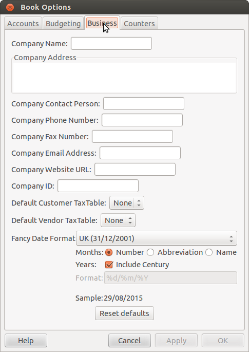

   Entering Company Information

Here you can:

-  Enter the name of your company along with contact information such as
   your phone number, fax number, e-mail address and website URL.

-  Enter your company’s tax payer id number in the Company ID field.

-  Select default tax tables applicable to your most common customers
   and vendors.

.. _bus_setup_pref:

Setting Business Preferences
~~~~~~~~~~~~~~~~~~~~~~~~~~~~

Set options on the Business tab of the GnuCash preferences, which is
accessed via Edit > Preferences (GnuCash > Preferences on MacOS). See
Help manual chapter 10.3.3 Business Book Options Tab.

.. _bus-setupterms:

Setting Billing Terms
~~~~~~~~~~~~~~~~~~~~~

Billing Terms can be used to determine the payment due date and be a
guide for determining discount for early payment of invoices (or vendor
bills).

.. note::

   As of GnuCash 2.6.7, Billing Terms are only partially supported. Date
   due is calculated using the Billing Terms but discount amount is not.

   Discount for early invoice payment is not implemented. There are 2
   ways this may be done, although neither is recommended, and
   professional advice should be used to confirm that regulations are
   being complied with:

   -  After creating and posting a payment which pays the invoice in
      full, manually edit the payment transaction (usually strongly
      discouraged) and split the payment to reduce it by the amount of
      the discount and create a compensating split in an income
      (discount) account.

   -  Alternatively, after creating and posting a payment for the
      discounted amount, create a credit note for the discount using a
      specific negative sales income (discount) account for the transfer
      account.

You can specify the billing terms on each invoice/bill. Invoice billing
terms will default from the customer billing terms. Bill billing terms
will default from the vendor billing terms.

Billing Terms are maintained using the Billing Terms Editor which is
accessed via menu Business > Billing Terms Editor.

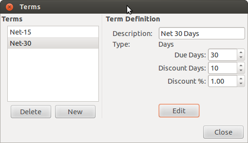

   Billing Terms Editor

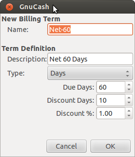

   New Billing Term

-  Name The internal name of the billing term. For some examples of
   billing term names and descriptions see
   ` <https://wiki.gnucash.org/wiki/Payment_Terms>`__.

-  Description The description of the billing term, printed on invoices

-  There are 2 types of billing terms, with different information to be
   entered

   -  Type Days

      -  Due Days The invoice or bill is due to be paid within this
         number of days after the post date

      -  Discount Days The number of days after the post date during
         which a discount will be applied for early payment

      -  Discount % The percentage discount applied for early payment

   -  Type Proximo

      -  Due Day The day of the month bills are due

      -  Discount Day The last day of the month for the early payment
         discount

      -  Discount % The discount percentage applied if paid early

      -  Cutoff Day The cutoff day for applying bills to the next month.
         After the cutoff, bills are applied to the following month.
         Negative values count backwards from the end of the month.

.. _bus_ar:

Accounts Receivable
-------------------

Accounts Receivable (or A/R) refers to products or services provided by
your company for which payment has not yet been received.

.. _bus-ar-components1:

System Components
~~~~~~~~~~~~~~~~~

Transactions generated by the A/R system are recorded within the
Accounts Receivable account. *You should not work directly with this
account.* Instead, you will work with the four integrated GnuCash A/R
application components available through the Business > Customer
sub-menu. These four components are:

-  Customers are people or companies to whom you sell products or
   services on credit.

-  Invoices represent the physical invoice you send to a customer to
   request payment. This invoice contains an itemized list of things you
   sold.

   In addition, GnuCash also has support for Credit Notes which
   represent the inverse of Invoices. A credit note is usually handed to
   a customer to correct items that were incorrectly invoiced or
   returned.

   Both document types will be set up using the same menu items. Credit
   notes were introduced starting with GnuCash stable release 2.6.0.

-  Jobs (optional) is where you register Customer Jobs. Jobs are a
   mechanism by which you can group multiple invoices to a particular
   customer.

-  Process Payments is used to register payments you received from a
   customer.

.. _bus-ar-customers1:

Customers
~~~~~~~~~

Customers are people or companies to whom you sell goods or services.
They must be registered within the A/R system.

.. _bus-ar-custnew2:

New
^^^

To register a new customer, enter the menu Business > Customer > New
Customer. Fill in customer information, such as Company Name, Address,
Phone, Fax, etc.

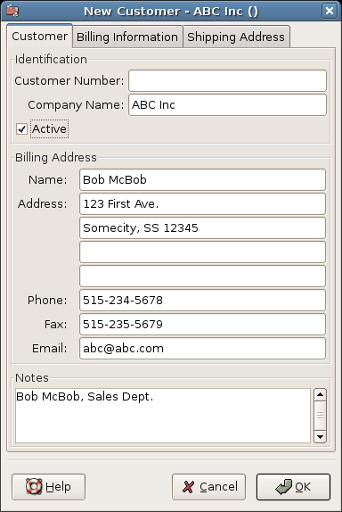

   New Customer Registration Window

.. _bus-ar-custfind2:

Find and Edit
^^^^^^^^^^^^^

To search for an existing customer, use the Business > Customer > Find
Customer window. You select a customer to View/Edit from the results of
the search. This window is also used to look up customers when creating
invoices and processing payments.

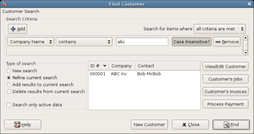

   Find Customer Window

If many customers match the search criteria you provide, the search can
be refined by running an additional search within the current results.
The current result set is searched when the Refine Current Search radio
button is selected. In fact, GnuCash selects this option for you after
you run the initial search.

If the customer you are searching for does not match the supplied search
criteria, change the search criteria, click the New Search radio button
and then the Find button. The relevant step is the New Search selection.
If the customer is not in the result of the original search, and you
only search within this set, the customer cannot be found, regardless of
new search criteria.

.. note::

   To return a list of all registered active customers, set the search
   criterion to matches regex, and place a single dot "." in the text
   field area. Make sure Search only active data is checked, then click
   Find. The regular expression "." means to match anything.

.. _bus-ar-invoices1:

Invoices
~~~~~~~~

An invoice is the paperwork you send to a customer to request payment
for products or services rendered. GnuCash can generate and track
invoices.

A credit note is the paperwork you send to a customer to correct
products or services rendered that were incorrectly invoiced. GnuCash
can generate and track credit notes via the same menu entries as
invoices.

.. note::

   This section applies to both invoices and credit notes. In order to
   avoid repeating everything twice and to keep the text easier to read
   it will refer only to invoices. You can apply it equally to credit
   notes. Only where the behavior of credit notes differs from invoices
   this will be explicitly mentioned.

.. _bus-ar-invoicenew2:

New
^^^

To send an invoice to a customer you must first create the new document.
To create an invoice use Business > Customer > New Invoice. The New
Invoice window must be filled in appropriately.

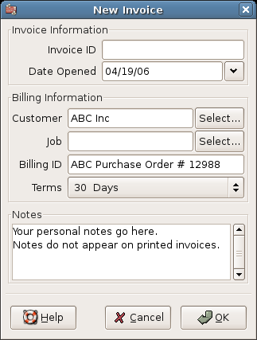

   Creating a New Invoice

When you click the OK button, the Edit Invoice window opens.

.. _bus-ar-invoiceedit2:

Edit
^^^^

From the Edit Invoice window you can enter an itemized list of goods and
services you sold on this invoice in a manner similar to how the account
register works. For credit notes you enter an itemized list of goods and
services you refunded instead.

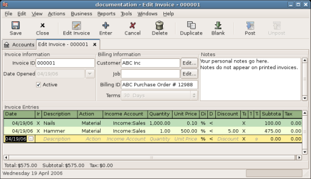

   Edit Invoice Window

When you have finished entering all the items, you can Post and print
the invoice.

.. _bus-ar-invoicepost2:

Post
^^^^

When you finish editing an invoice and are ready to print, you must Post
the invoice. The invoice does not have to be posted immediately. In
fact, you should only post an invoice when you are ready to print it.
Posting an invoice places the transactions in an accounts receivable
account.

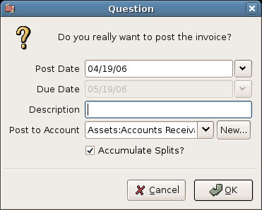

   Post Invoice Window

.. _bus-ar-invoicefind2:

Find
^^^^

To find an existing invoice, use the Business > Customer > Find Invoice
menu item. From the results of the search, you can select an invoice to
edit or view.

.. note::

   Before you can edit a posted invoice, you will need to Unpost it.

One of the design goals in GnuCash’s Account Receivable system was to
allow different processes to get to the same state, so you can reach an
invoice from different directions based on the way you think about the
problem:

-  You can search for the customer first, then list their invoices.

-  You can search for invoices by number or by company name.

-  You can list invoices associated with a customer job.

.. _bus-ar-invoiceprint2:

Print
^^^^^

After you post an invoice, you should print it and send it to your
customer. To print an invoice use File > Print Invoice menu item.

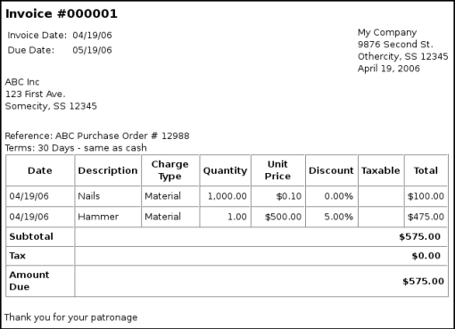

   Invoice Print Output

.. note::

   You can modify the appearance of the invoice, IE: add a company logo,
   etc. To do so, see the `Changing the Invoice
   Appearance <#bus-ar-invoicechange>`__.

Invoices can also be printed from the main window by selecting Reports >
Business Reports > Printable Invoice from the main menu. The resulting
report window states that no valid invoice is selected. To select the
invoice to print:

1. Use the Options *Toolbar* button or select Edit > Report Options from
   the main menu.

2. Select the General tab of the report options dialog.

3. Click the Select button next to the Invoice Number field.

4. Search for the invoice as usual.

You can also print invoices from within the Process Payment dialog. See
the `Process Payment <#bus-ar-payment1>`__ for instructions on how to do
so.

.. _bus-ar-invoicestarting2:

Assign Starting Invoice Number
^^^^^^^^^^^^^^^^^^^^^^^^^^^^^^

By default, GnuCash starts with invoice number 1 and increments from
there. You can manually type an invoice number into the text box each
time you create an invoice, but this gets tiring and sooner or later
leads to duplicate numbers.

You can change the starting invoice number if it is important you. Use
File > Properties, access the Counters tab, change the Invoice number
value to be one less than your desired starting invoice number and click
the OK button or the Apply button.

.. _bus-ar-jobs1:

Customer Jobs
~~~~~~~~~~~~~

Customer Jobs are used to group multiple invoices and credit notes to
the same customer. Use of the Customer Jobs feature is optional. The
feature is useful when you have multiple jobs for the same customer, and
would like to view all the invoices and credit notes related to a single
job.

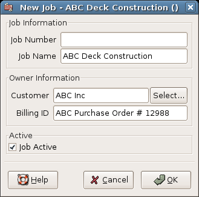

   New Customer Job

To use customer jobs, you must create them using the Business > Customer
> New Job menu item. You will see the New Job window.

To edit an existing customer job, use the Business > Customer > Find Job
menu item. Select the desired job in the search results, and click the
View/Edit Job button.

To select from the invoices and credit notes associated with a given
job, use Business > Customer > Find Job menu item. Select the desired
job in the search results and click the View Invoices button. A window
listing invoices and credit notes associated with this job appears.
Select an invoice or credit note and click the View Invoice button to
open an invoice editor in the main application window.

.. _bus-ar-payment1:

Process Payment
~~~~~~~~~~~~~~~

Eventually, you will receive payment from your customers for outstanding
invoices. To register these payments, use the Process Payment
application found in Business > Customer > Process Payment.

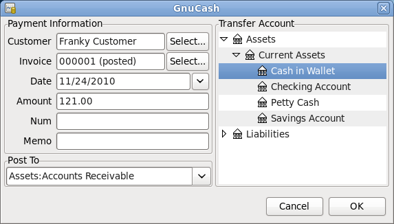

   Process Customer Payment

.. _bus-ar-invoicechange:

Changing the Invoice Appearance
~~~~~~~~~~~~~~~~~~~~~~~~~~~~~~~

The default Invoice style, as shown in
`Print <#bus-ar-invoiceprint2>`__, is fairly barren. The default invoice
style leaves the top part of the form blank, so you can print on company
letterhead paper. There are some things you can do to change invoice
appearance.

Use File > Properties to enter your Company information in the Business
tab of the Book Options window. Some of the entered information is
printed on the right side of invoices.

To add a customized background, heading banner or logo to invoices,
modify the invoice style sheets. To do this, go to Edit > Style Sheets
and select the New button in the Select HTML Style Sheet window that
will appear. You will then see a window like this:

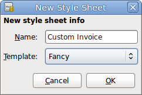

   The New Style Sheet Window

Give a Name to the new style sheet (e.g. Custom Invoice) and select the
Fancy Template. When you click the OK button, the HTML Style Sheet
Properties window is displayed. This window presents you five sections
listed in the left pane: Colors, Fonts, General, Images, and Tables. The
Colors section allows you to change the colors of various items of the
invoice. The Fonts section lets you set fonts type and dimensions. The
General section allows you to set the Preparer and Prepared for
information, and to Enable Links. The Images section allows you to
import graphics into the style sheet. The Tables section allows you to
adjust the spacing around the tables which make up the invoice.

To include a company logo, banner heading and background image, use your
favorite graphics application such as The Gimp or OpenOffice Draw to
save the images in either GIF or PNG format. Then import them into the
style sheet using the Images section described above.

Below is an example that imports all three types of images.

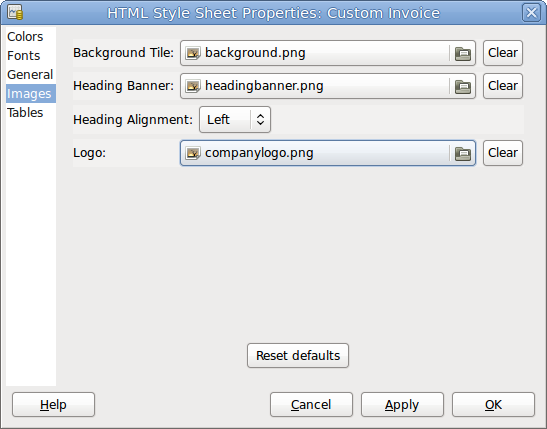

   HTML Style Sheets Example Window

.. note::

   The images are placed in the invoice as follows. The Background Tile
   is tiled to become the background image, the Heading Banner goes to
   above the invoice text, and the Logo is placed in the upper left
   corner of the invoice to the left of the Heading Banner. You will
   probably have to try a few different sized images until you get the
   invoices to print nicely. Some sizing suggestions are that the Logo
   should be 1 square cm (~0.5 inch), and the Heading Banner should be
   15 cm (~6 inches) wide and 1 cm (~0.5 inch) tall.

With the style sheet configured, when you print the invoice, you select
the style sheet to use from the Options menu. Below is the resultant
invoice after applying the style sheet demonstrated above.

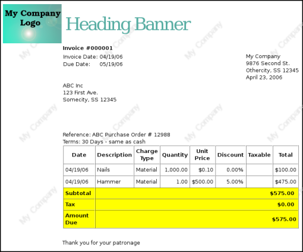

   HTML Style Sheets Example Output

.. _bus_ap:

Accounts Payable
----------------

Accounts Payable (or A/P) refers to the accounting of products or
services which a company has bought and needs to pay for.

.. _bus-ap-components1:

System Components
~~~~~~~~~~~~~~~~~

GnuCash has an integrated accounts payable system. The transactions
generated by the A/P system are placed within the Accounts Payable
account, as a record of what occurs. Generally you do not directly work
with this account but use the four integrated GnuCash A/P application
components. The A/P components are available from the Business > Vendor
sub-menu. These A/P components are:

-  Vendors are people or companies from which you buy products or
   services on credit.

-  Bills represent the physical bills vendors send to request payment
   from you. A bill contains an itemized list of things you purchased.

   In addition, GnuCash also has support for Credit Notes which
   represent the inverse of Bills. A credit note is usually received
   from a vendor to correct items that were erroneously billed or
   returned.

   Both document types will be set up using the same menu items.

-  Jobs (optional) is where you register Vendor Jobs. Jobs are mechanism
   by which you can group multiple bills from a particular vendor.

-  Process Payments is where you register payments to a vendor to whom
   you owe money.

The following sections introduce the individual Accounts Payable
application components.

.. _bus-ap-vendors1:

Vendors
~~~~~~~

A vendor is a company or person from whom you purchase goods or
services. Vendors must be registered within the A/P system.

.. _bus-ap-vendornew2:

New
^^^

To register a new vendor, select the Business > Vendor > New Vendor menu
item. Fill in general information about the vendor, such as Company
Name, Address, Phone, Fax, etc. Below is a list of the other options:

This is what the New Vendor registration window looks like:

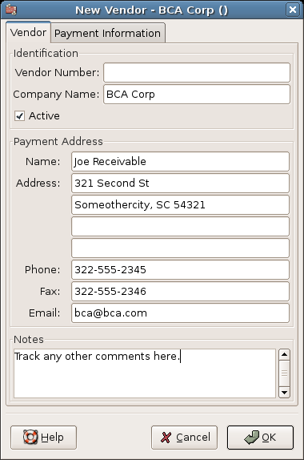

   New Vendor Registration Window

.. _bus-ap-vendorfind2:

Find and Edit
^^^^^^^^^^^^^

To search for an existing vendor, use the Business > Vendor > Find
Vendor window. You select a vendor to View/Edit from the results of the
search. This window is also used to look up a vendor when entering bills
and processing payments.

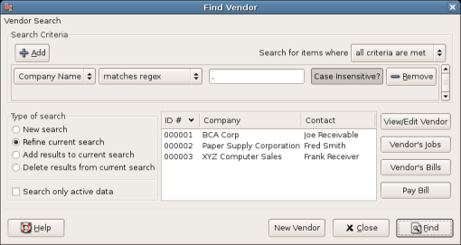

   Find Vendor Window

If many vendors match the search criteria you provide, the search can be
refined by running an additional search within the current results. The
current result set is searched when the Refine Current Search radio
button is selected. In fact, GnuCash selects this option for you after
you run the initial search.

If the vendor you are searching for does not match the supplied search
criteria, change the search criteria, click the New Search radio button
and then the Find button. The relevant step is the New Search selection.
If the vendor is not in the result of the original search, and you only
search within this set, the vendor cannot be found, regardless of new
search criteria.

.. note::

   To return a list of all registered active vendors, set the search
   criterion to matches regex, and place a single dot “.” in the text
   field area. Make sure Search only active data is checked, then click
   Find. The regular expression “.” means to match anything.

.. _bus-ap-bills1:

Bills
~~~~~

A bill is a request for payment you receive from a vendor. GnuCash can
track bills.

A credit note is the document you receive from a vendor to correct
products or services rendered that you were incorrectly charged for on a
bill. GnuCash can generate and track credit notes via the same menu
entries as bills.

.. note::

   This section applies to both bills and credit notes. In order to
   avoid repeating everything twice and to keep the text easier to read
   it will refer only to bills. You can apply it equally to credit
   notes. Only where the behaviour of credit notes differs from bills
   this will be explicitly mentioned.

.. _bus-ap-billnew2:

New
^^^

When you receive a bill from a vendor and want to enter it into GnuCash,
you must create a new bill. To create a new bill use the Business >
Vendor > New Bill menu item, and fill in the resulting window
appropriately.

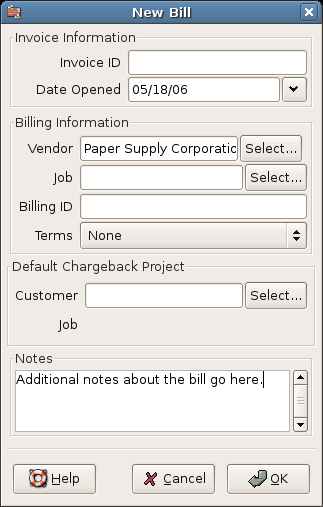

   New Bill Registration Window

When you click the OK button the Edit Bill window opens.

.. _bus-ap-billedit2:

Edit
^^^^

From the Edit Bill window you can enter an itemized list of goods and
services you purchased, in a manner similar to how the account register
works. For credit notes you enter an itemized list of goods and services
the vendor refunded instead.

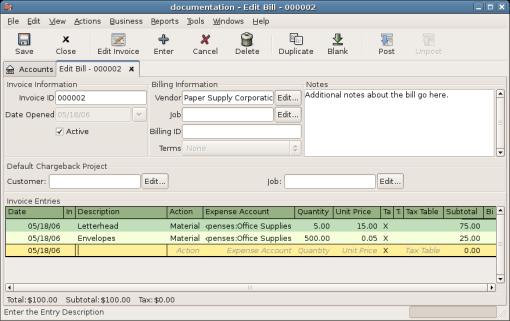

   Edit Bill Window

When you have finished entering all the items, Post the bill.

.. _bus-ap-billpost2:

Post
^^^^

When you finish editing a bill, you should Post the bill. You do not
have to post the bill, you can close it and return to it later. You have
to post the bill eventually. Posting a bill places its transactions into
an accounts payable account. The Post Bill window appears and asks you
to enter information:

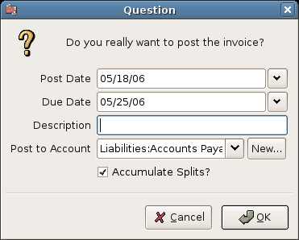

   Post Bill Window

.. _bus-ap-billfind2:

Find
^^^^

To find an existing bill, use the Business > Vendor > Find Bill menu
item. From the results of the search, you can select a bill to edit, or
view.

.. note::

   Before you can edit a posted bill, you will need to Unpost it.

.. note::

   There are other ways to access an existing bill. These are similar to
   accessing invoices for your customers. See
   `Find <#bus-ar-invoicefind2>`__ for more information.

.. _bus-ap-jobs1:

Vendor Jobs
~~~~~~~~~~~

Vendor Jobs are used to group multiple bills and credit notes from a
single vendor. Use of the vendor jobs feature is optional. The feature
is useful when you have multiple jobs for the same vendor, and would
like to view all the bills and credit notes for a single job.

To use vendor jobs, you must create them using the Business > Vendor >
New Job menu item. You will see the New Job window.

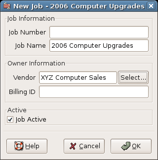

   New Vendor Job

To edit an existing vendor job, use the Business > Vendor > Find Job
menu item. Select the desired job in the search results, and click the
View/Edit Job button.

To select from the bills associated with a given job, use Business >
Vendor > Find Job menu item. Select the desired job in the search
results and click the View Invoices button. A window listing bills and
credit notes associated with this job appears. Select a bill or credit
note and click the View Invoice button to open a bill editor in the main
application window.

.. _bus-ap-payment1:

Process Payment
~~~~~~~~~~~~~~~

Eventually, you need to pay your bills. To do so, use the Process
Payment application found in Business > Vendor > Process Payment.

Below is the GnuCash Accounts Payable payment window.

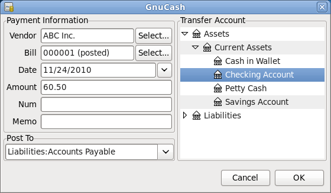

   Process Vendor Payment

.. _bus_payroll:

Payroll
-------

Payroll is a financial record of wages, net pay, paid vacations, and
deductions for an employee. This section demonstrates how to track
payroll using GnuCash.

.. _bus-payroll-concepts:

Basic Concepts
~~~~~~~~~~~~~~

Payroll is a financial record of wages, net pay, paid vacations, and
deductions for an employee. Basically, anything that relates to giving
money or benefits to an employee. Payroll is one of the more complex
tasks in accounting, because there are many different accounts, people,
and agencies involved in paying salaries.

Payroll is typically accounted for as an expense. Sometimes accountants
“store” some payroll expenses in a short term liability account. This is
useful for things such as payroll taxes, which may be paid at a
different time than the employee. The employee might get paid biweekly,
while taxes are paid quarterly. This chapter presents a methodology
which expenses payroll immediately for salaries, but stores taxes in
liability accounts.

.. note::

   GnuCash does not have an integrated payroll system. While you can
   track payroll expenses in GnuCash, the calculation of taxes and
   deductions has to be done outside of GnuCash.

.. _bus-payroll-acct:

Account Setup
~~~~~~~~~~~~~

Local tax law must be considered when setting up accounts. Because there
are many different ways payroll taxes are handled throughout the world,
this section presents a very simple structure. From this, you should be
able to adapt your particular payroll deductions setup.

Assume that you must pay 2 taxes, Tax1 and Tax2, and that each has an
employee contribution and an employer contribution.

The employee’s salary and these two taxes are expense accounts. The tax
components are liability accounts. The tax liability accounts are where
you accumulate the taxes withheld for all of your employees. The taxes
are later paid to the appropriate government agency.

Simple Payroll Account Layout: -Assets --Checking -Liabilities --Tax1
(short term “storage” account) --Tax2 (short term “storage” account)
-Expenses --Salaries --Tax1 --Tax2

.. note::

   Resist the temptation to create per-employee sub-accounts to track
   individual salaries. Creating a sub-account for each employee leads
   to unmanageably large lists of accounts. Imagine the account
   structure after a few years of employees coming and going. It is much
   simpler to keep all of your employees’ payroll records within a
   single account (*Expenses:Salaries* for example) and use reports to
   view per-employee information.

   The Transaction report can be used to sort and total by description
   or memo (but not by part of them).

   To report salary transactions for a specific employee where the
   employee name or code is entered in the transaction description or
   memo, use the Find Transaction assistant (Edit > Find) to select the
   transactions, and then report on them using Reports > Account Report.
   Further formatting or analysis may be done by copying and pasting the
   report into a spreadsheet. See `Find
   Transaction <ghelp:gnucash-help?tool-find-txn>`__ in the GnuCash Help
   Manual.

.. _bus-payroll-protocol:

Payroll Protocol Sample
~~~~~~~~~~~~~~~~~~~~~~~

GnuCash does not have an integrated payroll system. GnuCash can track
your payroll expenses, but you need to develop a payroll protocol and
perform the calculations outside of GnuCash, in a spreadsheet for
example. In this section, one such protocol is presented. You can use
the sample protocol as a model.

.. _bus-pay-protocol-1:

Step 1: Deductions list
^^^^^^^^^^^^^^^^^^^^^^^

The first step to the payroll protocol is to create a list of all the
possible taxes and deductions for each employee. Each entry should
include definitions and formulas for calculating each value. Once the
protocol is established it needs to be changed only when payroll laws or
tax rates change.

In the proposed scenario, such a list would look like this:

-  *E_GROSS_SALARY* - Employee gross salary

-  *E_TAX1* - Employee contribution to tax1 (X% of E_GROSS_SALARY)

-  *E_TAX2* - Employee contribution to tax2 (X% of E_GROSS_SALARY)

-  *C_TAX1* - Company contribution to tax1 (X% of E_GROSS_SALARY)

-  *C_TAX2* - Company contribution to tax2 (X% of E_GROSS_SALARY)

.. note::

   The employee’s net salary (E_NET_SALARY) is defined as E_GROSS_SALARY
   - E_TAX1 - E_TAX2 and need not be placed in this list since it is
   composed of items that already exist.

Place the actual formulas for calculating each deduction in this list.
Sometimes these formulas are quite complex, and sometimes they simply
say "look it up in table XYZ of the tax codes".

Notice that you can calculate some interesting values using the above
definitions. One such value is the total cost to the company:
E_GROSS_SALARY + C_TAX1 + C_TAX2.

.. _bus-pay-protocol-2:

Step 2: Create the Transaction Map
^^^^^^^^^^^^^^^^^^^^^^^^^^^^^^^^^^

When you record payroll in GnuCash, do so with a single split
transaction. This split transaction populates the appropriate expense
and liability accounts. If you need to look the payroll details at a
later time, open the split transaction.

With the deductions list from above, an employee split transaction map
can be generated. Each of the items in the list is mapped to a GnuCash
account.

.. table:: Payroll Transaction Map

   ================= ============== ============
   Account           Increase       Decrease
   ================= ============== ============
   Assets:Checking                  E_NET_SALARY
   Expenses:Salaries E_GROSS_SALARY 
   Liabilities:Tax1                 E_TAX1
   Liabilities:Tax2                 E_TAX2
   Expenses:Tax1     C_TAX1         
   Liabilities:Tax1                 C_TAX1
   Expenses:Tax2     C_TAX2         
   Liabilities:Tax2                 C_TAX2
   ================= ============== ============

Note that the C_TAX1 and C_TAX2 components have entries in the both the
liability and expense accounts. The company component of each tax is
expensed at the time of payroll, but remains a liability until taxes are
due.

.. _bus-pay-protocol-3:

Step 3: Pay the Employee
^^^^^^^^^^^^^^^^^^^^^^^^

Go to the account from which the employee will be paid, for example your
*Assets:Checking* account. Open a split transaction and enter the real
values using the Transaction Map above as a guide. Repeat this for all
employees.

.. tip::

   This manual process is tedious, especially if you have a large number
   of employees.

   One GnuCash tool you certainly want use when entering employee
   payroll is duplicate transaction (use the Duplicate *Toolbar*
   button). This saves you from having to enter all the transaction
   splits for each employee. You still need to change the amounts of
   money to match each employee’s real payroll values, but you will not
   have to build the split for each employee.

   If payroll transactions do not change significantly every pay period,
   you can also use the duplicate transaction feature to duplicate each
   employee’s most recent payroll transaction for the current pay
   period. If you find you are doing so all the time, read about the
   Schedule Transactions feature and save even more time!

.. _bus-pay-protocol-4:

Step 4: Pay the Government
^^^^^^^^^^^^^^^^^^^^^^^^^^

The final thing to do is to pay the taxes to the government. The
liability accounts have been collecting the taxes for various government
agencies, and periodically you need to send a check to the government to
pay this charge. To do so, you simply enter a 2 account transaction in
(for example) your checking account to pay off the tax liability. The
transaction is between the checking account and the liability account,
no expense account is involved. The expense accounts are charged at the
time the tax liability is recorded.

.. _bus-payroll-example:

Business Payroll Example
~~~~~~~~~~~~~~~~~~~~~~~~

Using the account setup seen previously, let’s go through an example.
Assume that there are 2 employees (E1 and E2) who each earn $1000 per
month gross salary. The employee contribution to Tax1 and Tax2 are 10%
and 5% respectively. The company contribution to Tax1 and Tax2 are 15%
and 10% each on top of the employee’s gross salary.

Starting with $50k in the bank, and before doing any payroll, the
account hierarchy looks like this:

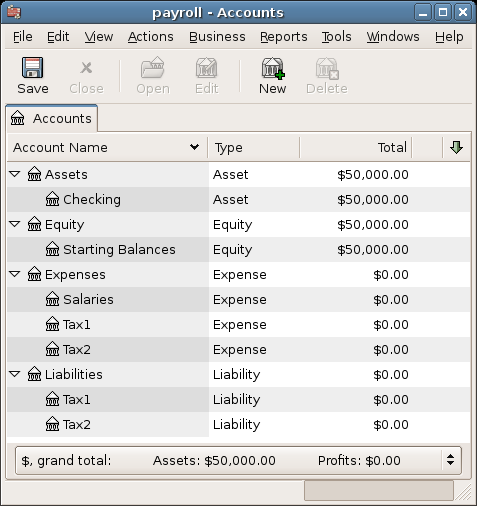

   Payroll Example: Initial Setup

The deductions list for employee 1 are:

-  *E_GROSS_SALARY* - Employee gross salary - *$1000*

-  *E_TAX1* - Employee contribution to tax1 - *$100* (10% of
   E_GROSS_SALARY)

-  *E_TAX2* - Employee contribution to tax2 - *$50* (5% of
   E_GROSS_SALARY)

-  *C_TAX1* - Company contribution to tax1 - *$150* (15% of
   E_GROSS_SALARY)

-  *C_TAX2* - Company contribution to tax2 - *$100* (10% of
   E_GROSS_SALARY)

.. table:: Payroll Transaction Map for Employee 1

   ================= ====================== ===================
   Account           Increase               Decrease
   ================= ====================== ===================
   Assets:Checking                          $850 (E_NET_SALARY)
   Expenses:Salaries $1000 (E_GROSS_SALARY) 
   Liabilities:Tax1                         $100 (E_TAX1)
   Liabilities:Tax2                         $50 (E_TAX2)
   Expenses:Tax1     $150 (C_TAX1)          
   Liabilities:Tax1                         $150 (C_TAX1)
   Expenses:Tax2     $100 (C_TAX2)          
   Liabilities:Tax2                         $100 (C_TAX2)
   ================= ====================== ===================

From the checking account, enter the split transaction for employee 1.
It should look like this:

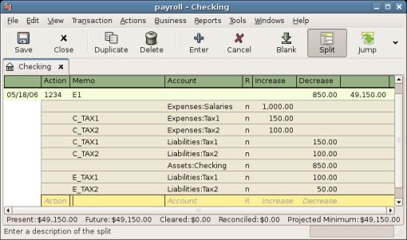

   Payroll Example: Employee Split Transaction

.. tip::

   When paying employees, enter only the employee name in the
   Description area. If you decide to use GnuCash’s check printing
   capabilities, the check is automatically made out to the correct
   employee. If you want to record other information in the transaction
   besides the employee name, use the Notes area, available when viewing
   the Register in double-line mode.

Repeat this for the second employee, which leaves the account hierarchy
looking like this:

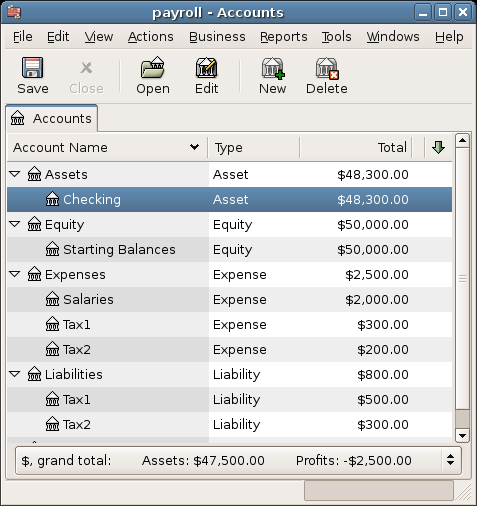

   Payroll Example: Accounts After Salaries Paid

Now, you will enter the company contributions. The *Liabilities:Tax1*
and *Liabilities:Tax2* accounts track how much you must pay to the
government for each tax type. When it is time to pay these agencies, you
will make a transaction from the checking account to these liability
accounts. No expense accounts are involved. The main account will then
appear like this:

   Payroll Example: Accounts After Paying Government
