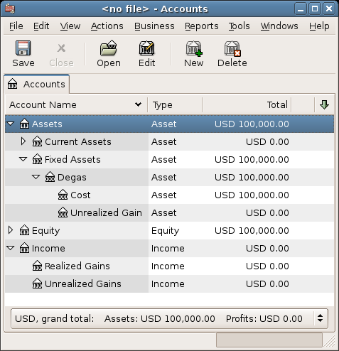
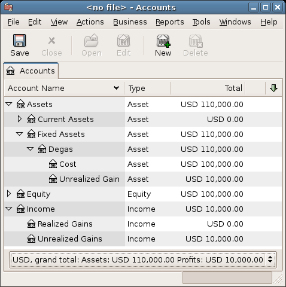
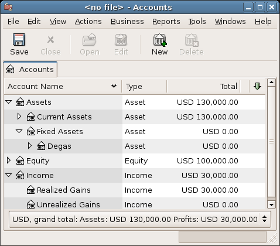

.. _chapter_capgain:

Capital Gains
=============

This chapter will present some of the techniques used to keep track of
the unrealized and realized gains and losses, better known as capital
gains and losses.

.. _capgain_concepts1:

Basic Concepts
--------------

This chapter will present some of the techniques used to keep track of
the unrealized and realized gains and losses, better known as capital
gains and losses.

Certain resellable assets can change value over time, such as stocks,
bonds, houses, or cars. Some assets (eg: a stock) could increase in
value, some (eg: a car) could decrease in value. It is important to be
able to track some of these time-dependent asset valuations, this
chapter will show you how.

Probably everything you own will increase or decrease in value over
time. So, the question is for which of these assets should you track
this changing value? The simple answer is that you only need to track
this for items which could be sold for cash in the future or which
relate to taxation.

Consumable and disposable items (eg: food, gas for your car, or printer
paper) are obviously not involved. Thus, even though the new clothes you
recently bought will certainly depreciate, you would not want to track
this depreciation since you have no intention of reselling the clothes
and there is no tax implications to the depreciation on clothing. So,
for this example, the purchase of new clothes should be recorded as a
pure expense... you spent the money, and it is gone.

Asset appreciation occurs when something you own increases in value over
time. When you own an asset which has increased in value, the difference
between the original purchase price and the new value is known as
*unrealized gains*. When you sell the asset, the profit you earn is
known as *realized gains* or *capital gains*. An example of an asset
from which you could have unrealized gains, and eventually capital
gains, is stock in a publicly traded company.

.. _capgain_value1:

Estimating Valuation
--------------------

As mentioned in the introduction to this chapter, capital gains are the
profits received from the sale of an asset. This section will describe
how to record capital gains in GnuCash.

The accounting methods for handling asset appreciation differs somewhat
from depreciation because typically you are only concerned with the
moment you sell the asset and realize the capital gains. This is opposed
to the continuous nature of tracking depreciation. Capital gains are an
important subject in the world of taxation, because governments tend to
be quite interested in taxing capital gains in one manner or another.

.. note::

   As always, there are exceptions. If you hold a bond that pays all of
   its interest at maturity, tax authorities often require that you
   recognize interest each year, and refuse this to be treated as a
   capital gain. Consult the appropriate tax codes to determine the
   preferred treatment for each type of asset you have which may be
   affected by capital gains taxes.

Estimating the increasing value of assets is generally not simple,
because often it is difficult to know its exact value until the moment
it is sold.

Securities traded daily on open markets such as stock exchanges are
possibly the easiest type of asset to predict the value of, and selling
the asset at market prices may be as simple as calling a broker and
issuing a Market Order. On the other hand, estimating the value of a
house is more difficult. Homes are sold less often than stocks, and the
sales tend to involve expending considerable effort and negotiations,
which means that estimates are likely to be less precise. Similarly,
selling a used automobile involves a negotiation process that makes
pricing a bit less predictable.

Values of collectible objects such as jewelry, works of art, baseball
cards, and “Beanie Babies” are even harder to estimate. The markets for
such objects are much less open than the securities markets and less
open than the housing market. Worse still are one-of-a-kind assets.
Factories often contain presses and dies customized to build a very
specific product that cost tens or hundreds of thousands of dollars;
this equipment may be worthless outside of that very specific context.
In such cases, several conflicting values might be attached to the
asset, none of them unambiguously correct.

The general rule of thumb in accounting for estimating unrealized gains
(or loses) is that you should only revalue assets such as stocks which
are readily sellable and for which there are very good estimates of the
value. For all other assets, it is better to simply wait until you sell
them, at which time you can exactly determine the capital gains. Of
course, there is no hard rule on this, and in fact different accountants
may prefer to do this differently.

.. _capgain_accounts1:

Account Setup
-------------

As with most accounting practices, there are a number of different ways
to setup capital gains accounts. We will present here a general method
which should be flexible enough to handle most situations. The first
account you will need is an *Asset Cost* account (GnuCash account type
Asset), which is simply a place where you record the original purchase
of the asset. Usually this purchase is accomplished by a transaction
from your bank account.

In order to keep track of the appreciation of the asset, you will need
three accounts. The first is an *Unrealized Gains* asset account in
which to collect the sum of all of the appreciation amounts. The
*Unrealized Gains* asset account is balanced by a *Unrealized Gains*
income account, in which all periodic appreciation income is recorded.
Finally, another income account is necessary, called a *Realized Gains*
in which you record the actual capital gains upon selling the asset.

Below is a generic account hierarchy for tracking the appreciation of 2
assets, *ITEM1* and *ITEM2*. The *Assets:Fixed Assets:ITEM1:Cost*
accounts are balanced by the *Assets:Current Assets:Savings Account*
account, the *Assets:Fixed Assets:ITEM1:Unrealized Gains* accounts are
balanced by the *Income:Unrealized Gains* account (similar for *ITEM2*).

::

   -Assets
       -Current Assets
           -Savings Account
       -Fixed Assets
           -ITEM1
               -Cost
               -Unrealized Gain
           -ITEM2
               -Cost
               -Unrealized Gain
   -Income
       -Realized Gains
       -Unrealized Gains
     

.. _capgain_example1:

Example
-------

Let’s suppose you buy an asset expected to increase in value, say a
Degas painting, and want to track this. (The insurance company will care
about this, even if nobody else does.)

Start with an account hierarchy similar to that shown in `Account
Setup <#capgain_accounts1>`__, but replace “ITEM1” with “Degas” and you
can remove the “ITEM2” accounts. We will assume that the Degas painting
had an initial value of one hundred thousand dollars. Begin by giving
your self $100,000 in the bank and then transferring that from your bank
account to your *Assets:Fixed Assets:Degas:Cost* account (the asset
purchase transaction). You should now have a main account window which
appears like this:

|Asset Appreciation Main Window|

.. _capgain_exampleunrealized2:

Unrealized Gains
~~~~~~~~~~~~~~~~

A month later, you have reason to suspect that the value of your
painting has increased by $10,000 (an unrealized gain). In order to
record this you transfer $10,000 from your *Accrued Gains* income
account (*Income:Unrealized Gains*) to your asset Unrealized Gains
account (*Assets:Fixed Assets:Degas:Unrealized Gain*). Your main window
will resemble this:

|Asset Appreciation Main Window|

.. _capgain_examplesell2:

Selling
~~~~~~~

Let’s suppose another month later prices for Degas paintings have gone
up some more, in this case about $20,000, you estimate. You duly record
the $20,000 as an unrealized income like above, then decide to sell the
painting.

Three possibilities arise. You may have *accurately estimated* the
unrealized gain, *underestimated* the unrealized gain, or
*overestimated* the unrealized gain.

1. *Accurate estimation* of unrealized gain.

   Your optimistic estimate of the painting’s value was correct. First
   you must record that the profits made are now realized gains, not
   unrealized gains. Do this by transferring the income from the
   *Income:Unrealized Gains* to the *Income:Realized Gains* account.

   Secondly, you must credit your bank account with the selling price of
   the painting. This money comes directly from your *Assets:Fixed
   Assets:Degas* sub-accounts. Transfer the full *Assets:Fixed
   Assets:Degas:Cost* value into *Assets:Current Assets:Savings
   Account*, and the full *Assets:Fixed Assets:Degas:Unrealized Gain*
   into *Assets:Current Assets:Savings Account*.

   These transactions should now appear as follows:

   .. table:: Turning an Accrued Gain into a Realized Gain - Accurate
   Estimation

      +----------------+----------------+----------------+----------------+
      | *Account*      | *Transfer to*  | *Transaction   | *Account       |
      |                |                | Amount*        | Total*         |
      +----------------+----------------+----------------+----------------+
      | Inc            | I              | $30,000        | $0             |
      | ome:Unrealized | ncome:Realized |                |                |
      | Gains          | Gains          |                |                |
      +----------------+----------------+----------------+----------------+
      | Assets:Fixed   | Assets:Current | $100,000       | $0             |
      | Ass            | Assets:Savings |                |                |
      | ets:Degas:Cost | Account        |                |                |
      +----------------+----------------+----------------+----------------+
      | Assets:Fixed   | Assets:Current | $30,000        | $0             |
      | Assets:De      | Assets:Savings |                |                |
      | gas:Unrealized | Account        |                |                |
      | Gains          |                |                |                |
      +----------------+----------------+----------------+----------------+

   This leaves the *Assets:Current Assets:Savings Account* account with
   a total of $130000 and *Income:Realized Gains* with a total of
   $30000.

   |Asset Appreciation Main Window|

2. *Under estimation* of unrealized gain.

   You were over-optimistic about the value of the painting. Instead of
   the $130000 you thought the painting was worth you are only offered
   $120000. But you still decide to sell, because you value $120000 more
   than you value the painting. The numbers change a little bit, but not
   too dramatically.

   The transactions should now appear as follows (observe the last
   transaction which balances the *Unrealized Gains* accounts):

   .. table:: Turning an Accrued Gain into a Realized Gain -
   Underestimation

      +----------------+----------------+----------------+----------------+
      | *Account*      | *Transfer to*  | *Transaction   | *Account       |
      |                |                | Amount*        | Total*         |
      +----------------+----------------+----------------+----------------+
      | Inc            | I              | $20,000        | $10,000        |
      | ome:Unrealized | ncome:Realized |                |                |
      | Gains          | Gains          |                |                |
      +----------------+----------------+----------------+----------------+
      | Assets:Fixed   | Assets:Current | $100,000       | $0             |
      | Ass            | Assets:Savings |                |                |
      | ets:Degas:Cost | Account        |                |                |
      +----------------+----------------+----------------+----------------+
      | Assets:Fixed   | Assets:Current | $20,000        | $10,000        |
      | Assets:De      | Assets:Savings |                |                |
      | gas:Unrealized | Account        |                |                |
      | Gains          |                |                |                |
      +----------------+----------------+----------------+----------------+
      | Assets:Fixed   | Inc            | $10,000        | $0             |
      | Assets:De      | ome:Unrealized |                |                |
      | gas:Unrealized | Gains          |                |                |
      | Gains          |                |                |                |
      +----------------+----------------+----------------+----------------+

   This leaves the *Assets:Current Assets:Savings Account* account with
   a total of $120000 and *Income:Realized Gains* with a total of
   $20000.

3. *Over estimation* of unrealized gain.

   You manage to sell your painting for more than you thought in your
   wildest dreams ($150,000). The extra value is, again, recorded as a
   gain, i.e. an income.

   The transactions should now appear as follows (observe the last
   transaction which balances the Unrealized Gains accounts):

   .. table:: Turning an Accrued Gain into a Realized Gain -
   Overestimation

      +----------------+----------------+----------------+----------------+
      | *Account*      | *Transfer to*  | *Transaction   | *Account       |
      |                |                | Amount*        | Total*         |
      +----------------+----------------+----------------+----------------+
      | Inc            | I              | $50,000        | $-20,000       |
      | ome:Unrealized | ncome:Realized |                |                |
      | Gains          | Gains          |                |                |
      +----------------+----------------+----------------+----------------+
      | Assets:Fixed   | Assets:Current | $100,000       | $0             |
      | Ass            | Assets:Savings |                |                |
      | ets:Degas:Cost | Account        |                |                |
      +----------------+----------------+----------------+----------------+
      | Assets:Fixed   | Assets:Current | $50,000        | $-20,000       |
      | Assets:De      | Assets:Savings |                |                |
      | gas:Unrealized | Account        |                |                |
      | Gains          |                |                |                |
      +----------------+----------------+----------------+----------------+
      | Inc            | Assets:Fixed   | $20,000        | $0             |
      | ome:Unrealized | Assets:De      |                |                |
      | Gains          | gas:Unrealized |                |                |
      |                | Gains          |                |                |
      +----------------+----------------+----------------+----------------+

   This leaves the *Assets:Current Assets:Savings Account* account with
   a total of $150,000 and *Income:Realized Gains* with a total of
   $50,000.

.. _capgain_tax1:

Taxation
--------

Taxation policies vary considerably between countries, so it is
virtually impossible to say anything that will be universally useful.
However, it is common for income generated by capital gains to not be
subject to taxation until the date that the asset is actually sold, and
sometimes not even then. North American home owners usually find that
when they sell personal residences, capital gains that occur are exempt
from taxation. It appears that other countries treat sale of homes
differently, taxing people on such gains. German authorities, for
example, tax those gains only if you owned the property for less than
ten years.

Chris Browne has a story from his professional tax preparation days
where a family sold a farm, and expected a considerable tax bill that
turned out to be virtually nil due to having owned the property before
1971 (wherein lies a critical “Valuation Day” date in Canada) and due to
it being a dairy farm, with some really peculiar resulting deductions.
The point of this story is that while the presentation here is fairly
simple, taxation often gets terribly complicated...

