.. _chapter_cbook:

Checkbook
=========

This chapter will give you all the specific information you need to
manage your checkbook with GnuCash. Managing your checkbook register is
the first step of tracking your finances, and GnuCash makes it much
easier to manage than the traditional paper register does.

For one thing, as discussed in `??? <#chapter_txns>`__, data entry of
common transactions is practically done for you in GnuCash, because of
its auto-completion feature. GnuCash keeps a running balance of each
account, and it makes reconciling these accounts easy. And the
double-entry method helps you account for your spending by requiring a
transfer account for withdrawals, so you can easily find out how much
money you spend in different areas.

Once you are comfortable with using GnuCash for your checking and other
bank accounts, you may wish to continue on with tracking other financial
accounts. Chapters 6 through 9 examine methods to manage your other
accounts.

.. _cbook-accounts1:

Setting up Accounts
-------------------

The first step in managing your checkbook is to set up the necessary
accounts. You can either use the default GnuCash accounts or set up your
own. For more detail on how to set up a new account, refer to
`??? <#accts-examples-toplevel2>`__. For instructions on importing your
accounts from another program, refer to the GnuCash manual.

Let’s start with the bank accounts you’ll need. You need one GnuCash
bank type account for each physical bank account you wish to track. If
you are setting up your own accounts or using the default GnuCash
accounts, make sure that you have an opening balance transaction for
each bank account you own. The easiest way to get this number is to use
the balance from your last bank statement as your opening balance. You
can enter this in the account information window automatically as part
of the New Account Hierarchy Setup assistant, or you can enter a manual
transaction directly in the account. To enter the transaction manually,
enter a transfer from an Opening Balances account (type equity) to the
bank account.

The typical bank accounts you might track include:

-  Checking - any institutional account that provides check-writing
   privileges.

-  Savings - an interest-bearing institutional account usually used to
   hold money for a longer term than checking accounts.

Common transactions that affect these bank accounts are payments and
deposits. *Payments* are transfers of money out of the bank account,
usually to an expense account. *Deposits* are transfers of money into
the bank account, usually from an income account. You will need to set
up income and expense accounts to track where that money comes from and
where it goes. Remember that a balanced transaction requires a transfer
of an equal sum of money from at least one account to at least one other
account. So if you deposit money in your checking account, you must also
enter the account that money comes from. If you pay a bill from your
checking account, you must also enter the account where that money goes.

.. _cbook-deposits1:

Entering Deposits
-----------------

Most deposit transactions are entered as a transfer from an income
account to a bank account. Income may come from many sources, and it’s a
good idea to set up a separate income type account for each different
source. For example, your income may come mainly from your paychecks,
but you may also receive interest on your savings. In this case, you
should have one income account for salary and another income account for
interest income.

.. tip::

   Be sure to check the Tax-Related box and assign an appropriate tax
   category in the Income Tax Information Dialog (Edit > Tax Report
   Options) when you set up taxable income accounts. Some types of
   income, such as gift income, may not be considered taxable, so check
   the appropriate tax rules to determine what is taxable. For ways to
   track capital gains income, refer to `??? <#chapter_capgain>`__.

Before you start entering paycheck deposits, decide how much detail you
want to track. The basic level of detail is to enter your net pay, just
like you would in your paper register. This is easiest, but you can get
even more information out of GnuCash if you enter your gross pay with
deductions. It takes a bit more effort to enter the deductions, but
entering your tax withholding information throughout the year allows you
to run useful tax status reports in GnuCash at any time. These reports
can help you determine whether you are withholding enough tax, and they
can help you estimate your tax bill ahead of time. If you are unsure
about the level of detail, start by entering net pay. You can always go
back and edit your transactions later if you decide you want more
detail.

.. _cbook-withdrawals1:

Entering Withdrawals
--------------------

When you withdraw money from your bank account, for whatever reason, you
are transferring money from your bank account to some other location. In
GnuCash, this other location is tracked as an account. The more detailed
accounts you create and use for your spending, the more information you
will get about where your money goes.

Withdrawals take many forms. ATM withdrawals are one of the most common
transactions. Writing checks is one way to withdraw money to pay bills,
to buy purchases, or to give to charity. Depending on your bank, you
might also have service charges, where the bank withdraws the money from
your account. Transfers of money out to another account are also
withdrawals. We will take a look at each of these types of withdrawals
and how to record them in GnuCash.

.. _cbook-atm2:

ATM/Cash Withdrawals
~~~~~~~~~~~~~~~~~~~~

Cash withdrawals are handled as a transfer from a bank account to a cash
account. GnuCash provides special *Cash* type accounts for tracking your
cash purchases, so you should set up a cash account to record your ATM
and other cash withdrawals.

Cash accounts can be used for different levels of detail. On a basic
level of detail, you simply transfer money to it from your checking
account. That tells you how much money you took out of checking on a
given day, but it doesn’t tell you where that cash was spent. With a
little more effort, you can use the cash account to record your cash
purchases as well, so that you can see where that cash went. You record
these purchases as a transfer from the cash account to expense accounts.

Some people record every cash purchase, but this takes a lot of work. An
easier way is to record the purchases for which you have receipts, but
then adjust the balance of the account to match what is in your wallet.

It’s a good idea to at least set up a cash account for your withdrawals.
Then if you decide to track where your cash goes, you can enter
transactions for the money you spend. You determine what level of detail
you want to use.

.. _cbook-reconacct1:

Reconciling Your Accounts
-------------------------

GnuCash makes reconciliation of your bank account with your monthly bank
statement much easier. `??? <#txns-reconcile1>`__ gives instructions on
how to reconcile your transactions with the monthly bank statement. This
is the main reconciliation task that should be done every month.

But what about all those other accounts you created? Should those be
reconciled too? If you receive a statement for the account, then you
should consider reconciling that account. Examples include the checking
account statement, the savings account statement, and the credit card
statement. Credit card statements and credit card transactions are
covered in the `??? <#chapter_cc>`__, so if you are interested in
tracking your credit cards in GnuCash, take a look at the instructions
provided there.

Income and expense accounts are usually not reconciled, because there is
no statement to check them against. You also don’t need to reconcile
cash accounts, for the same reason. With a cash account, though, you
might want to adjust the balance every once in a while, so that your
actual cash on hand matches the balance in your cash account. Adjusting
balances is covered in the next section.

.. _cbook-together1:

Putting It All Together
-----------------------

In `??? <#chapter_txns>`__, you entered some transactions in your
checking account. In this chapter, we will add more transactions and
then reconcile them.

.. _cbook-puttoget-open2:

Opening Balances
~~~~~~~~~~~~~~~~

So, let’s get started by opening the gcashdata file you saved in the
last chapter (``gcashdata_4``). Your chart of accounts should look like
this:

|The Chart of Accounts|

.. _cbook-puttoget-transactions:

Add some transactions
~~~~~~~~~~~~~~~~~~~~~

1. Now open the *Checking* account from the main window. In the last
   chapter, you entered some paycheck transactions as deposits into
   Checking. Now we will enter another kind of deposit - a transfer of
   money from Savings into Checking. On a blank line, enter a
   transaction to transfer $500 from *Savings* to *Checking* (In this
   case, the last transaction date was March 28, but this transfer
   transaction took place on the March 24). Your Transfer account will
   be *Savings*, since you are in the *Checking* account. Your
   *Checking* account should now look like this:

   |The Checking Account Register|

2. Now let’s write some checks on this account. First, write a check to
   HomeTown Grocery for $75 (5th of March). Your transfer account is
   *Groceries*, since all of this money is going to buy groceries. Next,
   write a check to ABC Hardware for $100 (6 of March), and split this
   amount between two expenses: *Household* $50 and *Tools* $50. You
   will need to create an *Expense* type account for each of these, then
   enter splits for them. Your checking account should now look like
   this;

   |The Checking Account Register|

3. Suppose you now need to withdraw some money. You don’t have a cash
   account set up in your chart of accounts, so you will need to create
   one. Create the account as Cash as a top-level account of type Asset.
   From your *Checking* account register, enter an ATM type withdrawal
   to transfer $100 from *Checking* to *Cash* on the 25 of March.

   |The Checking Account Register|

.. _cbook-puttoget-reconcile:

Opening Balances
~~~~~~~~~~~~~~~~

Now we are ready to reconcile this *Checking* account, using this sample
bank statement:

|A sample Bank Statement|

1. Select Actions > Reconcile from the menu, and fill in the Closing
   balance as $1451.79. Click OK to begin reconciling the account. Check
   off the entries as they appear on the sample statement. When you have
   checked off all your entries, the reconcile window should look like
   this:

   |The reconcile window|

   Notice that your reconciled balance differs from your ending balance
   by $5.00. If you look at the sample bank statement, you will see
   there is a $5.00 service charge that has not been added to your
   *Checking* account.

2. So click on the *Checking* register and add the $5.00 service charge
   to your *Checking* account. On a blank line of the *Checking*
   register, enter a transaction to transfer $5.00 from *Checking* to a
   *Service Charges* account. (You will need to create the *Service
   Charges* account as type Expense.) Use the transaction date printed
   on the sample statement as the date you enter for this transaction.
   Your *Checking* account should now look like this:

   |The Checking Account Register|

3. Click back on the Reconcile window, and you should see the service
   charge now under Funds Out. Click on it to mark it as reconciled, and
   note that the difference amount below now becomes 0.00. Click the
   Finish button on the *Toolbar* to complete the reconciliation. The
   Reconcile R column in your *Checking* register should now show y for
   each transaction you just reconciled. Also observe the bottom status
   row that now indicates Reconciled: USD 1451.79

   |The Checking Account Register|

.. _cbook-puttoget-save:

Save file
~~~~~~~~~

Go back to the main window and save your file with the new
``gcashdata_5`` name. Your chart of accounts is steadily growing, and it
should now look like this:

|The Chart of Accounts|

.. _cbook-puttoget-reports:

Reports
~~~~~~~

As we did in the previous chapter, let’s have a look at a Cash Flow, and
a Transaction Report.

1. First let’s have a look at the Cash Flow report for the month of
   March.

   Select the cash flow report from Reports > Income & Expense > Cash
   Flow.

   |Cash Flow report for the month of March|

2. Now let’s have a look at corresponding transaction report for the
   various Asset accounts.

   Select the transaction report from Reports > Transaction Report.

   |Transaction Report for the Assets accounts during March|

3. Now let’s change the transaction report to only show the various
   *Expenses* account.

   |Transaction Report for the Expenses accounts during March|

Notice that you have not yet used one of the accounts listed in your
chart, the Credit Card account. Now that you know how to keep track of
your bank and cash accounts in GnuCash, you may want to start tracking
your credit cards as well. GnuCash provides a special type of account
for credit cards, and this is discussed in the next chapter.

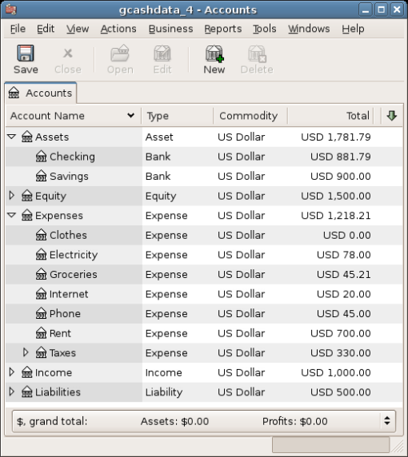
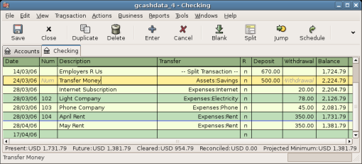
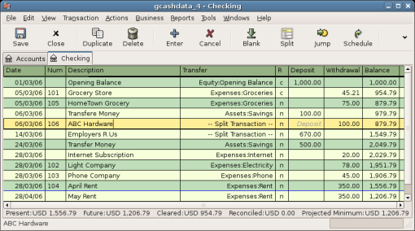
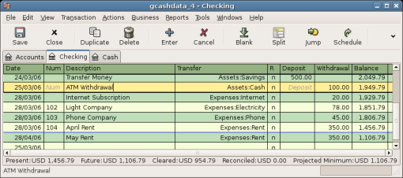
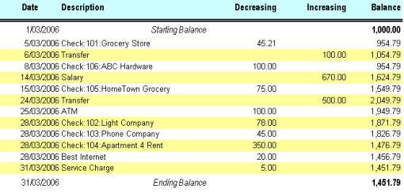
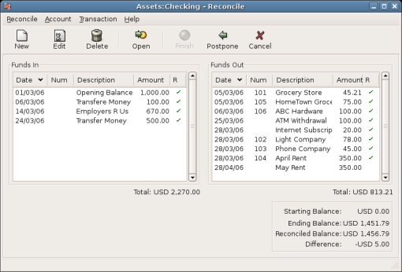
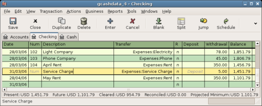
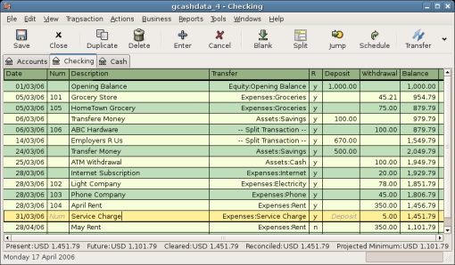
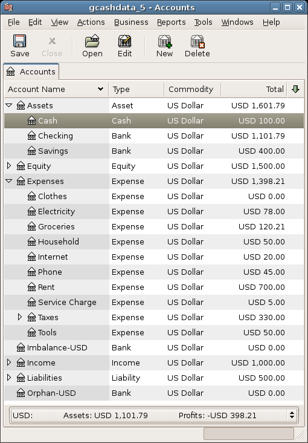
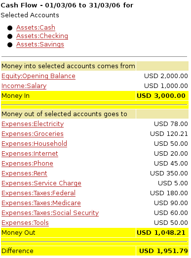
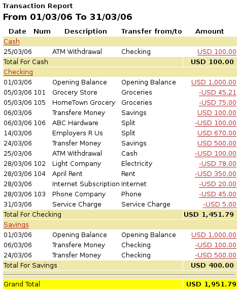
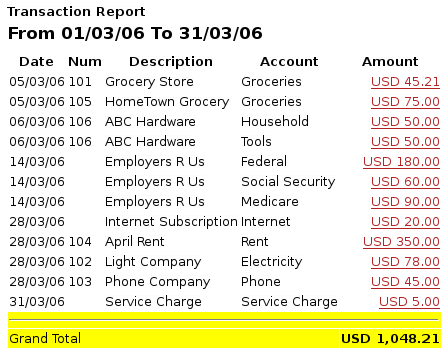
