.. _chapter_cc:

Credit Cards
============

This chapter will show you how to manage your credit cards using
GnuCash.

.. _cc-concepts1:

Concepts
--------

Since you probably write a check or make an electronic payment to the
credit card company each month, you may think of your credit card bill
as an expense - but it really is not an expense. Why? A credit card
account is a short-term loan - you buy things on that loan account, and
then you eventually have to pay back the money, often with interest
(your finance charge). The purchases you make with that credit card are
your expenses.

You have a couple of options when entering credit card transactions, so
choose the one that fits your desired level of detail. The simplest
method is to simply track monthly payments to the credit card company.
From your bank account, you enter a transfer of money each month to the
credit card expense account. This will show you the amount of money you
are paying each month to the credit card company, but it won’t show you
any information about your credit card balance or credit card purchases.

A more complete way to track your credit card in GnuCash is to enter
each purchase and payment as a separate transaction. Using the credit
card account register, you enter your receipts throughout the month.
When your credit card statement arrives, you reconcile the credit card
account to the statement, and you enter your payment as a transfer of
money from your checking account to your credit card account. This
method gives you more information about your balance during the month
and points out any discrepancies during reconciliation, but you will
have to do more data entry.

.. _cc-accounts1:

Setting Up Accounts
-------------------

To begin managing your credit cards in GnuCash, you should set up a
Liability top level account and under this parent account create credit
card type accounts for each credit card you use. If you are tracking
only the payments you make to the credit card company, then all you need
is a bank account and a credit card account to enter your transactions.

The charges you make on your credit card are expenses, so you will have
to set up these accounts under the top-level account called Expenses. If
you decide to keep a more detailed records of your purchases, you will
need to create expense accounts for each kind of purchase you make.
Since you will also be reconciling the balance to your credit card
statements, you should also enter an opening balance in each credit card
account. The easiest way to do this is to use your last statement
balance as the opening balance.

.. _cc-accounts-simple2:

Simple Setup
~~~~~~~~~~~~

If you do not want to track each expense made on the credit card, you
can set up a simple account hierarchy like this:

::

   -Assets
      -Bank
   -Liabilities
      -Credit Card
   -Expenses
      -Credit Card
      

In this example, if you enter your total amount charged per month as a
transaction between *Liabilities:Credit Card* and *Expenses:Credit
Card*. When you make a payment, you would enter a transaction between
*Assets:Bank* and *Liabilities:Credit Card*.

The obvious limitation of this simple credit card setup is that you
cannot see where your money is going. All your credit card expenses are
being entered in the Credit Card expense account. This is, however, very
simple to set up and maintain.

.. _cc-accounts-complete2:

Complete Setup
~~~~~~~~~~~~~~

If you want to track your expenses more completely, you should set up
multiple expense accounts named for the various kinds of expenses you
have. Each charge on your credit card is then entered as a separate
transaction between your Credit Card liability account and a specific
expense account. Below is an example of an account hierarchy for this:

::

   -Assets
       -Bank
   -Liabilities
       -Credit Card
   -Expenses
       -Food
       -Car
       -Clothes
       -Entertainment
       -Interest
       -Service
      

Clearly, you should enter specific expense accounts which fit your
spending habits. The only difference with this setup as compared to the
simple setup is that the expenses have been subdivided by groups. Also
notice that there is an “Interest” expense, this is used for when your
credit card charges interest on your monthly unpaid balance. The
“Service” expense account is used to track service expenses associated
with the credit card, such as the yearly usage fee if it exists. With
this setup, you will be able to see where your money goes every month,
grouped according to the expense accounts.

The rest of this chapter will assume you are using the complete setup.

.. _cc-entercharge1:

Entering Charges
----------------

Entering your charges provides you with a more complete picture of your
spending habits. Charges on a credit card are tracked as a transaction
between the credit card liability account and the appropriate expense
account.

When you pay for goods or services with your credit card, you are
telling the credit card company to pay the merchant for you. This
transaction will increase the amount of money you owe the credit card
company, and the credit card balance will increase. The other side of
these transactions will in most cases be an expense account. For
example, if you buy clothing from a store with your credit card for $50,
you would be transferring that money from the credit account into
Expenses:Clothing.

Entering these transactions into GnuCash allows you to track how much
you owe the credit card company, as well as provides you a better
picture of your overall accounts. It also allows you to monitor your
account and ensure that fraud is avoided.

Adding transactions to a credit card account is similar to entering
transactions in other accounts. You can enter them manually, or import
them from your credit card company using a compatible import format.

For assistance with entering transactions, see Chapter 6 of the Help
manual and :ref:`chapter_txns`.

.. _cc-enterpay1:

Entering Payments
-----------------

Most payments to your credit card bill are entered as transfers from a
bank account (asset) to the credit card account (liability). When you
pay the monthly bill, you are withdrawing money from a bank account to
pay down the credit card balance. This transaction decreases both your
bank account balance and the amount of credit card debt you owe.

When you return a purchase, you receive a refund on your credit card.
This is another type of payment in that it decreases the amount of
credit card debt you owe. If you recorded the original purchase
transaction as a transfer from the credit card account to the expense,
you now simply reverse that transaction: transfer the money back from
the expense to the credit card account. This transaction decreases both
the expense account balance and the credit card account balance. For
example, if you originally recorded a credit card purchase of clothing,
the transaction is a transfer from the credit card account to the
clothing expense account. If you then return that clothing for a refund,
you simply transfer the money back from the clothing expense account to
the credit card account.

.. note::

   A common mistake is to enter a refund as income. It is not income,
   but rather a “negative expense”. That is why you must transfer money
   from the expense account to your credit card when you receive a
   refund.

To clarify this, let’s run through an example. You bought some jeans for
$74.99 on your VISA card, but realized one day later that they are too
big and want to return them. The shop gracefully agrees, and refunds
your credit card.

1. Start with opening the previous datafile we stored (``gcashdata_5``),
   and store it as ``gcashdata_6``.

2. Open the *Liabilities:Visa* account register and enter a simple 2
   account transaction to pay the $74.99 jeans purchase. The Transfer
   account should be *Expenses:Clothes* and you Charge your *Visa*
   account with the $74.99.

   .. note::

      Since we had not created the *Expenses:Clothes* account
      previously, GnuCash will prompt us to create it. Just remember to
      create it as an Expense account

3. Enter the refund in one of the following way.

   -  Enter the same transaction as the purchase transaction, but
      instead of a “Charge” amount, use a “Payment” amount in the Credit
      Card account register.

   -  Select the purchase transaction you want to refund (that is the
      Jeans transaction in our case), and selecting Transaction > Add
      Reversing Transaction. Modify the date as needed.

   After reversing the transaction, your credit card account should look
   something like this:

   |Refunded a credit card purchase|

   And the *Expenses:Clothes* register should look something like this:

   |Refunded a credit card purchase|

4. Save the GnuCash data file.

.. _cc-together1:

Putting It All Together
-----------------------

Now that we have covered the basic ideas behind the various transactions
you must make to successfully track your credit card in GnuCash, let’s
go through an example. In this example, we will make credit card
purchases, refund two of the purchases, get charged interest on the
unpaid balance, reconcile the credit card account, and finally make a
partial payoff of the credit card.

.. _cc-puttoget-openfile:

Open GnuCash file
~~~~~~~~~~~~~~~~~

Start with opening the previous datafile we stored, ``gcashdata_5``, and
store it as ``gcashdata_6`` directly. The main window should look
something like this:

|Starting account structure|

.. _cc-together-purchases2:

Purchases
~~~~~~~~~

Let’s make some purchases on our visa card. Start by buying $25 worth of
food from the Greasy Spoon Cafe, $100 worth of clothing from Faux Pas
Fashions, $25 worth of gasoline from Premium Gasoline, $125 worth of
groceries and household items from Groceries R Us (split between $85 in
groceries and $40 in household items) and finally, $60 worth of
household items from CheapMart.

We also redo the exercise in previous chapter, with purchasing a pair of
Jeans for $74.99 on April 3, and refund them two days later.

The register window for the credit card liability should look like this:

|Initial credit card purchases|

.. _cc-together-refund2:

Refund
~~~~~~

Now suppose that on April 15th you return the clothes you bought on
April 11th from Faux Pas Fashions and they give you credit back on your
credit card. Enter a transaction for the credit card refund for the full
$100 amount. Remember to use the same transfer account you used for the
original purchase, and enter the amount under the Payment column.
GnuCash will automatically complete the name and transfer account for
you, but it will also automatically enter the $100 in the Charge column.
You will need to reenter the amount in the Payment column. The
transaction looks like this:

|Item return transaction|

.. _cc-together-interest2:

Interest Charge
~~~~~~~~~~~~~~~

After the month of spending, unfortunately, the credit card bill arrives
in the mail or you access it on-line through the internet. You have been
charged $20 in interest on the last day of April because of the balance
you carried from the previous month. This gets entered into the credit
card account as an expense.

|Interest charge|

.. _cc-together-reconcile2:

Reconciliation
~~~~~~~~~~~~~~

When your credit card bill arrives you should reconcile your credit card
account to this document. This is done using GnuCash’s built-in
reconciliation application. Highlight the credit card account and click
on Actions > Reconcile.... This reconciliation procedure is described in
detail in the :ref:`txns-reconcile1`, but we will step through the
process here as well. For this example, let’s assume that the credit
card statement is dated May 1st, with a final balance of $455. Enter
these values in to the initial Reconcile window as shown here.

|Initial reconcile window|

During the reconciliation process, you check off each transaction in the
account as you confirm that the transaction appears in both your GnuCash
account and the credit card statement. For this example, as shown in the
figure below, there is a $300 difference between your GnuCash accounts
and the credit card statement.

|Main reconcile window|

Some investigation uncovers that you forgot to record a payment you made
on March 5th to the credit card company for $300, you must enter this
payment transaction from your bank account to the credit card. Now the
credit card statement and your GnuCash account can be reconciled, with a
balance of $455.

.. _cc-together-payment2:

Payment
~~~~~~~

Assuming you have completed reconciliation of your credit card account,
you need to make a payment to the credit card company. In this example,
we owe $455 but will make a partial payment of $300 again this month. To
do so, enter a transaction from your bank account to the credit card
account for $300, which should reduce your credit card balance to $155.
Your credit card account register should now appear like this:

|Reconciliation and payment|

Go back to the main window and save your file (``gcashdata_6``). Your
chart of accounts is steadily growing, and it should now look like this:

|GnuCash main window|

.. _cc-puttoget-save:

Save file
~~~~~~~~~

Last, save the GnuCash data file (``gcashdata_6``).

.. _cc-puttoget-reports:

Reports
~~~~~~~

As we did in the previous chapters, let’s have a look at a Cash Flow,
and a Transaction Report.

1. First let’s have a look at the Cash Flow report for the liability
   account Visa during the month of March.

   Select the cash flow report from Reports > Income & Expense > Cash
   Flow.

   |Cash Flow report for the month of March|

2. Now let’s have a look at corresponding transaction report for the
   Visa account.

   Select the transaction report from Reports > Transaction Report.

   |Transaction Report for the Visa account during March/April|

3. Now let’s change the transaction report to only show the various
   Expenses accounts.

   |Transaction Report for the Expenses accounts during April|

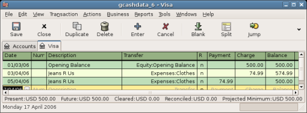
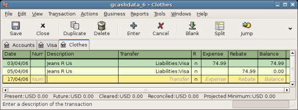
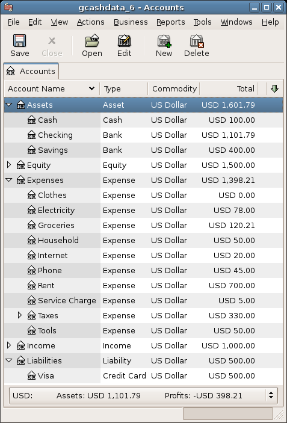
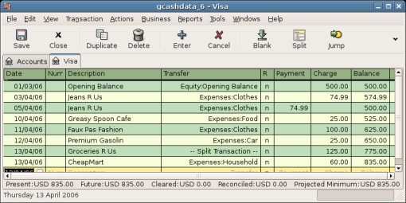
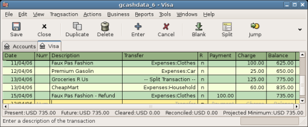
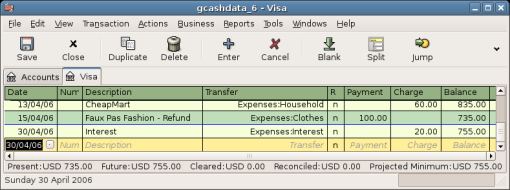
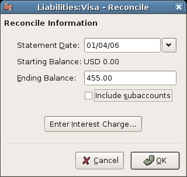
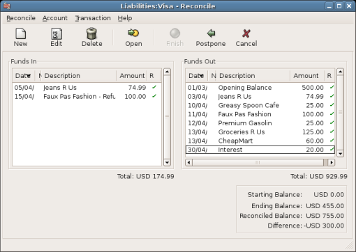
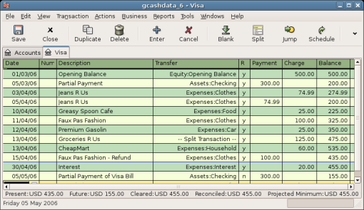
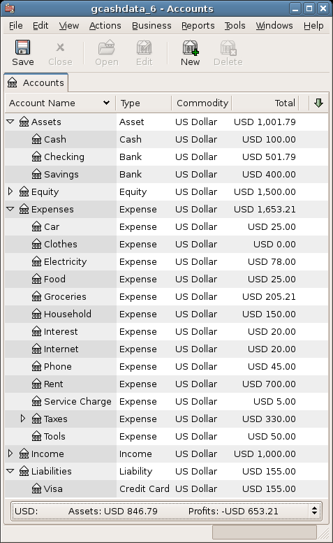
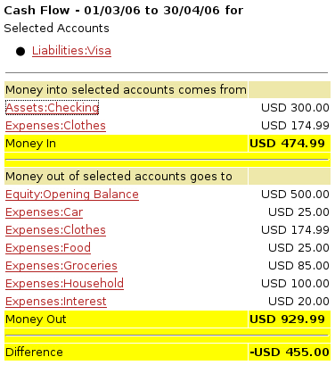
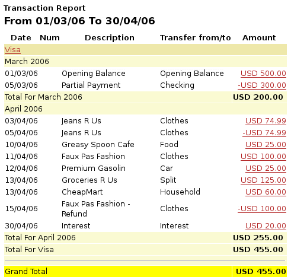
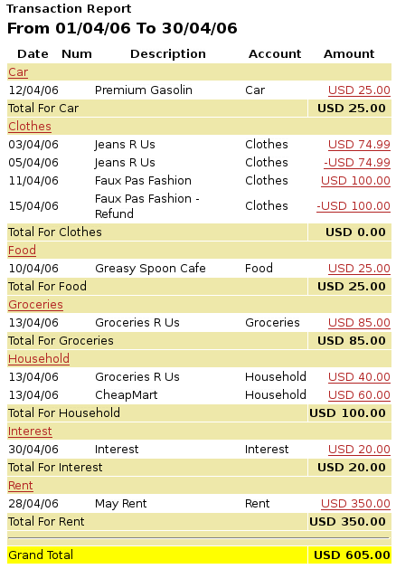
