.. _chapter_currency:

Multiple Currencies
===================

This chapter will show how to set up GnuCash accounts to use multiple
currencies.

.. _currency_concepts1:

Basic Concepts
--------------

GnuCash supports over a hundred currencies, from the Andorran Franc to
the Zimbabwe Dollar. For example, you can have a bank account set up in
Euros, and another using Hong Kong Dollars.

Some of the issues which arise when using multiple currencies are, how
do you transfer funds between accounts with different currencies? How do
you calculate the overall value when you have mixed currency accounts?
How do reports deal with mixed currencies?

.. note::

   An alternative way to manage multiple currency accounts from the one
   presented in the next sections, is to use the trading accounts
   capabilities of GnuCash. This feature, which was introduced with
   GnuCash version 2.3.14, can be enabled by going to the Accounts tab
   under File > Properties.

   For a complete guide on trading accounts, see `this tutorial by Peter
   Selinger <http://www.mathstat.dal.ca/~selinger/accounting/tutorial.html>`__.

.. _currency_acct1:

Account Setup
-------------

Your default account currency is set in the Account tab under Edit >
Preferences (GnuCash > Preferences on MacOS).

Similarly, GnuCash offers an option to set your preferred currency for
displaying reports (like the balance sheet and income statement). The
option is called Default Report Currency, and is in the Reports tab of
the GnuCash Preferences screen. You’ll want to set both options when you
start using GnuCash because if (for example) your accounts are all in
Canadian Dollars but the generated reports are all in US Dollars, the
reports will just say that there are “no data/transactions (or only
zeroes) for the selected time period”.

When you create a new account, you have the option to define the
commodity in which that account is denominated. For accounts denominated
in a currency, you can specify any of the currencies supported by
GnuCash by simply selecting it from the currency commodity list. You
will notice that the default currency is the currency that is defined
for the parent account of the new account.

As an example, let’s set up a bank account scenario where you mostly
work in US Dollars, but do also have a European bank account using the
Euro currency, as well as one bank account in Hong Kong using Hong Kong
Dollars. So, set up 3 bank accounts, one denominated in US Dollars, one
using Euros, and the third in Hong Kong Dollars. One possible account
structure for this would be:

::

   -Assets (USD)
      -Current Assets (USD)
         -US Bank (USD)
         -European Bank (EUR)
         -HK Bank (HKD)
   -Equity (USD)
      -Opening Balances (USD)
         -USD (USD)
         -EUR (EUR)
         -HKD (HKD)
    

.. note::

   The currency of each account is shown in parenthesis.

Since in this example you mostly work in USD, all of the parent accounts
are set to USD. Of course, if you mostly work in Euros, you could change
the currency of these parent accounts to EUR. The totals shown in the
account tree window will always be converted to the currency of each
particular account. Notice, we also set up 3 Starting Balances equity
accounts, used to initially populate the 3 banks.

.. note::

   You could also set up just a single Starting Balance account and use
   a currency transfer to populate the “different currency” accounts.
   However, this is more advanced option, which is explained in a later
   section (`Purchase of an Asset with Foreign
   Currency <#currency_purchase2>`__).

Below you see the result of this example, in which you start with USD
10,000, EUR 10,000 as well as HKD 10,000 in the three bank accounts.
Notice that the total of the parent accounts only shows the value of the
currency of sub-accounts with matching currencies. In other words, the
Total Assets and Total Equity values only reflect USD amounts, because
GnuCash has no way of evaluating the value of EUR or HKD yet. Once you
set up exchange rates between the currencies, the parent accounts will
calculate the converted value of all sub-accounts. See the later section
(`Recording and Updating Currency Exchange Rates <#currency_howto1>`__)
on ways to do this.

|Initial multi currency Account Bank Setup|

Notice that the "Total (Report)" column is being displayed. This is
configured in the column header row, select Arrow down and select
“Total(USD)”.

.. _currency_acct_user2:

User-Defined Currencies
~~~~~~~~~~~~~~~~~~~~~~~

Usually when we talk about currencies, we mean government-backed
currencies (or more precisely, currencies defined in `ISO
4217 <https://en.wikipedia.org/wiki/ISO_4217>`__). GnuCash does not
allow you to create your own currencies. If you want to track non-ISO
currencies, you can use either of two workarounds, depending on which
fits your needs better.

The **first method** is to treat these as if they were a security—that
is, like a stock or mutual fund. The second method is to use one of the
“dummy” currencies for them.

Let’s say for example that you want to track loyalty points you’ve
earned by buying from a certain group of businesses. The account which
tracks your loyalty points will be
*Assets:Other:LoyaltyGroupRewardMiles*.

In the first method, you define a new security, of type FUND, called
RewardMiles. This is pretty straightforward—when you create the new
*LoyaltyGroupRewardMiles* account, just set the account type to Stock or
Mutual Fund, click the Select... button next to the Security/currency:
box, and click New to define a new security of type FUND.

This is not really what the stock and mutual fund account types are
meant for, but GnuCash will allow it. The downside is that you’ll have
to enter a “price” for every transaction involving this account, because
GnuCash needs the prices to figure out the monetary value of the points
and treat them as one of your assets.

In the **second method**, you use one of the dummy currencies to track
the loyalty points. These currencies are “XTS (Code for testing
purposes)” and “XXX (No currency)”. If you use one of these for your
LoyaltyGroupRewardMiles account, you can enter transactions into the
account without having to enter share prices for every transaction. And,
you can keep using the same two dummy currencies to track all sorts of
amounts—vacation dollars earned and used so far this year, vacation
hours earned and used, health insurance benefits allowance used and
remaining, and so on.

The drawback with this second method is that you cannot define exchange
rates for the dummy currencies to convert them to ISO currencies. If you
want to do that, you really should use the first method.

.. _currency_howto1:

Recording and Updating Currency Exchange Rates
----------------------------------------------

GnuCash allows you to update the Currency Exchange Rates both manually
and automatically. This process is essentially the same as setting share
prices for investments (see `??? <#invest-stockprice1>`__). In the
following two sections we will work through both methods.

Before we start, let’s have a quick look at the Chart of Accounts

|Initial multi currency Account Bank Setup|

As you see, the overall balances do not yet reflect any value for EUR or
HKD holdings. Adding currency exchange rates will fix this.

.. _currency_howto_Manual:

Manually Updating Exchange Rates
~~~~~~~~~~~~~~~~~~~~~~~~~~~~~~~~

Open the Price Editor by going to Tools > Price Editor.

|Price Editor window|

Click on the Add button to add a new currency exchange rate. A window
will appear in which you can set up a new exchange rate. This window
should appear like this:

|Set up Euro Exchange Rate|

Set the Namespace to Currency and the Security to EUR (Euro). Then set
the exchange rate between the selected security and the selected
currency. The price box defines how many units of currency are required
to purchase one unit of the security. In this case, how many dollars it
will take to purchase on Euro. In this example, you will set the
exchange rate to 1 EUR for 1 USD.

|Price Editor Window|

|Chart of Accounts|

Observe that since you have no exchange rate for HKD, GnuCash doesn’t
convert the HKD accounts to USD. This will be added in the next section.

.. _currency_howto_Auto:

Automatic Updating Exchange Rates (How-To)
~~~~~~~~~~~~~~~~~~~~~~~~~~~~~~~~~~~~~~~~~~

In the previous section you saw how to manually define a new currency
exchange rate, but GnuCash includes an automatic price update feature,
which will now be described.

Open the Price Editor by going to Tools > Price Editor.

|Price Editor window|

Click on the Get Quotes button to automatically load the various
exchange rates you need.

.. note::

   If the Get Quotes button is disabled, that means that the Perl module
   Finance::Quote is not installed. For information on how to install
   it, please see `??? <#invest-stockprice-auto2>`__

Price Editor window Price Editor Window after we obtained online quotes.

GnuCash downloads exchange rates for all currencies that are in use in
your various accounts. This will happen every time you click on Get
Quotes or request GnuCash to download quotes as per
`??? <#invest-stockprice-auto2>`__

Now when you check the main Chart of Accounts you will see that GnuCash
has automatically converted the HKD amount to USD amount on the parent
accounts that are in USD, as well as on the Total (USD) column. Also the
Euro accounts have been been updated with the latest exchange rate.

|Price Editor window|

.. _currency_howto_disable:

Disabling Exchange Rate Retrieval
~~~~~~~~~~~~~~~~~~~~~~~~~~~~~~~~~

Whenever you create an account that uses a non-default currency,
exchange rate retrieval will be automatically enabled for that currency.
However, if you later delete that account, GnuCash will not
automatically disable exchange rate retrieval for that currency.

If you have deleted the last account for a particular currency, and you
do not wish to retrieve exchange rates for that currency anymore, do the
following:

-  Open the Securities window by selecting Tools > Security Editor.

-  Make sure the Show National Currencies box is selected.

-  Expand the CURRENCY row.

-  Double click on the currency for which you want to disable exchange
   rate retrieval.

-  Deselect the Get Online Quotes box and click OK.

.. _currency_purchase1:

Recording Purchases in a Foreign Currency
-----------------------------------------

Purchases in a foreign currency can be managed in two different ways.

1) Use GnuCash's built-in currency exchange functions when you do your
transactions. This is mainly used for one-time transactions, and nothing
which happens regularly.

2) Use separate accounts to track transactions, where all involved
accounts use the same currency. This is the recommended method, since it
allows much better tracking and follow up. In this way, you do one
currency exchange transaction, and after that you do normal transactions
in the native currency.

The rest of this section will explain more based upon option 2).

.. _currency_purchase2:

Purchase of an Asset with Foreign Currency
~~~~~~~~~~~~~~~~~~~~~~~~~~~~~~~~~~~~~~~~~~

You are using USD as your default currency. But, you decide to purchase
a boat in Jamaica. To do this, you opened a bank account in Jamaica,
moved some money from the US, and then purchased your boat.

To record this in GnuCash we use the following basic account structure:

::

   -Assets (USD)
      -Current Assets (USD)
         -US Bank (USD)
         -Jamaican Bank (JMD)
      -Fixed Assets (USD)
         -Boat (JMD)
   -Equity (USD)
      -Opening Balances (USD)
         -USD (USD)
         

.. note::

   The currency of each account is shown in parenthesis.

First you need to transfer some money ($10,000) to Jamaica, and you use
your US bank account (with a balance of $100,000) for that. The bank
gives you an exchange rate of USD 1 = JMD 64, but charges you USD 150 to
transfer the money.

|Currency transfer|

Select the Jamaica transaction line ($9,850.00), right click and select
Edit Exchange Rate

|Edit Exchange rate|

As Exchange Rate, you enter 1 USD = 64 JMD, since this is the rate your
bank gave. Press ok in the Transfer Funds (Edit Exchange Rate) window,
and then save this split transaction. Below is how it now looks in the
main Chart of Accounts.

|Chart of Accounts before purchasing the boat|

You choose to buy a boat for JMD 509,000. To record this transaction in
GnuCash, you will need to enter a simple transaction in *Assets:Current
Assets:Jamaican Bank* withdrawing JMD 509,000 and transferring it to
*Assets:Fixed Assets:Boat*

|Chart of Accounts after purchasing the boat|

The Chart of Accounts now reflects that your bank account has been
reduced by JMD 509,000, and that your Fixed Assets boat account has been
increased by the same amount. If you also have turned on the CoA (Column
Choice) "Total (USD)" you will see the corresponding value in USD. The
USD value will always reflect the latest currency exchange rate you have
either automatically or manually retrieved.

.. _currency_purchase3:

Purchasing Foreign Stocks
~~~~~~~~~~~~~~~~~~~~~~~~~

This example will show how to purchase stocks that are priced in a
currency other than your primary currency.

Assume that you live in New York and therefore you have set the default
currency to USD. You decide to purchase a stock traded in Hong Kong that
is priced in HKD. You would also like to be able to track the various
income and expense amounts per stock and broker.

You decide to purchase stock in the Beijing Airport (Hong Kong). The
ticker for this stock is 0694.HK on Yahoo! Since you wanted to track all
various income and expense amounts, here is the necessary account
structure:

::

   Assets:Investments:Brokerage Accounts:Boom:0694.HK (0694.HK)
   Assets:Investments:Brokerage Accounts:Boom:Bank (HKD)
   Equity:Opening Balances:HKD (HKD)
   Expenses:Commissions:Boom.0694.HK (HKD)
   Income:Investments:Dividend:Boom:0694.HK (HKD)
         

The Chart of Accounts looks like this after creating all the needed
accounts:

|Chart of Accounts for international stocks|

The stock definition can be seen in the Security Editor. (Tools >
Security Editor)

|International securities|

If you have not moved money (HKD 50,000) into the brokerage cash account
(*Assets:Investments:Brokerage Account:Boom:Bank*), do so now, either
using the Equity (HKD) account, or an existing bank account (Currency
Transfer).

There are two ways to enter the actual purchase transaction: you can
enter it from the cash account (shown below), or you can enter it from
the stock account. *If entered from the stock account, the stock is
assumed to be priced in the currency of the parent account*.

Let’s assume that the stock price is HKD 3 per share. To record the
purchase, open the brokerage’s HKD cash account
(*Assets:Investments:Brokerage Account:Boom:Bank*), and enter the
following:

**Buy Stocks**

+------------------------------------------+-------------+-------------+
| Assets:Investments:Brokerage             | Withdrawal  | 50,000      |
| Account:Boom:Bank                        |             |             |
+------------------------------------------+-------------+-------------+
| Expenses:Investments:Commission:Boom_HKD | Deposit     | 500         |
+------------------------------------------+-------------+-------------+
| Assets:Investments:Brokerage             | Deposit     | 49,500      |
| Account:Boom:0694                        |             | (16,500     |
|                                          |             | shares)     |
+------------------------------------------+-------------+-------------+

If the exchange rate dialog box does not appear automatically,
right-click on the stock row, and select Edit Exchange Rate. Enter the
number of shares (16,500) as the To Amount.

|Transfer Funds|

When you return to the Chart of Accounts, you will see the purchased
shares reflected in the stock account’s total.

|Purchased international stocks|

However, as you can see, the USD totals may be zero if GnuCash doesn’t
have an exchange rate between USD and HKD. To fix this, go to Tools >
Price Editor and click the Get Quotes button to automatically retrieve
the exchange rates you need.

.. note::

   To reiterate, this example shows how stock can be purchased in any
   currency by entering the transaction in the register of the cash
   account used to make payment. It is also possible to enter the
   purchase in the stock account’s register, but be aware that the stock
   is assumed to be priced in the currency of the stock account’s
   parent.

   In this example, the stock account’s parent
   (*Assets:Investments:Brokerage Account:Boom*) is denominated in HKD.
   Since this is same currency as the stock price, the purchase can be
   safely entered in the stock account’s register.

.. _currency_invest1:

Tracking Currency Investments
-----------------------------

Currency investment is when you decide to invest in a different
country's currency, and hope that it will rise in value relative your
own currency.

When you enter these transactions into GnuCash, you will have to decide
on how much detail you would like to have.

If you are not interested in detail at all, a very simple account
structure would suffice:

::

       Assets:Investments:Currency:Bank (USD)
       Assets:Investments:Currency:XXX (XXX)
       

You would simply enter transfers between the two accounts, noting
exchange rates as you went.

But, if you do want to be able to track capital gains or losses, as well
as any fees, you do need a more complex account structure, such as:

::

       Assets:Investments:Currency:Bank (USD)
       Assets:Investments:Currency:Currency Bank:XXX (XXX)
       Expenses:Investments:Currency:Currency Bank:XXX (XXX)
       Income:Investments:Currency Bank:Capital Gains:XXX (XXX)
       

.. _currency_invest12:

Purchasing Currency
~~~~~~~~~~~~~~~~~~~

When purchasing another currency, you will buy a certain number of units
of foreign currency with your own currency, at a particular rate. For
example, you might buy USD 10,000 worth of Andorran Francs, at 5 Francs
to the dollar, with a transaction fee of $150.

**Buy Currency**

+--------------------------------------------+-----------------+--------+
| Assets:Investments:Currency:Bank           | Withdrawal      | 10,000 |
+--------------------------------------------+-----------------+--------+
| Expenses:Investments:Currency:Currency     | Deposit         | 150    |
| Bank:ADF                                   |                 |        |
+--------------------------------------------+-----------------+--------+
| Assets:Investments:Currency:ADF            | Deposit         | 49,250 |
+--------------------------------------------+-----------------+--------+

The Exchange Rate window should pop up when you leave the last row in
the split above (Currency Transaction). If this window does not pop up,
right click on the row or select Actions, and select Edit Exchange Rate.
In the Exchange Rate window you specify the exchange rate you got from
the bank.

.. _currency_invest13:

Selling a currency investment
~~~~~~~~~~~~~~~~~~~~~~~~~~~~~

Entering a currency sale is done in the same way as a currency buy
except that you are now transferring money from the Currency account to
your Savings account (very similar to `??? <#invest-sell1>`__).

The proper recording of the currency sale \*must\* account for realized
gains or losses. This can be done using a split transaction. In the
split transaction, you must account for the profit (or loss) as coming
from an *Income:Capital Gains* account (or *Expenses:Capital Loss*). To
balance this income, you will need to enter the Currency asset twice in
the split—once to record the actual sale (using the correct amount and
correct exchange rate), and once to balance the income profit (setting
the amount to 0).

In short, a selling Currency transaction should look something like
below, seen again from the *Assets:Investments:Currency:Bank*.

.. table:: Selling a currency with a Split Transaction Scheme

   +------------------------------------------+-------------+-------------+
   | Account                                  | Deposit     | Withdrawal  |
   +==========================================+=============+=============+
   | Assets:Investments:Currency:Bank         | Sold Amount |             |
   |                                          | - Exchange  |             |
   |                                          | Fee         |             |
   +------------------------------------------+-------------+-------------+
   | Expenses:Investments:Currency:Currency   | Exchange    |             |
   | Bank:XXX                                 | Fee         |             |
   +------------------------------------------+-------------+-------------+
   | Assets:Investments:Currency:XXX          |             | Sold Amount |
   +------------------------------------------+-------------+-------------+
   | Income:Investments:Currency Bank:Capital | [LOSS]      | PROFIT      |
   | Gains:XXX                                |             |             |
   +------------------------------------------+-------------+-------------+
   | Assets:Investments:Currency:XXX          | PROFIT      | [LOSS (with |
   |                                          | (with To    | To Amount = |
   |                                          | Amount = 0) | 0) ]        |
   +------------------------------------------+-------------+-------------+

.. _currency_reconcile1:

Reconciling Statements in a Foreign Currency
--------------------------------------------

Reconciling foreign statement are done in the same manner as when you
reconcile your local bank statement. If you have created a Chart of
Accounts structure which allows you to have the same currency per
account as your statement, it is actually exactly the same as
reconciling your local bank statement.

If you have different currencies you might have to manually convert the
amounts from one currency to another while you reconcile the accounts.

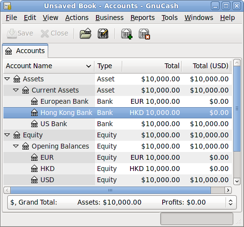
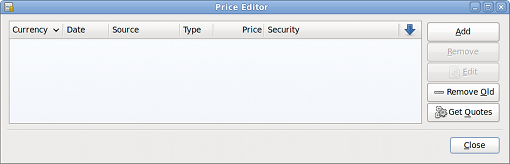
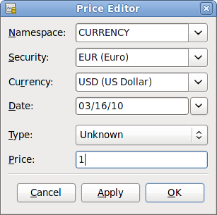
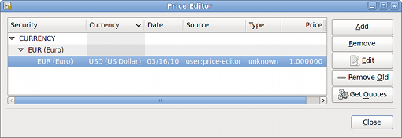
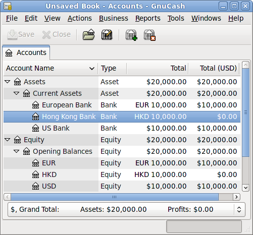

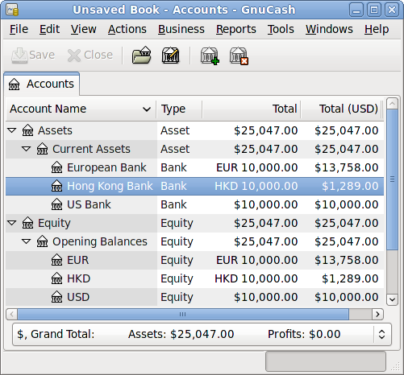
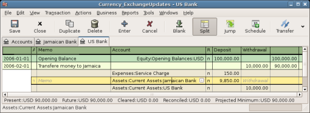
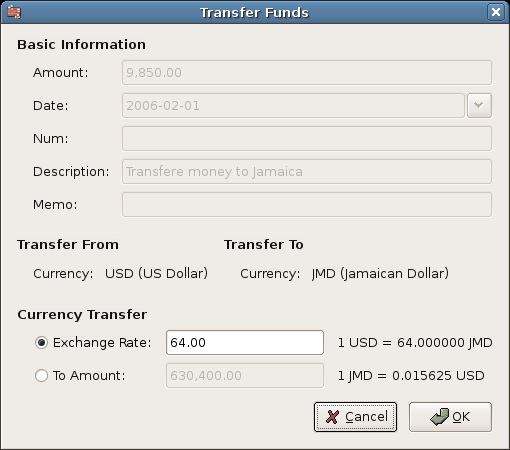
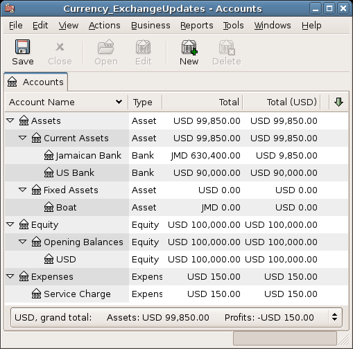
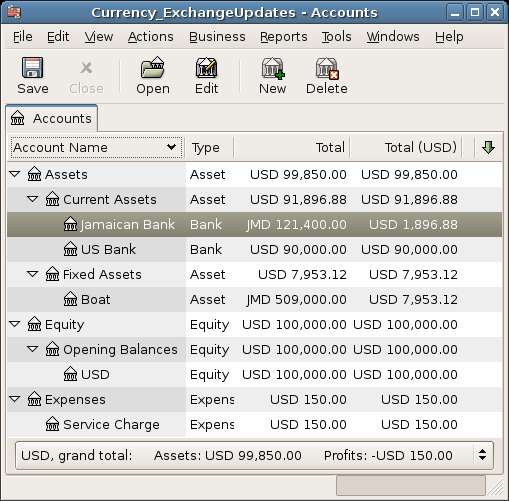
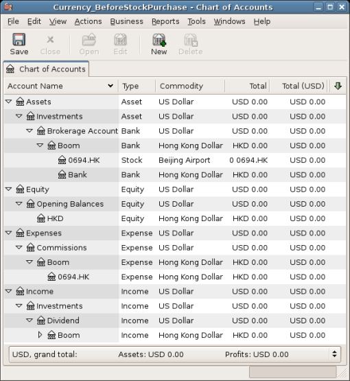
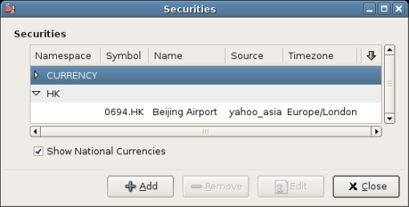
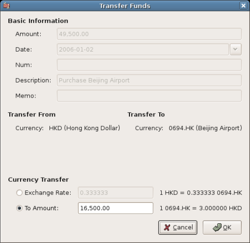
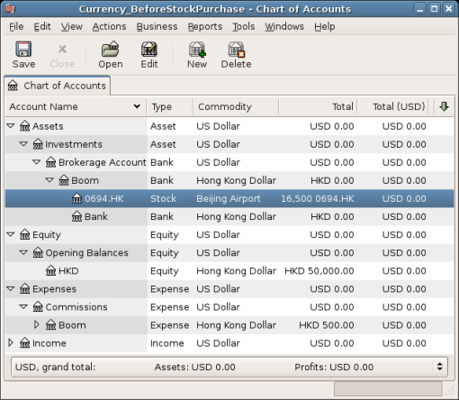
