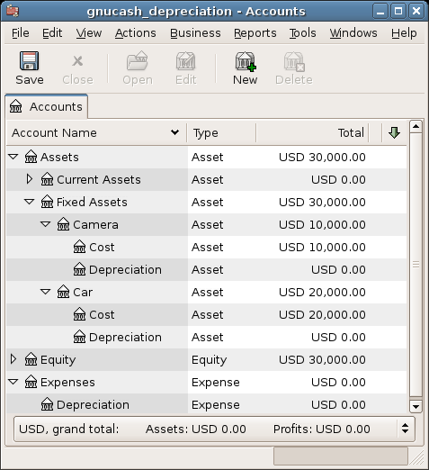
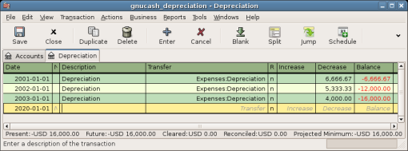
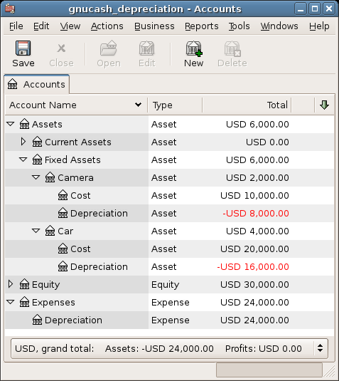

.. _chapter_dep:

Depreciation
============

This chapter will introduce the concept of depreciation in accounting
and give some real life examples for using it.

.. _dep_concepts1:

Basic Concepts
--------------

Depreciation is the accounting method for expensing capital purchases
over time. There are two reasons that you may want to record
depreciation; you are doing bookkeeping for your own personal finances
and would like to keep track of your net worth, or you are doing
bookkeeping for a small busines and need to produce a financial
statement from which you will prepare your tax return.

The method of recording depreciation is the same in either case. but the
end goal is different. This section will discuss the differences between
the two. But first, some terminology.

-  *Accumulated depreciation* - the accumulated total of book
   depreciation taken over the life of the asset. This is accumulated in
   the depreciation account in the asset section.

-  *Book depreciation* - this is the amount of depreciation that you
   record in your financial statements per accounting period.

-  *Fair market value* - the amount for which an asset could be sold at
   a given time.

-  *Net book value* - this is the difference between the original cost
   and the depreciation taken to date.

-  *Original cost* - this is the amount that the asset cost you to
   purchase. It includes any cost to get the asset into a condition in
   which you can use it. For example - shipping, installation costs,
   special training.

-  *Salvage value* - this is the value that you estimate the asset can
   be sold for at the end of it’s useful life (to you).

-  *Tax depreciation* - this is the amount of depreciation that you take
   for income tax purposes.

.. _dep_concepts_personal2:

Personal Finances
~~~~~~~~~~~~~~~~~

Depreciation is used in personal finances to periodically lower an
asset’s value to give you an accurate estimation of your current net
worth. For example, if you owned a car you could keep track of its
current value by recording depreciation every year. To accomplish this,
you record the original purchase as an asset, and then record a
depreciation expense each year (See `Example <#dep_example1>`__ for an
example). This would result in the net book value being approximately
equal to the fair market value of the asset at the end of the year.

Depreciation for personal finance has no tax implications, it is simply
used to help you estimate your net worth. Because of this, there are no
rules for how you estimate depreciation, use your best judgement.

For which assets should you estimate depreciation? Since the idea of
depreciation for personal finances is to give you an estimate of your
personal net worth, you need only track depreciation on assets of
notable worth that you could potentially sell, such as a car or boat.

.. _dep_concepts_business2:

Business
~~~~~~~~

As opposed to personal finance where the goal is tracking personal
worth, business is concerned with matching the expense of purchasing
capital assets with the revenue generated by them. This is done through
book depreciation. Businesses must also be concerned with local tax laws
covering depreciation of assets. This is known as tax depreciation. The
business is free to choose whatever scheme it wants to record book
depreciation, but the scheme used for tax depreciation is fixed. More
often than not this results in differences between book and tax
depreciation, but steps can be taken to reduce these differences.

Now, what purchases should be capitalized? If you expect something that
you purchase to help you earn income for more than just the current
year, then it should be capitalized. This includes things like land,
buildings, equipment, automobiles, and computers - as long as they are
used for business purposes. It does not include items that would be
considered inventory. So if you made a purchase with the intent to
resell the item, it should not be capitalized.

In addition to the purchase of the asset itself, any costs associated
with getting the asset into a condition so that you can use it should be
capitalized. For example, if you buy a piece of equipment and it needs
to be shipped from out of town, and then some electrical work needs to
be done so you can plug the machine in, and some specialized training is
needed so you know how to use the machine, all these costs would be
included in the cost of the equipment.

You also need to know the estimated salvage value of the asset.
Generally, this is assumed to be zero. The idea behind knowing the
salvage value is that the asset will be depreciated until the net book
value (cost less depreciation) equals the salvage value. Then, when the
asset is written off, you will not have a gain or loss resulting from
the disposal of the asset.

The last step is to determine the method of depreciation that you want
to use. This will be discussed on the next few pages.

.. warning::

   Be aware that different countries can have substantially different
   tax policies for depreciation; all that this document can really
   provide is some of the underlying ideas to help you apply your
   “favorite” tax/depreciation policies.

.. _dep_value1:

Estimating Valuation
--------------------

A central issue with depreciation is to determine how you will estimate
the future value of the asset. Compared to the often uncertain estimates
one has to do where appreciation of assets is concerned, we are on
somewhat firmer ground here. Using sources listed below should make it
fairly straight forward to estimate the future value of your
depreciating assets.

-  *Tax Codes:* For businesses that want to use depreciation for tax
   purposes, governments tend to set up precise rules as to how you are
   required to calculate depreciation. Consult your local tax codes,
   which should explicitly state how to estimate depreciation.

-  *Car Blue Book:* For automobiles, it is easy to look up in references
   such as “Blue Books” estimates of what an automobile should be worth
   after some period of time in the future. From this you will be able
   to develop a model of the depreciation.

.. _dep_valueschemes2:

Depreciation Schemes
~~~~~~~~~~~~~~~~~~~~

A *depreciation scheme* is a mathematical model of how an asset will be
expensed over time. For every asset which undergoes depreciation, you
will need to decide on a depreciation scheme. An important point to keep
in mind is that, for tax purposes, you will need to depreciate your
assets at a certain rate. This is called tax depreciation. For financial
statement purposes you are free to choose whatever method you want. This
is book depreciation. Most small businesses use the same rate for tax
and book depreciation. This way there is less of a difference between
your net income on the financial statements and your taxable income.

This section will present 3 of the more popular depreciation schemes:
*linear*, *geometric*, and *sum of digits*. To simplify the examples, we
will assume the salvage value of the asset being depreciated is zero. If
you choose to use a salvage value, you would stop depreciating the asset
once the net book value equals the salvage value.

1. *Linear depreciation* diminishes the value of an asset by a fixed
   amount each period until the net value is zero. This is the simplest
   calculation, as you estimate a useful lifetime, and simply divide the
   cost equally across that lifetime.

   Example: You have bought a computer for $1500 and wish to depreciate
   it over a period of 5 years. Each year the amount of depreciation is
   $300, leading to the following calculations:

   .. table:: Linear Depreciation Scheme Example

      ====== ============== =================
      *Year* *Depreciation* *Remaining Value*
      0      -              1500
      1      300            1200
      2      300            900
      3      300            600
      4      300            300
      5      300            0
      ====== ============== =================

2. *Geometric depreciation* is depreciated by a fixed percentage of the
   asset value in the previous period. This is a front-weighted
   depreciation scheme, more depreciation being applied early in the
   period. In this scheme the value of an asset decreases exponentially
   leaving a value at the end that is larger than zero (i.e.: a resale
   value).

   Example: We take the same example as above, with an annual
   depreciation of 30%.

   .. table:: Geometric Depreciation Scheme Example

      ====== ============== =================
      *Year* *Depreciation* *Remaining Value*
      0      -              1500
      1      450            1050
      2      315            735
      3      220.50         514.50
      4      154.35         360.15
      5      108.05         252.10
      ====== ============== =================

   .. note::

      Beware: Tax authorities may require (or allow) a larger percentage
      in the first period. On the other hand, in Canada, this is
      reversed, as they permit only a half share of “Capital Cost
      Allowance” in the first year. The result of this approach is that
      asset value decreases more rapidly at the beginning than at the
      end which is probably more realistic for most assets than a linear
      scheme. This is certainly true for automobiles.

3. *Sum of digits* is a front-weighted depreciation scheme similar to
   the geometric depreciation, except that the value of the asset
   reaches zero at the end of the period. This is a front-weighted
   depreciation scheme, more depreciation being applied early in the
   period. This method is most often employed in Anglo/Saxon countries.
   Here is an illustration:

   Example: First you divide the asset value by the sum of the years of
   use, e.g. for our example from above with an asset worth $1500 that
   is used over a period of five years you get 1500/(1+2+3+4+5)=100.
   Depreciation and asset value are then calculated as follows:

   .. table:: Sum of Digits Depreciation Scheme Example

      ====== ============== =================
      *Year* *Depreciation* *Remaining Value*
      0      -              1500
      1      100*5=500      1000
      2      100*4=400      600
      3      100*3=300      300
      4      100*2=200      100
      5      100*1=100      0
      ====== ============== =================

.. _dep_accounts1:

Account Setup
-------------

As with most accounting practices, there are a number of different ways
to setup depreciation accounts. We will present here a general method
which should be flexible enough to handle most situations. The first
account you will need is an *Asset Cost* account (GnuCash account type
Asset), which is simply a place where you record the original purchase
of the asset. Usually this purchase is accomplished by a transaction
from your bank account.

In order to keep track of the depreciation of the asset, you will need
two depreciation accounts. The first is an *Accumulated Depreciation*
account in which to collect the sum of all of the depreciation amounts,
and will contain negative values. In GnuCash, this is an account type
*asset*. The *Accumulated Depreciation* account is balanced by a
*Depreciation Expense* account, in which all periodic depreciation
expenses are recorded. In GnuCash, this is an account type *expense*.

Below is a generic account hierarchy for tracking the depreciation of 2
assets, *ITEM1* and *ITEM2*. The *Asset Cost* accounts are balanced by
the *Bank* account, the *Accumulated Depreciation* account is balanced
by the *Expenses:Depreciation* account.

::

   -Assets
      -Fixed Assets
         -ITEM1
            -Cost                (Asset Cost account)
            -Depreciation     (Accumulated Depreciation account)
         -ITEM2
            -Cost                (Asset Cost account)
            -Depreciation     (Accumulated Depreciation account)
      -Current Assets
         -Bank
   -Expense
      -Depreciation        (Depreciation Expense account)
     

One of the features of the account hierarchy shown above is that you can
readily see some important summary values about your depreciating asset.
The *Assets:Fixed Assets:ITEM1* account total shows you the current
estimated value for item1, the *Assets:Fixed Assets:ITEM1:Cost* shows
you what you originally paid for item1, *Assets:Fixed
Assets:ITEM1:Depreciation* shows you your accrued depreciation for
item1, and finally, *Expenses:Depreciation* demonstrates the total
accrued depreciation of all your assets.

It is certainly possible to use a different account hierarchy. One
popular account setup is to combine the *Asset Cost* and *Accrued
Depreciation* asset accounts. This has the advantage of having fewer
accounts cluttering your account hierarchy, but with the disadvantage
that to determine some of the summary details mentioned in the paragraph
above you will have to open the account register windows. As with most
things, there are many ways to do it, find a way that works best for
you.

The actual input of the depreciation amounts is done by hand every
accounting period. There is no way in GnuCash (as of yet) to perform the
depreciation scheme calculations automatically, or to input the values
automatically into the appropriate accounts. However, since an
accounting period is typically one year, this really is not much work to
do by hand.

.. _dep_example1:

Example
-------

Let’s go ahead and step through an example. Imagine you are a
photographer and you use a car and an expensive camera for your personal
business. You will want to track the depreciation on these items,
because you can probably deduct the depreciation from your business
taxes.

The first step is to build the account hierarchy (as shown in the
previous section, replace *ITEM1* and *ITEM2* with “car” and “camera”).
Now, record the purchase of your assets by transferring the money from
your bank account to the appropriate *Asset Cost* accounts for each item
(eg: the *Assets:Fixed Assets:Car:Cost* account for the car). In this
example, you start with $30k in the bank, the car cost $20k and the
camera cost $10k and were both purchased on January 1, 2000.

|Asset Depreciation Example1|

Looking at the tax codes, we realize that we must report depreciation on
these items using the “sum of digits” scheme, over a 5 year period. So,
the yearly depreciation amounts for the car come to $6667, $5333, $4000,
$2667, $1333 for years 1 to 5 respectively, rounded to the nearest
dollar. The yearly depreciation amounts for the camera are $3333, $2667,
$2000, $1333, $667. Consult the previous section on Depreciation Schemes
for the formula for calculating these values.

For each accounting period (IE: fiscal year) you record the depreciation
as an expense in the appropriate *Accrued Depreciation* account (eg: the
*Assets:Fixed Assets:Car:Depreciation* account for the car). The two
windows below show your car’s accrued depreciation account and the main
window after the third year (IE: three periods) of depreciation using
this sum of digits scheme.

|Asset Depreciation Register Window|

|Asset Depreciation Main Window|

.. note::

   A Word of Caution: Since depreciation and tax issues are closely
   related, you may not always be free in choosing your preferred
   method. Fixing wrong calculations will cost a whole lot more time and
   trouble than getting the calculations right the first time, so if you
   plan to depreciate assets, it is wise to make sure of the schemes you
   will be permitted or required to use.

