.. _chapter_invest:

Investments
===========

This chapter explains how to manage your investments with GnuCash. Most
people have an investment plan, whether its just putting money into a CD
account, investing through a company sponsored plan at your workplace or
buying and selling stocks and bonds through a brokerage. GnuCash gives
you tools to help you manage these investments such as the *Price
Editor* which allows you to record changes in the prices of stocks you
own.

.. _invest_concepts1:

Basic Concepts
--------------

An investment is something that you purchase in the hopes of generating
income, or that you hope to sell in the future for more than you paid.
Using this simple definition, many things could be considered
investments: the house you live in, a valuable painting, stocks in
publicly traded companies, your savings account at the bank, or a
certificate of deposit. These many types of investments will be
discussed in this chapter in terms of how to track them using GnuCash.

.. _invest_terms2:

Terminology
~~~~~~~~~~~

Before discussing investments specifically, it will be helpful to
present a glossary of investment terminology. The terms presented below
represent some of the basic concepts of investing. It is a good idea to
become familiar with these terms, or at least, refer back to this list
if you encounter an unfamiliar word in the later sections.

*Capital gains*
   The difference between the purchase and selling prices of an
   investment. If the selling price is lower than the purchase price,
   this is called a *capital loss*. Also known as *realized gain/loss*.

*Commission*
   The fee you pay to a broker to buy or sell securities.

*Common stock*
   A security that represents a certain fractional ownership of a
   company. This is what you buy when you “buy stock” in a company on
   the open market. This is also sometimes known as *capital stock*.

*Compounding*
   The concept that the reinvested interest can later earn interest of
   its own (interest on interest). This is often referred to as
   *compound interest*.

*Dividends*
   Dividends are cash payments a company makes to shareholders. The
   amount of this payment is usually determined as some amount of the
   profits of the company. Note that not all common stocks give
   dividends.

*Equities*
   Equities are investments in which the investor becomes part (or
   whole) owner in something. This includes common stock in a company,
   or real estate.

*Interest*
   What a borrower pays a lender for the use of their money. Normally,
   this is expressed in terms of a percentage of the principal per year.
   For example, a savings account with 1% interest (you are the lender,
   the bank is the borrower) will pay you $1 for every $100 you keep
   there per year.

*Liquidity*
   A measure of how easily convertible an investment is to cash. Money
   in a savings account is very liquid, while money invested in a house
   has low liquidity because it takes time to sell a house.

*Principal*
   The original amount of money invested or borrowed.

*Realized vs Unrealized Gain/Loss*
   Unrealized gain or loss occurs when you’ve got a change in price of
   an asset. You realize the gain/loss when you actually sell the asset.
   See also *capital gain/loss*.

*Return*
   The total income plus capital gains or losses of an investment. See
   also *Yield*.

*Risk*
   The probability that the return on investment is different from what
   was expected. Investments are often grouped on a scale from low risk
   (savings account, government bonds) to high risk (common stock, junk
   bonds). As a general rule of thumb, the higher the risk the higher
   the possible return.

*Shareholder*
   A shareholder is a person who holds common stock in a company.

*Stock split*
   Occurs when a company offers to issue some additional multiple of
   shares for each existing stock. For example, a “2 for 1” stock split
   means that if you own 100 shares of a stock, you will receive an
   additional 100 at no cost to you. The unit price of the shares will
   be adjusted so there is no net change in the value, so in this
   example the price per share will be halved.

*Valuation*
   The process of determining the market value or the price the
   investment would sell at in a “reasonable time frame”.

*Yield*
   A measure of the amount of money you earn from an investment (IE: how
   much income you receive from the investment). Typically this is
   reported as a percentage of the principal amount. Yield does not
   include capital gains or loses (see Return). Eg: A stock sells for
   $100 and gives $2 in dividends per year has a yield of 2%.

.. _invest_types2:

Types of Investments
~~~~~~~~~~~~~~~~~~~~

Below is presented some of the broad types of investments available, and
examples of each type.

-  *Interest-bearing account or instrument*

   This type of investment usually allows you immediate access to your
   money, and will typically pay you interest every month based on the
   amount of money you have deposited. Examples are bank savings
   accounts (and some interest bearing checking accounts) and cash
   accounts at your brokerage. This is a very low risk investment, in
   the US these accounts are often insured against loss, to a specified
   limit.

   Sometimes an interest bearing investment is *time-locked*. This type
   of investment requires you to commit your money to be invested for a
   given period of time for which you receive a set rate of return.
   Usually, the longer you commit the higher the interest rates. If you
   withdraw your money before the maturity date, you will usually have
   to pay an early withdrawal penalty. This is a relatively lower risk
   investment. Examples are certificates of deposit or some government
   bonds. Other types of Bonds may have higher yields based on the
   higher risks from the quality of the issuer’s “credit rating”.

-  *Stocks and Mutual Funds*

   This is an investment you make in a company, in which you effectively
   become a part owner. There is usually no time lock on publicly traded
   stock, however there may be changes in the tax rates you pay on
   capital gains depending on how long you hold the stock. Thus, stocks
   are typically quite liquid, you can access your money relatively
   quickly. This investment is a higher risk, as you have no guarantee
   on the future price of a stock.

   A mutual fund is a group investment mechanism in which you can buy
   into many stocks simultaneously. For example, a "S&P 500 index fund"
   is a fund which purchases all 500 stocks listed in the Standard and
   Poor’s index. When you buy a share of this fund, you are really
   buying a small amount of each of the 500 stocks contained within the
   fund. Mutual funds are treated exactly like a single stock, both for
   tax purposes and in accounting.

-  *Fixed Assets*

   Assets that increase in value over time are another form of
   investment. Examples include a house, a plot of land, or a valuable
   painting. This type of investment is very difficult to determine the
   value of until you sell it. The tax implications of selling these
   items is varied, depending on the item. For example, you may have tax
   relief from selling a house if it is your primary residence, but may
   not receive this tax break on an expensive painting.

   Fixed asset investments are discussed in :ref:`chapter_capgain`
   and :ref:`chapter_dep`. Typically, there is not much to do in
   terms of accounting for fixed asset investments except recording the
   buying and selling transactions.

.. _invest_accounts1:

Setting Up Accounts
-------------------

To setup investment accounts in GnuCash you can either use the
predefined investment account hierarchy or create your own. The minimum
you need to do to track investments is to setup an asset account for
each type of investment you own. However, as we have seen in previous
chapters, it is usually more logical to create a structured account
hierarchy, grouping related investments together. For example, you may
want to group all your publicly traded stocks under a parent account
named after the brokerage firm you used to buy the stocks.

.. note::

   Regardless of how you setup your account hierarchy, remember that you
   can always move accounts around later (without losing the work you’ve
   put into them), so your initial account hierarchy does not have to be
   perfect.

.. _invest_predefined2:

Using Predefined Investment Accounts
~~~~~~~~~~~~~~~~~~~~~~~~~~~~~~~~~~~~

The Investment Accounts option of the New Account Hierarchy Setup
assistant will automatically create a basic investment account hierarchy
for you. To access the predefined investment accounts hierarchy, you
must make sure your GnuCash file is open, switch to the Accounts tab,
and choose Actions > New Account Hierarchy. This will run the New
Account Hierarchy Setup assistant and allow you to select additional
accounts to add to your account hierarchy. Choose the Investment
Accounts option (along with any others you are interested in). Assuming
only investment accounts were selected, this will create an account
hierarchy as shown below.

.. tip::

   You can also run the New Account Hierarchy Setup assistant by
   creating a new GnuCash file.

|Setup Interest Investment|

You will probably at least want to add a *Bank* account to the Assets
and probably an *Equity:Opening Balances* account, as we have done in
previous chapters. Don’t forget to save your new account file with a
relevant name!

.. _invest_creating2:

Creating Investment Accounts Manually
~~~~~~~~~~~~~~~~~~~~~~~~~~~~~~~~~~~~~

If you want to set up your own investment accounts hierarchy, you may of
course do so. Investments usually have a number of associated accounts
that need to be created: an asset account to track the investment
itself; an income account to track dividend transactions; and expense
accounts to track investment fees and commissions.

In a typical account structure, security accounts are sub accounts of an
asset account representing an account at a brokerage firm. The brokerage
account would be denominated in your local currency and it would include
sub accounts for each security that you trade there.

Related purchases, sales, income and expense accounts should also be in
the same currency as the brokerage account.

The security sub accounts would each be configured to contain units of a
single security selected from the master (user defined) security list
and they are expected to use the same currency as the brokerage account.

Security prices are kept in a separate area of GnuCash (the Price
Database - Tools > Price Editor). This contains prices for individual
securities (not security accounts). All prices for an individual
security are in a single currency. If a security is traded in multiple
currencies, then a separate security and separate accounts should be set
up for each currency.

.. _invest_custom2:

Custom Accounts Example
~~~~~~~~~~~~~~~~~~~~~~~

The following is a somewhat more complicated example of setting up
GnuCash to track your investments, which has the advantage that it
groups each different investment under the brokerage that deals with the
investments. This way it is easier to compare the statements you get
from your brokerage with the accounts you have in GnuCash and spot where
GnuCash differs from the statement. Assets Investments Brokerage
Accounts I*Trade Stocks ACME Corp Money Market Funds I*Trade Municipal
Fund Cash My Stockbroker Money Market Funds Active Assets Fund
Government Securities Treas Bond xxx Treas Note yyy Mutual Funds Fund A
Fund B Cash Income Investments Brokerage Accounts Capital Gains I*Trade
My Stockbroker Dividends I*Trade Taxable Non-taxable My Stockbroker
Taxable Non-taxable Interest Income I*Trade Taxable Non-taxable My
Stockbroker Taxable Non-taxable Expenses Investment Expenses Commissions
I*Trade My Stockbroker Management Fees I*Trade My Stockbroker

.. tip::

   There really is no standard way to set up your investment account
   hierarchy. Play around, try different layouts until you find
   something which divides your investment accounts into logical groups
   which make sense to you.

.. _invest_int1:

Interest Bearing Accounts
-------------------------

Investments which have a fixed or variable rate of interest are one of
the simplest and most common form of investments available. Interest
bearing investments include your bank account, a certificate of deposit,
or any other kind of investment in which you receive interest from the
principal. This section will describe how to handle these kinds of
investments in GnuCash.

.. _invest_intacct2:

Account Setup
~~~~~~~~~~~~~

When you purchase the interest bearing investment, you must create an
asset account to record the purchase of the investment, an income
account to record earnings from interest, and an expense account to
record bank charges. Below is an account layout example, in which you
have an interest bearing savings account and a certificate of deposit at
your bank.

::

   Assets
      Bank ABC
         CD
         Savings
   Expenses
      Bank ABC
         Charges
   Income
      Interest Income
         CD
         Savings
     

As usual, this account hierarchy is simply presented as an example, you
should create your accounts in a form which best matches your actual
situation.

.. _invest-intex2:

Example
~~~~~~~

Now let’s populate these accounts with real numbers. Let’s assume that
you start with $10000 in your bank account, which pays 1% interest and
you buy a $5000 certificate of deposit with a 6 month maturity date and
a 2% yield. Clearly, it is much better to keep your money in the CD than
in the savings account. After the initial purchase, your accounts should
look something like this:

|Setup Interest Investment|

Now, during the course of the next 6 months, you receive monthly bank
statements which describe the activity of your account. In our fictional
example, we do nothing with the money at this bank, so the only activity
is income from interest and bank charges. The monthly bank charges are
$2. After 6 months, the register window for the CD and for the savings
account should look like these:

|Setup Interest Investment|

|Setup Interest Investment|

And this is the main GnuCash account window:

|Setup Interest Investment|

From the above image of the main GnuCash account window you see a nice
summary of what happened to these investments over the 6 months. While
the yield on the CD is double that of the savings account, the return on
the CD was $50.21 versus $13.03 for the savings account, or almost 4
times more. Why? Because of the pesky $2 bank charges that hit the
savings account (which counted for $12 over 6 months).

After this 6 month period, the CD has reached maturity which means you
may sell it with no early withdrawal penalty. To do so, simply transfer
the $5050.21 from the CD account into the savings account.

.. _invest-setup1:

Setup Investment Portfolio
--------------------------

Now that you have built an account hierarchy in the previous section,
this section will show you how to create and populate the accounts with
your investment portfolio. After this initial setup of your portfolio,
you may have shares of stock purchased from before you started using
GnuCash. For these stocks, follow the instructions in the `Entering
Preexisting Shares <#invest-buy-stock2>`__ section below. If you have
just purchased your stocks, then use the `Buying New
Shares <#invest-buy-new2>`__ section.

.. _invest-setup-stockaccounts2:

Setup Accounts for Stocks and Mutual Funds
~~~~~~~~~~~~~~~~~~~~~~~~~~~~~~~~~~~~~~~~~~

This section will show you how to add stocks and mutual fund accounts to
GnuCash. In this section, we will assume you are using the basic account
setup introduced in the previous section, but the principles can be
applied to any account hierarchy.

You should have within the top level Asset account, a few levels down,
an account entitled Stock. Open the account tree to this level by
clicking on the “right facing triangle marker” signs next to the account
names until the tree is opened to the depth of the new account. You will
need to create a sub-account (of type *stock*) under the Stock account
for every stock you own. Every stock is a separate account. The naming
of these stock accounts is usually done using the stock ticker
abbreviation, though account names may be anything that is clear to you
and other users. So, for example, you could name your accounts *AMZN*,
*IBM* and *NST* for your Amazon, IBM and NSTAR stocks respectively.
Below is a schematic model of the layout (only showing the Assets
sub-accounts).

::

    Assets
       Investments
          Brokerage Accounts
             Bond
             Mutual Funds
             Market Index
             Stock
                AMZN
                IBM
                NST
    

.. note::

   If you want to track income (dividends/interest/capital gains) on a
   per-stock or fund basis, you will need to create an
   *Income:Dividends:STOCKSYMBOL*, *Income:Cap Gain (Long):STOCKSYMBOL*,
   *Income:Cap Gain (Short):STOCKSYMBOL* and
   *Income:Interest:STOCKSYMBOL* account for each stock you own that
   pays dividends or interest.

.. _invest-setup-example2:

Example Stock Account
~~~~~~~~~~~~~~~~~~~~~

As an example, let’s assume that you currently own 100 shares of Amazon
stock. First, create the stock account AMZN by selecting the Stock
account and click on the menu Actions > New Account.... The New Account
dialog will appear, follow the steps, in the sequence below to setup
your new stock account.

|New Account Window|

1.  *Account Name* - Usually, use the stock ticker abbreviation, IE:
    “AMZN”

2.  *Account Code* - Optional field, use CUSIP, the newspaper listing
    symbol, mutual fund family ID or code of your own choosing.

3.  *Description* - Optional field for detailed description of the
    commodity/stock. Note this field by default is displayed in the
    Account tab tree.

4.  *Account Type* - Select the type of account you are creating from
    the lower left-hand list.

5.  *Parent Account* - Select the parent account for the new account
    from the right hand listing. Expand list of accounts if necessary.

6.  *Create the New Security* - To use a new stock, you must create the
    stock as a new commodity

    .. note::

       Be sure to first select Account Type *Stock* or *Mutual Fund* so
       that the Select... button brings up the list of securites rather
       than currencies.

    -  *Select Security/Currency* - Click on the Select ... button next
       to the security/currency line. We must change the security from
       the default (your default currency) to this specific stock. This
       will bring up the Select Security dialog.

    -  *Type* - Select the exchange where the security/commodity is
       traded (in this example NASDAQ).

       Select the New button to open the New Security window.

       |Select Security Window|

    -  *Create the Security* - Click on the New... button and enter the
       appropriate information for this stock on the new form New
       Security.

       -  The Full name: is “Amazon.com”.

       -  The Symbol/abbreviation: is “AMZN”. The symbol is the stock
          ticker used in your quote source several lines down on the
          form. Note that different symbols will be utilized on
          different price sources for the same stock, an example is
          Ericsson on the Stockholm Exchange is ERIC-B while on Yahoo it
          is ERRICB.ST

       -  The Type: should already be NASDAQ, because this is what was
          selected in the security selector, but you can change it here,
          including adding more categories. More information about this
          can be found in the Help Manual in section 7.7, “Security
          Editor”.

       -  The ISIN, CUSIP or other code is where you can enter some
          other coding number or text (leave it blank in this example).

       -  The Fraction traded should be adjusted to the smallest
          fraction of this security which can be traded, usually 1/100
          or 1/10000.

       -  The checkbox “Get Online Quotes”, the quote source and the
          timezone should be selected to define the sources for updating
          prices on-line. See Also `“Setting Stock Price
          Automatically” <#invest-stockprice-auto2>`__.

          .. note::

             If the Get Online Quotes button is not highlighted, and it
             is not tickable, then the Finance::Quote package is not
             installed. See the section on `“Installing
             Finance::Quote” <#invest-stockprice-auto-install3>`__.

          Below is what this window should look like when finished: New
          Security Window New Security Window

       -  *Save Security* - Click on the OK button to save this new
          security, this will close the New Security window and return
          to the New Account window.

7.  *Select the Security* - you should now see the newly created
    security available in the pull down menu for Security/Currency.
    Select it (it is probably already selected) and click on OK.

8.  *Smallest Fraction* - Specify the smallest fraction of the
    security/commodity that is traded.

9.  *Notes* - Enter any notes or messages related to this
    security/commodity.

10. *Tax Related* - Go to Edit > Tax Report Options to check this box if
    this account’s transactions will relate to Income Taxes.

11. *Placeholder* - Check box if this account is a “Placeholder”, that
    is it will contain no transactions.

12. *Finished* - You should now have been automatically returned to the
    New Account dialog, with the symbol/abbreviation: line set to “AMZN
    (Amazon.com)”. Click on OK to save this new stock account.

You have now created the Amazon stock account, your main account should
look something like this (notice that there are a few extra accounts
here, a bank account, and an equity account):

|Setup Current Portfolio|

Open the account register window for this AMZN stock account (double
click on it). Here you see the **Commodity** view. This gives you an
overview of the transactions in this commodity including the number of
units (shares for a stock or mutual fund) bought or sold, the net price
per unit, and the total amount. Obviously, we have not bought or sold
any shares of AMZN yet, so the register should not contain any
transactions.

.. _invest-buy-stock1:

Buying Shares
-------------

.. _invest-buy-stock2:

Entering Preexisting Shares
~~~~~~~~~~~~~~~~~~~~~~~~~~~

The examples in this section use Transaction Journal view.

To register the initial 100 shares of this stock that you purchased
previously, on the first (transaction) line, enter the date of the
purchase (eg: Jan. 1 2005) and Description (eg: Opening Balance). On the
first split line, enter 100 in Shares, delete the (unit) Price (it will
be calculated when you Tab out of the split) and enter 2000 in the Buy
column.

.. note::

   It is also possible to use GnuCash to calculate Shares or Buy from
   the other 2 columns but to avoid rounding errors, it is better to
   automatically calculate Price.

Tab to the second split line, enter transfer from account
*Equity:Opening Balances*. For simplicity, this example assumed there
were no commissions on this transaction. Your AMZN Commodity view should
now appear like this:

|Setup Current Portfolio|

Notice that the Balance (last column) is in the units of the commodity
(AMZN shares) not in currency units. Thus, the balance is 100 (AMZN
units) rather than $2000. This is how it should be.

.. _invest-buy-new2:

Buying New Shares
~~~~~~~~~~~~~~~~~

The main difference between setting up a new stock purchase versus the
setup for preexisting stocks as described in the previous section is
that instead of transferring the money used to purchase the stock from
the *Equity:Opening Balances* account, you transfer from your
*Assets:Bank ABC* or *Assets:Brokerage Account* account.

.. _invest-buy-com:

Handling Commissions and Fees
^^^^^^^^^^^^^^^^^^^^^^^^^^^^^

For conciseness, this document will refer to the money you pay to a
broker for buying and selling securities as *Commissions*. Government
fees may also be payable. Unless otherwise stated, fees are handled in a
similar way.

In GnuCash there are 2 alternate ways to handle commissions (for
simplicity this document section will refer to these ways as net pricing
and gross pricing):

-  *Net Pricing:* You enter a net price (adjusted by commissions) when
   buying and selling securities. You do *not* also record commissions
   in a specific commissions account in order to later claim it as an
   expense, as this would be claiming commissions twice. This way *is*
   compatible with using `Selling Shares with Automatic Calculation of
   Capital Gain or Loss Using Lots <#invest-sellLots>`__. This results
   in a slightly misleading price being added to the price database (the
   effective price you paid) but is not usually of any concern.

OR

-  *Gross Pricing:* You enter the price not adjusted by commissions and
   enter the commissions expense on a separate split in the transaction.
   This enables the tracking of commissions but is *not* compatible with
   using `Selling Shares with Automatic Calculation of Capital Gain or
   Loss Using Lots <#invest-sellLots>`__. Scrubbing doesn't know to
   deduct commissions and fees from the gains, so capital gains or
   losses must be manually calculated (see `Selling Shares with Manual
   Calculation of Capital Gain or Loss <#invest-sell-man>`__).

Please get professional advice if you are unsure which of these ways are
applicable to your jurisdiction.

.. _invest-buy-gross:

Example: Buying Shares with Gross Pricing
^^^^^^^^^^^^^^^^^^^^^^^^^^^^^^^^^^^^^^^^^

In this example you will purchase $5000 of IBM stock, with a commission
of $100. First step will be to create the stock account for IBM. The
existing *Expenses:Commission* account will be used. If you wish to
track commissions to the individual stock level an additional
sub-account would be necessary. E.g. *Expenses:Commission:IBM*.

Now for the transaction, on the first (transaction) line, enter the Date
of the purchase (eg: Jan. 3 2005) and Description (eg: Initial IBM
Purchase). On the first split line, enter 50 in Shares, delete Price
(leave it empty so it will be calculated)), and enter 5000 in Buy. You
do not need to fill in the Price column, as it will be calculated for
you when you Tab to the next split. The next line in the split
transaction will be *Expenses:Commissions* and fill in Buy ($100). The
third line will be to transfer $5100 from account *Assets:Bank ABC* to
balance the transaction. Your IBM Commodity view should now appear like
this:

|Setup Current Portfolio|

.. _invest-buy-net:

Example: Buying Shares with Net Pricing
^^^^^^^^^^^^^^^^^^^^^^^^^^^^^^^^^^^^^^^

Repeating the previous example using Net Pricing instead of Gross
Pricing, in Transaction Journal view:

Purchase $5000 of IBM stock being 50 Shares for $100.00 each, plus a
commission of $100.

Now for the transaction, on the first (transaction) line, enter the Date
of the purchase (eg: Jan. 3 2005) and a Description (eg: Initial IBM
Purchase). On the first split line, optionally enter more details in
Memo, then 50 in Shares, delete anything in Price (so it will be
calculated by dividing Buy by Shares when you Tab out of the split),
5100 in Buy (50 \* $100.00 + $100). Alternatively use GnuCash to
calculate Buy by entering the formula *5000+100* or *(50 \* 100) + 100*
in Buy ( Buy will be calculated when you Tab
           out of the column. Use the Tab key as many times as needed to
proceed to the next split.

Do *not* enter a separate split for Commission as it has already been
included in the Buy value. The second split line will be to transfer
from *Assets:Bank ABC* $5100 to balance the transaction. After the
splits are all correct, use the Enter
           key to save the transaction. Your IBM Commodity view should
now appear like this:

|Setup Current Portfolio|

.. _invest-stockprice1:

Setting Share Price
-------------------

The value of a commodity, such as a stock, must be explicitly set. The
stock accounts track the quantity of stocks you own, but the value of
the stock is stored in the *Price Editor*. The values set in the Price
Editor can be updated manually or automatically.

.. _invest-stockprice-initial2:

Initial Price Editor Setup
~~~~~~~~~~~~~~~~~~~~~~~~~~

To use the Price Editor to track a stock value, you must initially
insert the stock. To do so, open the Price Editor (Tools > Price Editor)
and click on Add button. The first time a Commodity/Stock is entered
this window will be blank except for the control buttons on the bottom.
Select the appropriate Commodity you want to insert into the Price
Editor. At this point, you can input the price of the commodity
manually. There are 6 fields in the New Commodity window:

Namespace
   The exchange market where the security/commodity is traded (in this
   example NASDAQ)

Security
   The name of the commodity, must be chosen from the Select... list

Currency
   The currency in which the Price is expressed.

Date
   Date that the price is valid

Type
   One of: Bid (the market buying price), Ask (the market selling
   price), Last (the last transaction price), Net Asset Value (mutual
   fund price per share), or Unknown. Stocks and currencies will usually
   give their quotes as one of bid, ask or last. Mutual funds are often
   given as net asset value. For other commodities, simply choose
   Unknown. This option is for informational purposes only, it is not
   used by GnuCash.

Price
   The price of one unit of this commodity.

As an example of adding the AMZN commodity to the price editor, with an
initial value of $40.50 per share.

|Price Editor|

Click OK when finished. Once you have performed this initial placement
of the commodity into the Price Editor, you will not have to do it
again, even if you use the same commodity in another account.

.. note::

   If you have online retrieval of quotes activated (see `Configuring
   for Automatic Retrieval of Quotes <#invest-stockprice-auto2>`__), you
   can initialize a commodity without manually making an entry. When you
   initially add the security in the Security Editor, check Get Online
   Quotes and save the security. Then, in the Price Editor, click Get
   Quotes, and the new security will be inserted into the price list
   with the retrieved price.

.. _invest-stockprice-manual2:

Setting Stock Price Manually
~~~~~~~~~~~~~~~~~~~~~~~~~~~~

If the value of the commodity (stock) changes, you can adjust the value
by entering the Price Editor, selecting the commodity, clicking on Edit
and entering the new price.

|Price Editor|

.. _invest-stockprice-auto2:

Configuring for Automatic Retrieval of Quotes
~~~~~~~~~~~~~~~~~~~~~~~~~~~~~~~~~~~~~~~~~~~~~

If you have more than a couple of commodities, you will tire of having
to update their prices constantly. GnuCash has the ability to
automatically download the most recent price for your commodities using
the Internet. This is accomplished through the Perl module
Finance::Quote, which must be installed in order to activate this
feature.

To determine if the Perl module Finance::Quote is already installed on
your system, type ``perldoc Finance::Quote`` in a terminal window and
check to see if there is any documentation available. If you see the
documentation, then the module is installed, if you do not see the
documentation, then it has not been installed.

.. _invest-stockprice-auto-install3:

Installing Finance::Quote
^^^^^^^^^^^^^^^^^^^^^^^^^

**Microsoft Windows:**

-  Close GnuCash.

-  Run **Install Online Price Retrieval** which can be found in the
   GnuCash “Start” menu entry.

**MacOS:** You need to have XCode installed. XCode is an optional item
from your MacOS distribution DVD. Run the **Update Finance Quote** app
in the GnuCash dmg. You can run it from the dmg or copy it to the same
folder to which you copied GnuCash. It will open a Terminal window and
run a script for you which will ask lots of questions. Accept the
default for each unless you know what you’re doing.

**Linux:**

-  Close any running GnuCash instances.

-  Locate the folder where GnuCash is installed by searching for
   gnc-fq-update

-  Change to that directory, open a root shell

-  Run the command ``gnc-fq-update``

This will launch a Perl CPAN update session that will go out onto the
internet and install the Finance::Quote module on your system. The
gnc-fq-update program is interactive, however, with most systems you
should be able to answer “no” to the first question: “Are you ready for
manual configuration? [yes]” and the update will continue automatically
from that point.

After installation is complete, you should run the “gnc-fq-dump” test
program, in the same directory, distributed with GnuCash to test if
Finance::Quote is installed and working properly.

.. note::

   If you feel uncomfortable about performing any of these steps, please
   either email the GnuCash-user mailing list (gnucash-user@gnucash.org)
   for help or come to the GnuCash IRC channel on irc.gnome.org. You can
   also leave out this step and manually update your stock prices.

.. _invest-stockprice-auto-configure3:

Configuring Securities for Online Quotes
^^^^^^^^^^^^^^^^^^^^^^^^^^^^^^^^^^^^^^^^

With Finance::Quote installed and functioning correctly, you must
configure your GnuCash securities to use this feature to obtain updated
price information automatically. Whether creating new securities or
modifying securities that have already been setup, use the Tools >
Security Editor, to edit the security and check the Get Online Quotes
box. You will now be able to modify the radio buttons for Type of quote
source, the pull-down menus to specify the specific source(s) and The
timezone for these quotes. When finished editing, Close the Security
Editor to return to the Price Editor and click on the Get Quotes button
to update your stock prices on the Internet.

The command ``gnucash --add-price-quotes $HOME/gnucash-filename`` can be
used to fetch the current prices of your stocks. The file specified
``$HOME/gnucash-filename`` will depend on the name and location of your
data file. This can be determined by the name displayed in the top frame
of the GnuCash window, before the “-”. The file name can also be found
under File in the recently opened file list; the first item, numbered 1,
is the name of the currently open file.

This can be automated by creating a crontab entry. For example, to
update your file every Friday evening (16:00) after the relevant
exchange markets close (modify the time accordingly for your time zone),
you could add the following to your personal crontab:

0 16 \* \* 5 gnucash --add-price-quotes $HOME/gnucash-filename >
/dev/null 2>&1

Remember that Mutual Fund “prices” are really “Net Asset Value” and
require several hours after the exchange closes before being available.
If NAVs are downloaded before the current days NAVs are determined,
yesterday’s NAVs are retrieved.

.. _invest-stockprice-view2:

Displaying Share Value
~~~~~~~~~~~~~~~~~~~~~~

The main account window, by default, only shows the quantity of each
commodity that you own, under the column heading Total. In the case of
stocks, this commodity is the number of shares. Often, however, you will
want to see the value of your stocks expressed in terms of some monetary
unit. This is easily accomplished by entering the main window, selecting
the Accounts tab, by clicking on the *Titlebar* Options button (the
small down pointing arrow on the right side of the main account window
titles bar), and selecting the option to display the account total field
“Total (USD)”. You will see a new column in the main window entitled
Total (USD) that will express the value of all commodities in the report
currency.

|Viewing Stock Value|

.. _invest-stockprice-report:

The “Price Source” in Reports
~~~~~~~~~~~~~~~~~~~~~~~~~~~~~

Most GnuCash reports have options to set/modify a number of parameters
for the report. The Options dialog box is displayed by selecting the
report tab then clicking on either the Options icon in the *Menubar* or
selecting Edit > Report Options. Price Source determines how accounts
denominated in commodities different from the report currency are
converted to the report currency. Depending on the report the selector
may appear in either the General, the Commodities, or the Display tab of
the Report Options dialog box.

.. note::

   In the example below, the report is a customization of the **Average
   Balance** report in the Assets & Liabilities reports submenu.

Determining Stock Price/Currency Exchange Rate Source in Reports
Determining the value of a stock commodity or a currency other than the
report currency in a report by setting the Price Source option.

-  Weighted Average: Calculates the price by summing the absolute value
   of the amount and the absolute value of every split in every account
   denominated in the commodity, excluding those splits with a zero
   amount, and dividing the sum of values by the sum of amounts to
   obtain a price. For example, if you had a buy transaction for 200
   shares of XYZ for a total of 2000 and a sell of 100 for 1300 the
   weighted average would be 3300/300 or 11/share.

   .. note::

      Gain/Loss splits have an amount of 0 and are *not* included in
      this calculation.

-  Average Cost: Calculates the price by summing the amounts and values
   of every split in every account denominated in the commodity,
   including the zero amount splits. In the example above, with an
   additional split (either part of the sale transaction or in a
   separate transaction) booking the gain at 0 shares and a 300 gain,
   the average cost is 1000/100 (2000 original cost - 1300 proceeds from
   the sale + 300 gain)/(200 - 100) shares or 10/share.

   .. note::

      Gain/Loss splits *are* included in this calculation.

   .. note::

      This is the *only* Price Source that will balance the Trial
      Balance Report and in order for it to balance you *must* correctly
      book your gains and losses.

-  Most Recent: Uses the latest price from the price database.

-  Nearest in time: Uses the price nearest in time to the report
   date—the datum date for time series reports like Assets Over
   Time—from the price database.

   .. note::

      The nearest date isn’t necessarily before the date in question.

|An Asset Barchart Report based on the Nearest in time Price Source.|

.. _invest-sell1:

Selling Shares
--------------

Entering an investment sale transaction is done in a similar way to
entering a buy transaction (see `Buying New
Shares <#invest-buy-new2>`__) except the amount entered in the *Shares*
column is negative and the proceeds of the transaction is entered in the
*Sell* column. The net proceeds from the sale should be transferred from
the shares account to your bank or brokerage account.

For information on handling *commissions* and the use of *Net Pricing*
or *Gross Pricing*, please see `Handling Commissions and
Fees <#invest-buy-com>`__.

If you will be recording a capital gain or loss on the sale, please see
:ref:`chapter_capgain` and :ref:`chapter_dep` for more
information on this topic.

To use the GnuCash\ *Automatic Calculation of Capital Gain or Loss Using
Lots* feature, please see `Selling Shares with Automatic Calculation of
Capital Gain or Loss Using Lots <#invest-sellLots>`__ otherwise continue
to the next section.

.. _invest-sell-man:

Selling Shares with Manual Calculation of Capital Gain or Loss
~~~~~~~~~~~~~~~~~~~~~~~~~~~~~~~~~~~~~~~~~~~~~~~~~~~~~~~~~~~~~~

.. note::

   In order for GnuCash to commit the zero-share, zero-price split for
   account *Assets:Stock:SYMBOL* to the transaction in the following
   schemes, you \*must\* Tab out of that split. If you use the Enter
   key, GnuCash will convert the split into shares of the commodity.

In the schemes of transaction splits presented below, the following
symbols are used:

-  NUM_SHARES: number of shares you are selling

-  COMMISSION: brokerage commissions or fees

-  GROSS_SELL_PRICE: unit price for which you sold the shares, not
   reduced by COMMISSION

-  NET_SELL_PRICE: unit price for which you sold the shares, reduced by
   COMMISSION

-  GROSS_BUY_PRICE: unit price for which you bought the shares, not
   increased by COMMISSION

-  NET_BUY_PRICE: unit price for which you bought the shares, increased
   by COMMISSION

-  GROSS_BUY: total price for which you bought shares, excluding
   COMMISSION, equal to NUM_SHARES \* GROSS_BUY_PRICE

-  NET_BUY: amount of money for which you bought shares including
   COMMISSION, equal to GROSS_BUY + COMMISSION.

-  GROSS_SALE: total price for which you sold shares, equal to
   NUM_SHARES \* GROSS_SELL_PRICE

-  NET_SALE: amount of money received from the sale, equal to GROSS_SALE
   − COMMISSION

-  GROSS_PROFIT: amount of money you made on the sale, not reduced by
   COMMISSION

-  NET_PROFIT: amount of money you made on the sale, reduced by
   COMMISSION

There are 2 ways of manually recording the capital gain or loss. The
capital gain/loss can be combined with the sale in one transaction or it
can be entered in a separate transaction.

.. _invest-sell-man-comb:

Combine the Sale and Capital Gain/Loss in One Transaction
^^^^^^^^^^^^^^^^^^^^^^^^^^^^^^^^^^^^^^^^^^^^^^^^^^^^^^^^^

This has the advantage that all parts of the sale event are kept
together. This is *not* compatible with using *scrubbing* (see `Selling
Shares with Automatic Calculation of Capital Gain or Loss Using
Lots <#invest-sellLots>`__). If you may in future use scrubbing on a
specific security, save some work later by entering the capital
gain/loss splits in a separate transaction now.

When the capital gain/loss splits are combined with the sale splits in
one transaction, there are 2 splits for the security account in the same
transaction, so the transaction must be entered with the security
register in Auto-Split Ledger or Transaction Journal view. One of the
splits for the security account is for the sale and the other is for the
capital gain or loss. The security account split for the capital gain or
loss must be entered with 0 number of shares and 0 price per share to
stop the automatic recalculation of these fields.

Account for the profit or loss as coming from an *Income:Capital Gains*
or *Expenses:Capital Loss* account.

.. _invest-sell-man-comb-gr:

Combined, Gross Pricing
'''''''''''''''''''''''

.. table:: Selling Shares Split Scheme, Sale and Capital Gain/Loss Are
Combined, Gross Pricing

   +-------------+-------------+-------------+-------------+-------------+
   | *Account*   | *Number of  | *Share      | *Total Buy* | *Total      |
   |             | Shares*     | Price*      |             | Sell*       |
   +-------------+-------------+-------------+-------------+-------------+
   | Assets:Bank |             |             | NET_SALE    |             |
   | ABC         |             |             |             |             |
   +-------------+-------------+-------------+-------------+-------------+
   | Assets:S    | 0           | 0           | G           | (Loss)      |
   | tock:SYMBOL |             |             | ROSS_PROFIT |             |
   +-------------+-------------+-------------+-------------+-------------+
   | Expenses    |             |             | COMMISSION  |             |
   | :Commission |             |             |             |             |
   +-------------+-------------+-------------+-------------+-------------+
   | Assets:S    | −NUM_SHARES | GROSS       |             | GROSS_SALE  |
   | tock:SYMBOL |             | _SELL_PRICE |             |             |
   +-------------+-------------+-------------+-------------+-------------+
   | Inc         |             |             | (Loss)      | G           |
   | ome:Capital |             |             |             | ROSS_PROFIT |
   | Gains       |             |             |             |             |
   +-------------+-------------+-------------+-------------+-------------+

.. _invest-sell-man-comb-net:

Combined, Net Pricing
'''''''''''''''''''''

.. table:: Selling Shares Split Scheme, Sale and Capital Gain/Loss Are
Combined, Net Pricing

   +-------------+-------------+-------------+-------------+-------------+
   | *Account*   | *Number of  | *Share      | *Total Buy* | *Total      |
   |             | Shares*     | Price*      |             | Sell*       |
   +-------------+-------------+-------------+-------------+-------------+
   | Assets:Bank |             |             | NET_SALE    |             |
   | ABC         |             |             |             |             |
   +-------------+-------------+-------------+-------------+-------------+
   | Assets:S    | 0           | 0           | NET_PROFIT  | (Loss)      |
   | tock:SYMBOL |             |             |             |             |
   +-------------+-------------+-------------+-------------+-------------+
   | Assets:S    | −NUM_SHARES | NET         |             | NET_SALE    |
   | tock:SYMBOL |             | _SELL_PRICE |             |             |
   +-------------+-------------+-------------+-------------+-------------+
   | Inc         |             |             | (Loss)      | NET_PROFIT  |
   | ome:Capital |             |             |             |             |
   | Gain        |             |             |             |             |
   +-------------+-------------+-------------+-------------+-------------+

.. _invest-sell-man-sep:

Separate the Capital Gain/Loss Transaction from the Sale Transaction.
^^^^^^^^^^^^^^^^^^^^^^^^^^^^^^^^^^^^^^^^^^^^^^^^^^^^^^^^^^^^^^^^^^^^^

This is *required* if using *scrubbing* to automatically calculate and
create capital gain/loss transactions (otherwise scrubbing will not
detect them and will create an incorrectly valued gain/loss
transaction).

.. _invest-sell-man-sep-gr:

Separated, Gross Pricing
''''''''''''''''''''''''

.. table:: Selling Shares Split Scheme, Sale and Capital Gain/Loss Are
Separate Transactions, Sale Transaction

   +-------------+-------------+-------------+-------------+-------------+
   | *Account*   | *Number of  | *Share      | *Total Buy* | *Total      |
   |             | Shares*     | Price*      |             | Sell*       |
   +-------------+-------------+-------------+-------------+-------------+
   | Assets:Bank |             |             | NET_SALE    |             |
   | ABC         |             |             |             |             |
   +-------------+-------------+-------------+-------------+-------------+
   | Expenses    |             |             | COMMISSION  |             |
   | :Commission |             |             |             |             |
   +-------------+-------------+-------------+-------------+-------------+
   | Assets:S    | −NUM_SHARES | GROSS       |             | GROSS_SALE  |
   | tock:SYMBOL |             | _SELL_PRICE |             |             |
   +-------------+-------------+-------------+-------------+-------------+

.. table:: Selling Shares Split Scheme, Sale and Capital Gain/Loss Are
Separate Transactions, Capital Gain/Loss Transaction

   +-------------+-------------+-------------+-------------+-------------+
   | *Account*   | *Number of  | *Share      | *Total Buy* | *Total      |
   |             | Shares*     | Price*      |             | Sell*       |
   +-------------+-------------+-------------+-------------+-------------+
   | Assets:S    | 0           | 0           | G           | (Loss)      |
   | tock:SYMBOL |             |             | ROSS_PROFIT |             |
   +-------------+-------------+-------------+-------------+-------------+
   | Inc         |             |             | (Loss)      | G           |
   | ome:Capital |             |             |             | ROSS_PROFIT |
   | Gain        |             |             |             |             |
   +-------------+-------------+-------------+-------------+-------------+

.. _invest-sell-man-sep-net:

Separated, Net Pricing
''''''''''''''''''''''

.. table:: Selling Shares Split Scheme, Sale and Capital Gain/Loss Are
Separate Transactions, Sale Transaction

   +-------------+-------------+-------------+-------------+-------------+
   | *Account*   | *Number of  | *Share      | *Total Buy* | *Total      |
   |             | Shares*     | Price*      |             | Sell*       |
   +-------------+-------------+-------------+-------------+-------------+
   | Assets:Bank |             |             | NET_SALE    |             |
   | ABC         |             |             |             |             |
   +-------------+-------------+-------------+-------------+-------------+
   | Assets:S    | −NUM_SHARES | NET         |             | NET_SALE    |
   | tock:SYMBOL |             | _SELL_PRICE |             |             |
   +-------------+-------------+-------------+-------------+-------------+

.. table:: Selling Shares Split Scheme, Sale and Capital Gain/Loss Are
Separate Transactions, Capital Gain/Loss Transaction

   +-------------+-------------+-------------+-------------+-------------+
   | *Account*   | *Number of  | *Share      | *Total Buy* | *Total      |
   |             | Shares*     | Price*      |             | Sell*       |
   +-------------+-------------+-------------+-------------+-------------+
   | Assets:S    | 0           | 0           | NET_PROFIT  | (Loss)      |
   | tock:SYMBOL |             |             |             |             |
   +-------------+-------------+-------------+-------------+-------------+
   | Inc         |             |             | (Loss)      | NET_PROFIT  |
   | ome:Capital |             |             |             |             |
   | Gain        |             |             |             |             |
   +-------------+-------------+-------------+-------------+-------------+

.. _invest-sell-man-examples:

Examples of Selling Shares with Manually Entry of Capital Gain or Loss
~~~~~~~~~~~~~~~~~~~~~~~~~~~~~~~~~~~~~~~~~~~~~~~~~~~~~~~~~~~~~~~~~~~~~~

In these examples we will use the AMZN account created in the previous
section.

.. _invest-sell-man-prof-comb-gross:

Example: Sale of Shares with Profit, Manual Profit/Loss Calculation, Sale & Profit Combined, Gross Pricing
^^^^^^^^^^^^^^^^^^^^^^^^^^^^^^^^^^^^^^^^^^^^^^^^^^^^^^^^^^^^^^^^^^^^^^^^^^^^^^^^^^^^^^^^^^^^^^^^^^^^^^^^^^

In this example you bought 100 shares of AMZN for $20 per share, then
later sell them all for $36 per share with a commission of $75. In the
split transaction scheme above, GROSS_BUY_PRICE is $20 (the original
buying price), NUM_SHARES is 100, GROSS_BUY is $2000 (the original
buying cost), GROSS_SALE is $3600, and finally GROSS_PROFIT is $1600
(GROSS_SALE − GROSS_BUY).

.. table:: Selling Shares Split Scheme, Sale & Gain Combined, Gross
Pricing

   +---------------------------+-------------+-------------+------+------+
   | *Account*                 | *Shares*    | *Price*     | *    | *S   |
   |                           |             |             | Buy* | ell* |
   +---------------------------+-------------+-------------+------+------+
   | Assets:Bank ABC           |             |             | 352  |      |
   |                           |             |             | 5.00 |      |
   +---------------------------+-------------+-------------+------+------+
   | Assets:Brokerage          | 0           | 0           | 160  |      |
   | Account:Stock:AMZN        |             |             | 0.00 |      |
   +---------------------------+-------------+-------------+------+------+
   | Expenses:Commission       |             |             | 7    |      |
   |                           |             |             | 5.00 |      |
   +---------------------------+-------------+-------------+------+------+
   | Assets:Brokerage          | −100        | 36.00       |      | 360  |
   | Account:Stock:AMZN        |             |             |      | 0.00 |
   +---------------------------+-------------+-------------+------+------+
   | Income:Capital Gain (Long |             |             |      | 160  |
   | Term):AMZN                |             |             |      | 0.00 |
   +---------------------------+-------------+-------------+------+------+

|Selling Shares Example|

.. note::

   In the above screenshot, it appears there are 2 transactions for Mar
   21st 2006. This is because the register is in Auto-Split Ledger view
   and there are 2 splits for the register account in the 1 transaction.
   Transaction Journal view may be clearer. Refer to
   :ref:`txns-registers-txntypes`. As there are 2 splits for the
   register account in the sale transaction, this transaction must be
   entered in Auto-Split Ledger or Transaction Journal view. It cannot
   be entered in Basic Ledger view.

|Selling Shares Example|

.. _invest-sell-man-prof-comb-net:

Example: Sale of Shares with Profit, Manual Profit/Loss Calculation, Sale & Profit Combined, Net Pricing
^^^^^^^^^^^^^^^^^^^^^^^^^^^^^^^^^^^^^^^^^^^^^^^^^^^^^^^^^^^^^^^^^^^^^^^^^^^^^^^^^^^^^^^^^^^^^^^^^^^^^^^^

In this example you bought 100 shares of AMZN for $20 per share
(including commissions), then later sell them all for $36 per share with
a commission of $75. In the split transaction scheme above, NUM_SHARES
is 100, NET_BUY_PRICE is $20 (the original buying price), NET_BUY is
$2000 (the original buying cost), NET_SELL_PRICE is $35.25 (($3600 −
$75) / 100)), GROSS_SALE is $3600, NET_SALE is $3525, and finally
NET_PROFIT is $1525 (NET_SALE − NET_BUY).

.. table:: Selling Shares Split Scheme, Sale & Gain Combined, Net
Pricing

   +---------------------------+-------------+-------------+------+------+
   | *Account*                 | *Shares*    | *Price*     | *    | *S   |
   |                           |             |             | Buy* | ell* |
   +---------------------------+-------------+-------------+------+------+
   | Assets:Bank ABC           |             |             | 352  |      |
   |                           |             |             | 5.00 |      |
   +---------------------------+-------------+-------------+------+------+
   | Assets:Brokerage          | 0           | 0           | 152  |      |
   | Account:Stock:AMZN        |             |             | 5.00 |      |
   +---------------------------+-------------+-------------+------+------+
   | Assets:Brokerage          | −100        | 35.25       |      | 352  |
   | Account:Stock:AMZN        |             |             |      | 5.00 |
   +---------------------------+-------------+-------------+------+------+
   | Income:Capital Gain (Long |             |             |      | 152  |
   | Term):AMZN                |             |             |      | 5.00 |
   +---------------------------+-------------+-------------+------+------+

|Selling Shares Example|

.. _invest-sell-man-prof-sep-gross:

Example: Sale of Shares with Profit, Manual Profit/Loss Calculation, Sale & Profit Separated, Gross Pricing
^^^^^^^^^^^^^^^^^^^^^^^^^^^^^^^^^^^^^^^^^^^^^^^^^^^^^^^^^^^^^^^^^^^^^^^^^^^^^^^^^^^^^^^^^^^^^^^^^^^^^^^^^^^

You bought 100 shares of AMZN for $20 per share and commissions $20,
then later sell them all for $36 per share with a commission of $75. In
the split transaction scheme above, GROSS_BUY_PRICE is $20 (the original
buying price), NUM_SHARES is 100, GROSS_BUY is $2000 (the original
buying cost), GROSS_SALE is $3600, and finally GROSS_PROFIT is $1600
(GROSS_SALE − GROSS_BUY).

.. table:: Selling Shares Split Scheme, Sale Transaction, Gross Pricing

   +---------------------------+-------------+-------------+------+------+
   | *Account*                 | *Shares*    | *Price*     | *    | *S   |
   |                           |             |             | Buy* | ell* |
   +---------------------------+-------------+-------------+------+------+
   | Assets:Bank ABC           |             |             | 352  |      |
   |                           |             |             | 5.00 |      |
   +---------------------------+-------------+-------------+------+------+
   | Expenses:Commission       |             |             | 7    |      |
   |                           |             |             | 5.00 |      |
   +---------------------------+-------------+-------------+------+------+
   | Assets:Brokerage          | −100        | 36.00       |      | 360  |
   | Account:Stock:AMZN        |             |             |      | 0.00 |
   +---------------------------+-------------+-------------+------+------+

.. table:: Selling Shares Split Scheme, Gain Transaction, Gross Pricing

   +---------------------------+-------------+-------------+------+------+
   | *Account*                 | *Shares*    | *Price*     | *    | *S   |
   |                           |             |             | Buy* | ell* |
   +---------------------------+-------------+-------------+------+------+
   | Assets:Brokerage          | 0           | 0           | 160  |      |
   | Account:Stock:AMZN        |             |             | 0.00 |      |
   +---------------------------+-------------+-------------+------+------+
   | Income:Capital Gain (Long |             |             |      | 160  |
   | Term):AMZN                |             |             |      | 0.00 |
   +---------------------------+-------------+-------------+------+------+

|Selling Shares Example|

.. _invest-sell-man-prof-sep-net:

Example: Sale of Shares with Profit, Manual Profit/Loss Calculation, Sale & Profit Separated, Net Pricing
^^^^^^^^^^^^^^^^^^^^^^^^^^^^^^^^^^^^^^^^^^^^^^^^^^^^^^^^^^^^^^^^^^^^^^^^^^^^^^^^^^^^^^^^^^^^^^^^^^^^^^^^^

You bought 100 shares of AMZN for $20 per share (including commissions),
then later sell them all for $36 per share with a commission of $75. In
the split transaction scheme above, NUM_SHARES is 100, NET_BUY_PRICE is
$20 (the original buying price), NET_BUY is $2000 (the original buying
cost), NET_SELL_PRICE is $35.25 (($3600 − $75) / 100)), GROSS_SALE is
$3600, NET_SALE is $3525, and finally NET_PROFIT is $1525 (NET_SALE −
NET_BUY).

.. table:: Selling Shares Split Scheme, Sale Transaction, Net Pricing

   +---------------------------+-------------+-------------+------+------+
   | *Account*                 | *Shares*    | *Price*     | *    | *S   |
   |                           |             |             | Buy* | ell* |
   +---------------------------+-------------+-------------+------+------+
   | Assets:Bank ABC           |             |             | 352  |      |
   |                           |             |             | 5.00 |      |
   +---------------------------+-------------+-------------+------+------+
   | Assets:Brokerage          | −100        | 35.25       |      | 352  |
   | Account:Stock:AMZN        |             |             |      | 5.00 |
   +---------------------------+-------------+-------------+------+------+

.. table:: Selling Shares Split Scheme, Gain Transaction, Net Pricing

   +---------------------------+-------------+-------------+------+------+
   | *Account*                 | *Shares*    | *Price*     | *    | *S   |
   |                           |             |             | Buy* | ell* |
   +---------------------------+-------------+-------------+------+------+
   | Assets:Brokerage          | 0           | 0           | 152  |      |
   | Account:Stock:AMZN        |             |             | 5.00 |      |
   +---------------------------+-------------+-------------+------+------+
   | Income:Capital Gain (Long |             |             |      | 152  |
   | Term):AMZN                |             |             |      | 5.00 |
   +---------------------------+-------------+-------------+------+------+

|Selling Shares Example|

.. _invest-sellLots:

Selling Shares with Automatic Calculation of Capital Gain or Loss Using Lots
~~~~~~~~~~~~~~~~~~~~~~~~~~~~~~~~~~~~~~~~~~~~~~~~~~~~~~~~~~~~~~~~~~~~~~~~~~~~

.. _invest-sellLotsIntro:

Introduction
^^^^^^^^^^^^

`Wikipedia <https://en.wikipedia.org/wiki/Lot>`__ includes the following
definition of a lot

“a set of goods for sale together in an auction; or a quantity of a
financial instrument”.

GnuCash has a built-in lot management facility that can be used to keep
track of capital gains or losses resulting from security sales. Buy and
sell transactions are put into lots for the purpose of calculating the
cost of the sale. More specifically, a lot is used to link particular
buy and sell transaction splits. Lots can be automatically or manually
created and linked. Capital gain or loss can be automatically calculated
and transaction(s) created for the difference between the sale value and
the cost of the securities sold. GnuCash refers to this process as
*scrubbing*.

The term *scrub* is used because security accounts need to be cleaned
after sales to ensure the difference between the cost paid for
securities, and value received from selling them, is accounted for as
capital gain or loss. If the capital gain/loss is not correct, the Trial
Balance (Reports > Income & Expense > Trial Balance) bottom line total
debits will not balance to total credits.

.. note::

   If you make an error, you can delete the lot(s) and capital gain/loss
   transaction(s) and retry. Ensure you delete the lot, or at least
   unlink sale transactions from the lot, before you delete a capital
   gain/loss transaction. Otherwise, the Lots in Account screen will
   recreate the capital gain/loss transaction when you select the lot.

If you are not familiar with FIFO, LIFO or Average costing, please see
Wikipedia `FIFO and LIFO
accounting <https://en.wikipedia.org/wiki/FIFO_and_LIFO_accounting>`__
and `Average cost
method <https://en.wikipedia.org/wiki/Average_cost_method>`__.

If you are not familiar with the difference between GnuCash transactions
and splits, please see :ref:`txns-registers-txntypes`.

The GnuCash lot management facility can be a useful feature, reducing
manual calculation, especially if dividends have been reinvested over
years and there are many different costs involved. It can automatically
link buy transactions to sell transactions using FIFO cost method and
one can manually link specific buy transactions to sell transactions in
order to use LIFO. Advanced Portfolio Report basis costs and
gains/losses will agree with the costs and gain/loss transactions
created by scrubbing if either the FIFO or LIFO cost methods are used.

.. _invest-sellLotsWin:

Lots in Account Window
^^^^^^^^^^^^^^^^^^^^^^

The Lots in Account SSSS window, where SSSS is a security account, is
used to manually or automatically link security transaction splits to
lots and create capital gain/loss transactions to account for the
difference between the costs of buying a security and the value received
by selling it.

To open the Lots in Account window, open the security account register,
then select Actions > View Lots.

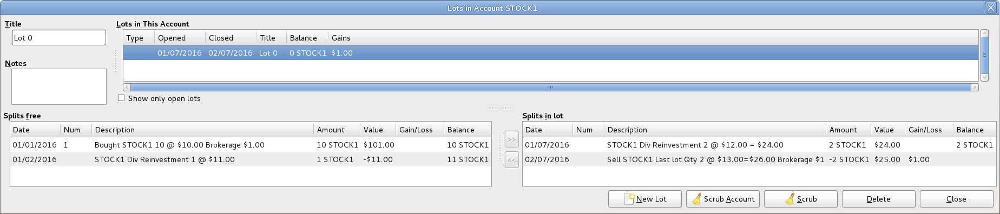

   Selling Shares - Capital Gains - Lots in Account window

Refer to the Help Manual, Chapter 8 Tools & Assistants, `Lots in
Account <https://www.gnucash.org/docs/v3/C/gnucash-help/tool-lots.html>`__
for details of the Lots in Account screen elements.

.. _invest-sellProcedure:

Procedure Summary
^^^^^^^^^^^^^^^^^

Using the lot management facility for the automatic calculation of
capital gain or loss typically follows these steps:

1. Record the sale transaction using Net Pricing (but stop short of
   entering the Capital Gain transaction as it will be created by
   scrubbing). See `Example: Sale of Shares with Profit, Manual
   Profit/Loss Calculation, Sale & Profit Separated, Net
   Pricing <#invest-sell-man-prof-sep-net>`__.

2. `Manual Lot Creation and Linking <#invest-sellManual>`__ (Optional
   depending on cost method)

3. `Automatic Creation of Capital Gain Or Loss
   Transactions <#invest-sellAuto>`__

4. `Change Orphaned Gains-CCC to Gain/Loss
   Account <#invest-sellChgCapGainsAcct>`__

5. `Run a Trial Balance <#invest-sellTrialBal>`__ report to ensure total
   debits balance to total credits

.. _invest-sellManual:

Manual Lot Creation and Linking
^^^^^^^^^^^^^^^^^^^^^^^^^^^^^^^

Before using this feature, ensure you have read
`Considerations <#invest-sellConsiderations>`__.

This functionality allows the manual linking of specfic buy and sell
transactions. It may be used in the case where a user wishes to use a
different cost method than the automatic linking method (FIFO).
Effectively, if one wishes the cost basis and capital gains in the
Advanced Portfolio Report to be consistent with the capital gains
transactions created by scrubbing, manual lot creation only needs to be
used when using LIFO or “sale of designated lots” (the same thing for
securities as far as US personal tax law is concerned). This is because
the scrub function can automatically do FIFO linking so there is no need
to do it manually and scrubbing cannot be used for average costing.

See `Example 1: Manual Lot Creation and
Linking <#invest-sellManualExample>`__.

.. _invest-sellAuto:

Automatic Creation of Capital Gain Or Loss Transactions
^^^^^^^^^^^^^^^^^^^^^^^^^^^^^^^^^^^^^^^^^^^^^^^^^^^^^^^

.. note::

   Do *NOT* do this unless you are using FIFO or LIFO to cost sales. See
   `Considerations <#invest-sellConsiderations>`__

GnuCash can automatically calculate and create security sale capital
gain/loss transactions. Lots are used to link buy transaction splits
with sell transaction splits so the correct cost of the securities sold
can be determined. GnuCash will use any existing lots, and create new
lots for any buy transaction splits not already linked to a lot. Buy and
sell transaction splits are linked to lots using FIFO method.

See:

`Example 2: Automatic Creation of Capital Gain Or Loss
Transactions <#invest-sellAutoExample>`__

`Example 3: Automatic Creation of Capital Gain Or Loss Transactions, 2
Sales at Once <#invest-sellAutoExample2>`__

`Example 4: Automatic Creation of Capital Gain Or Loss Transactions -
After a Simple Stock Split <#invest-sellFifoSplit>`__

.. _invest-sellChgCapGainsAcct:

Change Orphaned Gains-CCC to Gain/Loss Account
^^^^^^^^^^^^^^^^^^^^^^^^^^^^^^^^^^^^^^^^^^^^^^

The capital gain/loss transaction(s) created by scrubbing uses an
automatically created generic *Orphaned Gains-CCC* account (where CCC is
the security currency) because GnuCash doesn't know which capital gain
or loss account should be used. After scrubbing, the user should edit
the *Orphaned Gains-CCC* transaction split to re-assign the income
account to a more meaningful income (or expense) gain or loss account
(e.g. *Income:Long Term Capital Gain:IBM*).

See `Example 5: Changing the Orphaned Gains-CCC to Gain/Loss
Account <#invest-sellChgCapGainsAcctExample>`__.

.. _invest-sellTrialBal:

Run a Trial Balance
^^^^^^^^^^^^^^^^^^^

Running a Trial Balance report (Reports > Income & Expense > Trial
Balance) after creating capital gain/loss transactions, is a basic check
that capital gains/losses are correctly accounting for the difference
between the cost paid for securities, and value received from selling
them. At the end of the report, total debits should equal total credits.

.. tip::

   A Trial Balance may not balance due to some other problem. To
   determine if the cause of an imbalance is from incorrectly accounting
   for capital gain/loss:

   If necessary, temporarily change the date of the sell transaction and
   the capital gain/loss transaction, so they are the only transactions
   for a particular date, then run the Trial Balance as at the day
   before. If the Trial Balance is still out by the same amount, it is
   not the capital gain/loss that is causing the problem.

   If you find a prior *out of balance* Trial Balance, keep running the
   Trial Balance report with different dates until you find the date it
   starts being out of balance. Temporarily change the transaction dates
   for each transaction on the problem date to the following day, then
   change the dates back to the correct date 1 at a time, running the
   Trial Balance each time, until you identify the problem transaction.
   When you change the date of a security sell transaction, you also
   need to change the date of the corresponding capital gain transaction
   as it is only the sum of these that will balance in the Trial
   Balance.

.. _invest-sellConsiderations:

Considerations
^^^^^^^^^^^^^^

There are some points that should be considered before using the lot
management facility.

1. GnuCash implements only the First In/ First Out (FIFO) cost method
   when automatically linking buy transactions to sell transactions.
   I.e. The oldest securities are always sold first. The Last In First
   Out (LIFO) cost method may be used by manually linking the most
   recent buy security splits to the sell split before scrubbing.

2. The Advanced Portfolio Report does not use lot information when
   calculating costs, just the security transaction splits. It
   calculates the cost basis and gains or losses using the selected
   *Basis calculation method* report option (Average, FIFO or LIFO). If
   one wishes the Advanced Portfolio Report costs and gains/losses to be
   consistent with the capital gain/loss transactions created by
   scrubbing, the same cost model must be used in both places.

3. Scrubbing does not recognize commissions or fees so makes no
   allowance for them in the calculation of gain or loss. Therefore you
   must use *Net Pricing* rather than *Gross Pricing* if you wish to use
   scrubbing. See `Handling Commissions and Fees <#invest-buy-com>`__.

4. Scrubbing does not recognize capital gain/loss transaction splits if
   they have been manually entered as part of the sale transaction.
   Therefore ensure previous sales are recorded as 2 transactions:

   .. table:: Transaction 1 dealing with value received and the
   reduction of the number of shares

      +-------------------+--------------+----------------+---------------+-----------------+
      | *Account*         | *Tot Shares* | *(Unit) Price* | *Buy (Debit)* | *Sell (Credit)* |
      +-------------------+--------------+----------------+---------------+-----------------+
      | Brokerage or Bank |              |                | Debit         |                 |
      +-------------------+--------------+----------------+---------------+-----------------+
      | Security          | −NumSold     | SaleUnitPrice  |               | SaleValue       |
      +-------------------+--------------+----------------+---------------+-----------------+

   .. table:: Transaction 2 capital gain/loss (loss in this example)

      ============ ============ ============== ============= ===============
      *Account*    *Tot Shares* *(Unit) Price* *Buy (Debit)* *Sell (Credit)*
      Capital Loss                             Debit         
      Security     0            0                            Credit
      ============ ============ ============== ============= ===============

5. The automatic capital gains calculations can handle straightforward
   buy, sell, and return of capital transactions but any transaction
   that affect the number of shares, even simple splits, will cause it
   to produce wrong answers so those cases must be handled manually.

.. _invest-sellManualExample:

Example 1: Manual Lot Creation and Linking
^^^^^^^^^^^^^^^^^^^^^^^^^^^^^^^^^^^^^^^^^^

Here is an example of selling part of a security holding using the LIFO
method. In this example, the most recent buy transaction (dated
01/07/2016, a reinvested dividend), is linked to a lot, along with the
sell transaction, and the GnuCash scrub function is used to calculate
capital gain or loss and create the capital gain/loss transaction.

1.  Open the security account's register.

    .. figure:: figures/investLots0_RegB4Scrub.png
       :alt: Selling Shares - Capital Gains - Security register before
       scrubbing a single lot
       :width: 510px

       Selling Shares - Capital Gains - Security register before
       scrubbing a single lot

2.  Ensure all previous capital gain/loss transactions are separate
    transactions to the sell transactions which record the reduction in
    the number of shares and the value received.

3.  Select Actions > View Lots to open the Lots in Account SSSS window
    where SSSS is the security account.

    .. figure:: figures/investLots1_BeforeCreateLot.png
       :alt: Selling Shares - Capital Gains - Lots before scrubbing a
       single lot
       :width: 510px

       Selling Shares - Capital Gains - Lots before scrubbing a single
       lot

4.  Create a new lot using the New Lot button. Initially this lot is not
    linked to any buy or sell split.

5.  Highlight the new lot in the Lots in This Account panel.

6.  Highlight the buy split (dated 01/07/2016) of the security to be
    sold in the Splits free panel.

7.  Click the >> button to link the buy split with the highlighted lot.
    The split moves from the Splits free panel to the Splits in Lot
    panel.

8.  Repeat the previous 2 steps for any other buy splits that should be
    included in the lot (in this example, there is only 1 buy split in
    the sale).

9.  Highlight the sell split in the Splits free panel.

10. Click the >> button to link the sell split with the highlighted lot.

11. Check the lot Balance is as expected. I.e. in this example the lot
    balance should be zero as the number of securities sold in the lot,
    is matched with the same number of security buys.

    .. figure:: figures/investLots2_BeforeScrub1Lot.png
       :alt: Selling Shares - Capital Gains - Lots before scrubbing a
       single lot, after manual linking
       :width: 510px

       Selling Shares - Capital Gains - Lots before scrubbing a single
       lot, after manual linking

12. Click the Scrub button (*NOT* the Scrub Account button).

    The Lots in Account window has not changed after using the Scrub
    button so no example screen image is supplied.

13. Close the Lots in Account SSSS window and return to the security
    account register.

    .. figure:: figures/investLots2_RegAfterScrub1Lot.png
       :alt: Selling Shares - Capital Gains - Register after manual
       linking and scrubbing a single lot
       :width: 510px

       Selling Shares - Capital Gains - Register after manual linking
       and scrubbing a single lot

14. Continue to `Change Orphaned Gains-CCC to Gain/Loss
    Account <#invest-sellChgCapGainsAcct>`__

.. _invest-sellAutoExample:

Example 2: Automatic Creation of Capital Gain Or Loss Transactions
^^^^^^^^^^^^^^^^^^^^^^^^^^^^^^^^^^^^^^^^^^^^^^^^^^^^^^^^^^^^^^^^^^

Create the capital gains transaction by following these steps:

1. Open the security account's register.

2. Ensure any previous manually entered capital gain/loss transaction
   splits have been entered in separate transactions to the the sell
   transactions.

3. Select Actions > View Lots to open the Lots in Account SSSS window
   where SSSS is the security account.

4. If using LIFO, use the above procedure `Manual Lot Creation and
   Linking <#invest-sellManual>`__ to create a lot for each sell
   transaction, link the lot with the sell transaction and each of the
   buy transactions that make up the sale.

5. Click the Scrub Account button which:

   -  Creates lots for any buy transactions that are not already linked
      to a lot and links them to sell transactions splits using the FIFO
      method. As a transaction split can only be linked to 1 lot, if a
      sell transaction needs to be linked to multiple lots, the sell
      transaction split is itself split into multiple subsplits. In the
      case of multiple subsplits, it is possible to have different
      splits from the same transaction in both the Splits free and
      Splits in lot panels.

   -  Creates a separate transaction per lot for capital gain/loss.

6. Continue to `Change Orphaned Gains-CCC to Gain/Loss
   Account <#invest-sellChgCapGainsAcct>`__

.. _invest-sellAutoExample2:

Example 3: Automatic Creation of Capital Gain Or Loss Transactions, 2 Sales at Once
^^^^^^^^^^^^^^^^^^^^^^^^^^^^^^^^^^^^^^^^^^^^^^^^^^^^^^^^^^^^^^^^^^^^^^^^^^^^^^^^^^^

Here is an example of FIFO scrubbing without manual lot creation. In
this example, the transactions for 2 sales are scrubbed at once but
usually scrubbing would be performed after each sale. One reason for
scrubbing 2 sales at once, could be because there were multiple sales on
the same day.

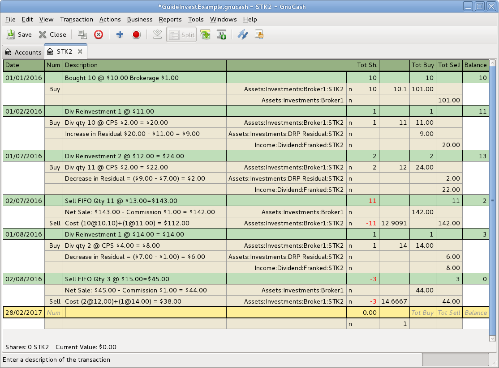

   Selling Shares - Capital Gains - Register before Scrub Account

1. Select Actions > View Lots to open the Lots in Account SSSS window
   where SSSS is the security account.

   .. figure:: figures/invest2Lots1B4Scrub.png
      :alt: Selling Shares - Capital Gains - Lots before Scrub Account
      :width: 510px

      Selling Shares - Capital Gains - Lots before Scrub Account

2. Click the Scrub Account button.

   .. figure:: figures/invest2Lots2LotsAftScrubAcct.png
      :alt: Selling Shares - Capital Gains - Lots after Scrub Account
      :width: 510px

      Selling Shares - Capital Gains - Lots after Scrub Account

   .. note::

      After using the Scrub Account button only the last lot is shown,
      so the above image is after the Lots in Account window has been
      closed and reopened so all the lots show.

3. Close the Lots in Account SSSS window and return to the security
   account register.

   .. figure:: figures/invest2Lots3RegAftScrubAcct.png
      :alt: Selling Shares - Capital Gains - Register after Scrub
      Account
      :width: 510px

      Selling Shares - Capital Gains - Register after Scrub Account

   .. note::

      The security splits in the sell transactions have been split into
      subsplits, one subsplit per lot, and a capital gain transaction
      has been created for each security subsplit of each sell
      transaction.

4. Continue to `Change Orphaned Gains-CCC to Gain/Loss
   Account <#invest-sellChgCapGainsAcct>`__

.. _invest-sellFifoSplit:

Example 4: Automatic Creation of Capital Gain Or Loss Transactions - After a Simple Stock Split
^^^^^^^^^^^^^^^^^^^^^^^^^^^^^^^^^^^^^^^^^^^^^^^^^^^^^^^^^^^^^^^^^^^^^^^^^^^^^^^^^^^^^^^^^^^^^^^

Here is an example of FIFO scrubbing without manual lot
creation/linking, where the Stock Split Assistant has been used for a
simple stock split. In this example, 100 shares of security XYZ were
bought for $10.00 each, there was a simple 2 for 1 stock split for zero
cost (so the holding was then 200 shares @ $5.00 each), then all 200
shares were sold for $6.00 each.

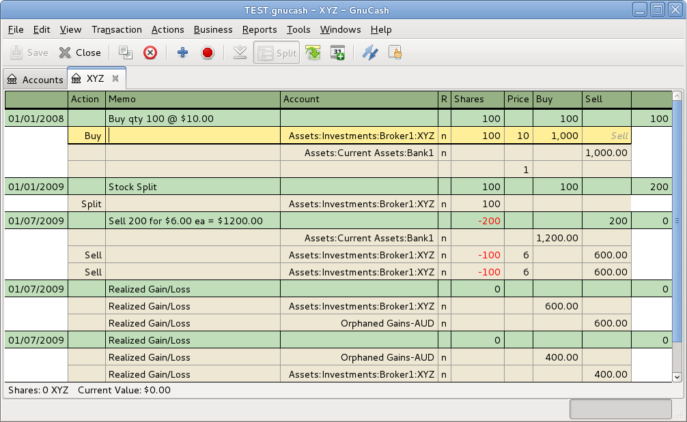

   Selling Shares - Capital Gains - Register after Scrub Account

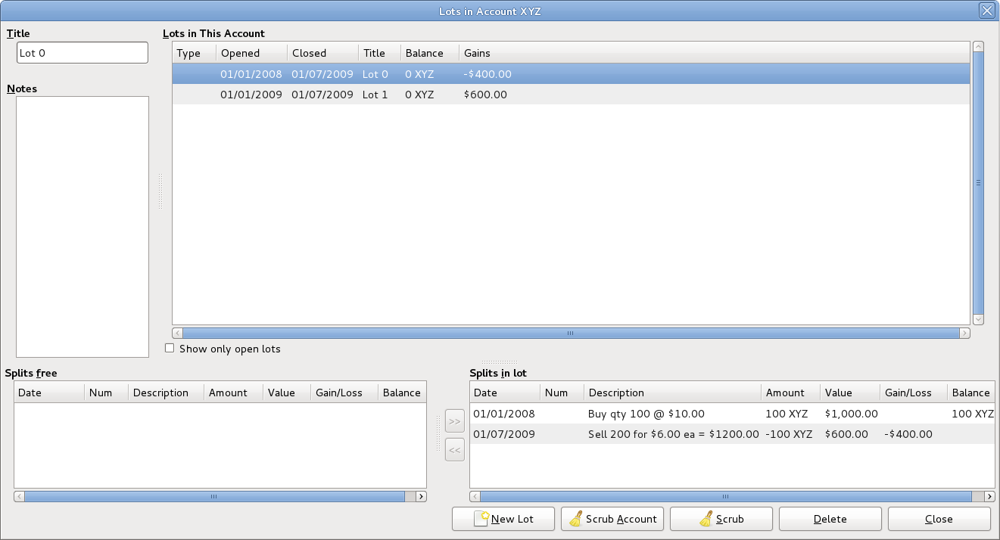

   Selling Shares - Capital Gains - Lot 0 after Scrub Account

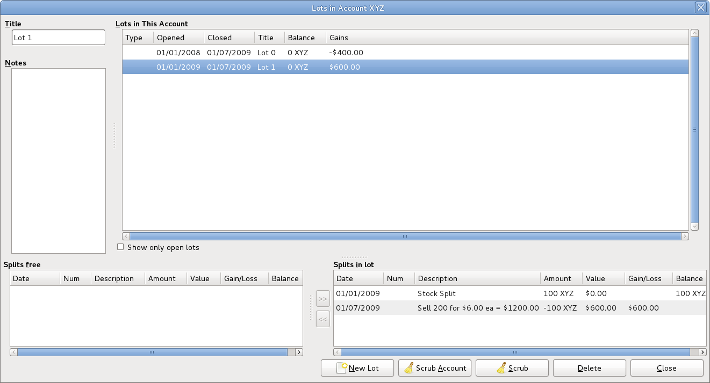

   Selling Shares - Capital Gains - Lot 1 after Scrub Account

The above screen shots show that scrubbing created:

2 lots. A separate lot for each buy (it essentially treats the stock
split as a buy of 100 for no cost)

2 capital gain transactions (one for each lot) on the date of the sale:

-  Lot 0: 1/7/2009 loss $400 (sale $600 − cost $1000)

-  Lot 1: 1/7/2009 gain $600 (sale $600 − cost $0)

Total gain $200 is correct. Whether the gain is a single long-term one
or one each of long-term and short-term or whether there's even a
distinction depends on the user's tax jurisdiction and the way the split
is structured. If the user needs help figuring it out they should
consult a professional.

.. _invest-sellChgCapGainsAcctExample:

Example 5: Changing the Orphaned Gains-CCC to Gain/Loss Account
^^^^^^^^^^^^^^^^^^^^^^^^^^^^^^^^^^^^^^^^^^^^^^^^^^^^^^^^^^^^^^^

1. Close the Lots in Account SSSS window if open and return to the
   security account register.

   .. figure:: figures/investLots2_RegAfterScrub1Lot.png
      :alt: Selling Shares - Capital Gains - Register after scrubbing a
      single lot
      :width: 510px

      Selling Shares - Capital Gains - Register after scrubbing a single
      lot

2. Find each new *Realized Gain/Loss* transaction in the security
   account register (they will have the same date as the sell
   transactions). Edit the *Orphaned Gains-CCC* transaction split to
   re-assign the income account to a more meaningful income (or expense)
   gain or loss account (e.g. *Income:Long Term Capital Gain:IBM*).

   .. tip::

      You may like to split the capital gain/loss into taxable and non
      taxable parts if that is in accord with your tax laws.

.. _invest-dividends1:

Dividends
---------

Some companies or mutual funds pay periodic dividends to shareholders.
Dividends are typically given in one of two ways, either they are
automatically reinvested into the commodity or they are given as cash.
Mutual funds are often setup to automatically reinvest the dividend,
while common stock dividends usually pay cash.

.. _invest-dividendcash:

Dividends in Cash
~~~~~~~~~~~~~~~~~

If the dividend is presented as cash, you should record the transaction
in the asset account that received the money, as income from
*Income:Dividends*. Additionally if you want to tie the cash dividend to
a particular stock holding then add a dummy transaction split to the
stock account with quantity 0 price 1 value 0.

As an example consider the following; the dividends deposited as cash
into the *Broker* Account with a tie to the stock account.

|Example of cash dividend transactions|

.. note::

   If you want to track dividends on a per-stock basis, you would need
   to create an *Income:Dividends:STOCKSYMBOL* account for each stock
   you own that pays dividends.

.. _invest-dividendreinvest:

Dividends Re-Invested
~~~~~~~~~~~~~~~~~~~~~

If you receive the dividend in the form of an automatic reinvestment,
the transaction for this should be handled within the stock or mutual
fund account as income from “Income:Dividend” for the appropriate number
of reinvested shares. This type of reinvest account is often referred to
as a DRIP (Dividend Re-Investment Program).

As an example consider the following purchase of NSTAR (NST) stock with
the dividends reinvested into a DRIP Account. Mutual fund re-investments
would be the same.

Starting with the purchase of 100 shares on Jan. 3, 2005, all dividends
will be reinvested and an account is created to track the dividend to
the specific stock. GnuCash simplifies the entry by allowing
calculations within the cells of the transaction. If the first dividend
is $.29/share, enter $53.28 (purchase price + dividend) in the share
Price cell and 100*.29 in the Buy cell. GnuCash will calculate for you
the corresponding numer of Shares

|Example of dividend reinvestment transactions|

.. _invest-retofcap:

Return of Capital
-----------------

This refers to a transaction where an investment returns capital to the
investor and doesn't have any accounting implications other than
reducing the cost basis. The number of shares held is not changed.

A Return of Capital transaction can be entered in the stock register by
entering the stock split with

====== =======================
Shares 0
Price  0
Sell   Return of Capital value
====== =======================

The other side of the double entry would usually be a debit to the
brokerage bank account.

|Example of return of capital transactions|

.. note::

   It is not possible to use the Stock Split Assistant to do this type
   of transaction.

.. tip::

   If you accidentally entered a non-zero price in the stock split,
   GnuCash may have created an unwanted price database entry which could
   cause reports to be wrong. Check for and remove such an unwanted
   entry from the price database using Tools > Price Editor.

.. _invest-splitsnmergers1:

Splits and Mergers
------------------

Companies may split their stock for many reasons but the most common is
that the price has risen higher than management thinks is a reasonable
price for many investors. Some of these splits are simple exchanges (eg
2 for 1 or 3 for 2) and some are complex exchanges with cash
distributions. Splits may also result in fewer shares if the exchange
rate is a reverse split (1 for 3 or .75 for 1).

.. _invest-simplesplit:

Simple Stock Split
~~~~~~~~~~~~~~~~~~

As an example, our holding of NST stock declared a 2 for 1 stock split
effective June 6, 2005. The process for entering this transaction is;
select Actions > Stock Split to start the assistant.

|An image of the stock split assistant at step 1.|

The first screen is an Introduction, select Forward to display the
selection of the account and stock for the split. You will need to
create an entry for each *Account:Stock* combination you hold.

|An image of the stock split assistant at step 2 - Selection of
Account/Stock.|

Select the *Assets:Investments:DRIPs:NST* and click on Forward.

The next screen presents 5 fields in the Stock Splits Details window:

-  Date - Enter the date of the split.

-  Shares - The number of shares increased (or decreased) in the
   transaction.

   In our example it is a 2 for 1 split so the number of additional
   shares is the number of shares currently in the register.

-  Description - The Description should give a brief explanation of the
   transaction.

-  New Price - If desired the new price of the stock, after the split,
   may be entered.

-  Currency - The currency of the transaction is required. This should
   be the same as the stock purchase currency.

Click on the Forward button.

|An image of the stock split assistant at step 3 - Split Details.|

The next screen will be skipped in this example as there was no “Cash in
Lieu”.

|An image of the stock split assistant at step 4 - Cash in Lieu.|

A final Finish screen will give a last option to; Cancel, Back to modify
any data entered or Apply to complete the stock split with the data
entered.

|Example of simple stock split transaction in the stock’s register|

.. _invest-merger1:

Moderately Complex Stock Merger
~~~~~~~~~~~~~~~~~~~~~~~~~~~~~~~

As an example, assume you held AT&T stock during the Nov. 18, 2005
merger of SBC with AT&T. For this example you will have purchased AT&T
on April 1, 2005, any dividends will have been paid in cash, therefore
not entered into the AT&T stock register.

The conditions of the merger were .77942 share of SBC stock were
exchanged for each share of AT&T stock. The merged company continued to
use the symbol “T” from AT&T.

AT&T paid a “dividend” of $1.20/share on the transaction date, however
this will not appear in the stock account as it was a cash distribution.

The process for entering this transaction is identical to the simple
split until the “Details” screen. You will need to create an split entry
in each *Investment Account:Stock* account combination that has shares
splitting.

|An image of the stock split assistant at step 2.|

Select the *Assets:Investments:Brokerage Account:Stock:T* and click on
Forward.

The next screen presents 5 fields in the Stock Splits Details window:

-  Date - Enter the date of the split. Here we’ll enter November 18,
   2005.

-  Shares - The number of shares increased (or decreased) in the
   transaction.

   In our example it is a .77942 for 1 split so the number of shares
   will decrease from the number of shares currently in the register.
   You may use GnuCash’s ability to perform calculations on an entry
   form by entering data directly (E.g. “(.77942*100)−100”) to calculate
   the decrease in shares from the split.

-  Description - The Description should give a brief explanation of the
   transaction.

-  New Price - If desired the new price of the stock, after the split,
   may be entered.

-  Currency - The currency of the transaction is required. This should
   be the same as the stock purchase currency.

Click on the Forward button.

|An image of the stock split assistant at step 3.|

The next screen will be skipped in this example as there was no “Cash in
Lieu”.

A final “Finish” screen will give a last option to Back to modify any
data entered or Apply to complete the stock split with the data entered.

|Example of moderate stock split transaction in the stock’s register|

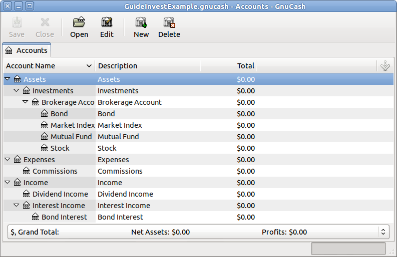
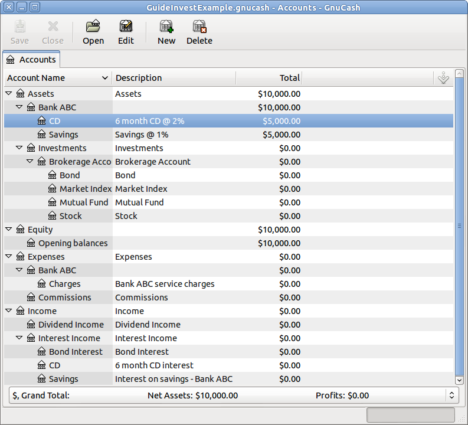
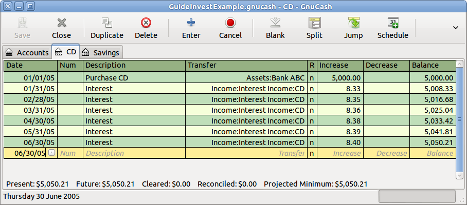
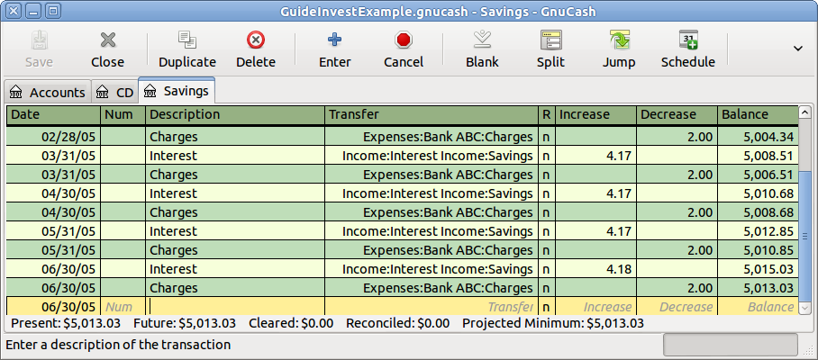
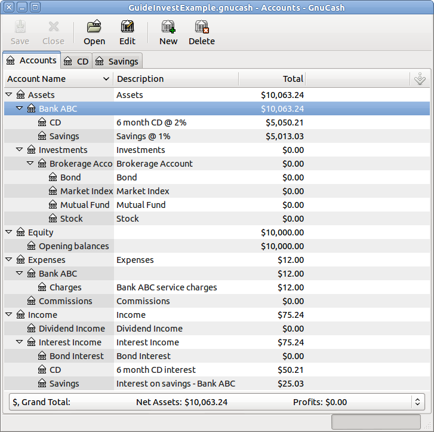
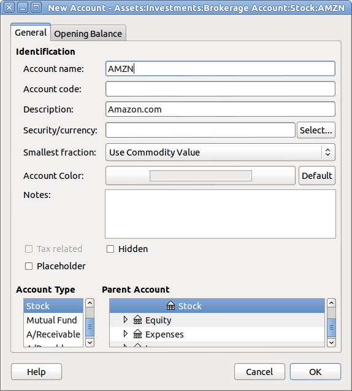
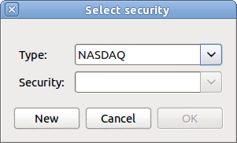
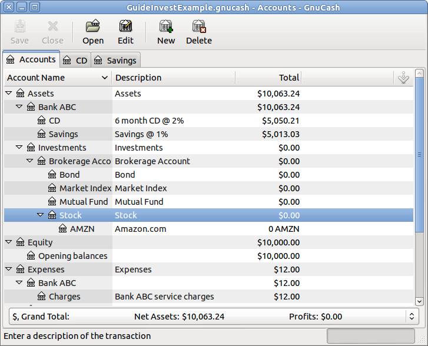
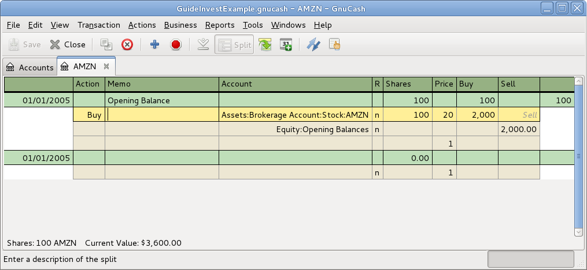
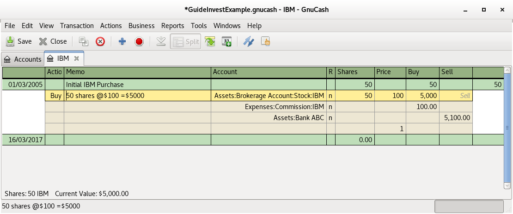
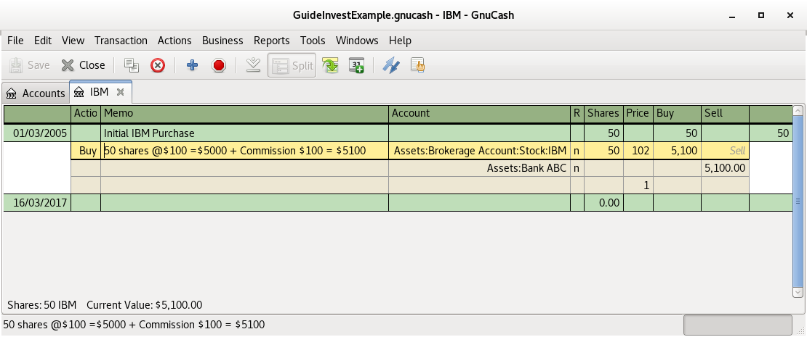
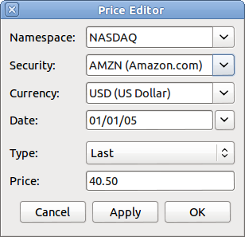
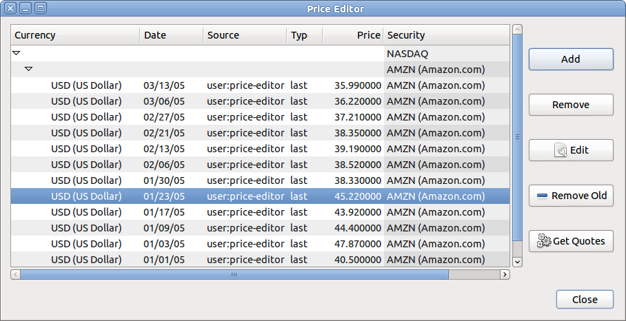
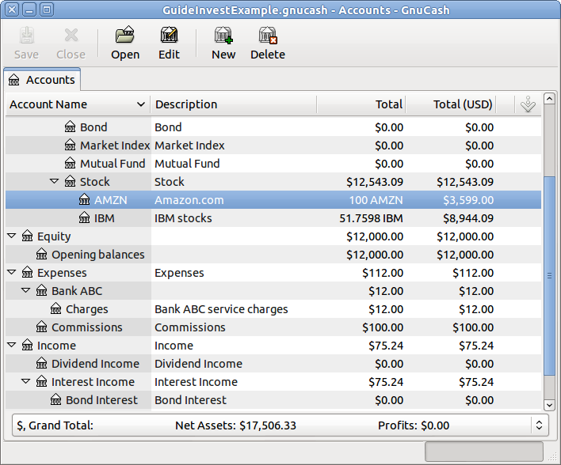
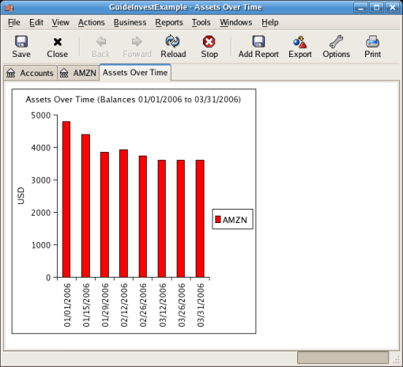
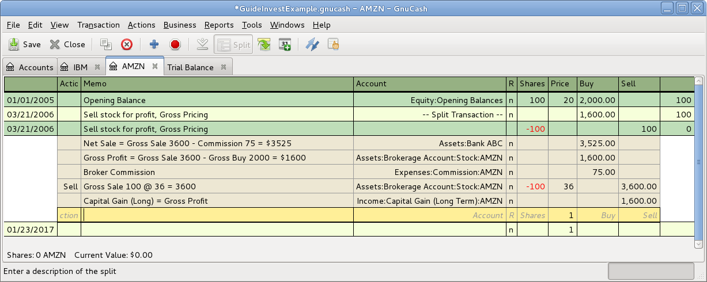
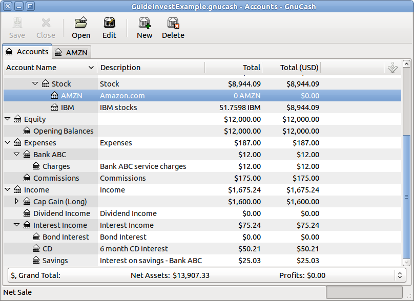
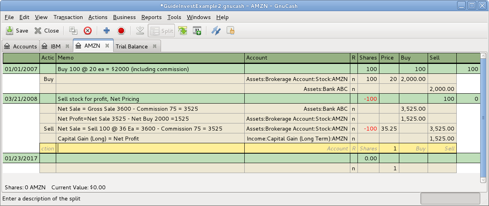
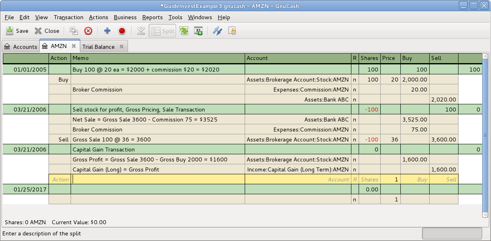
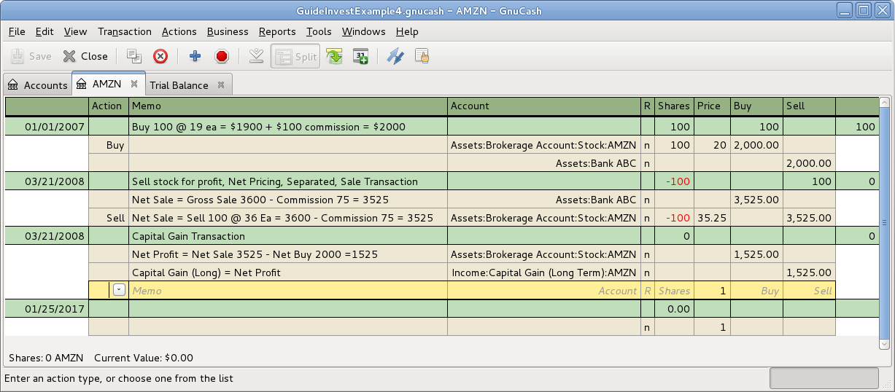
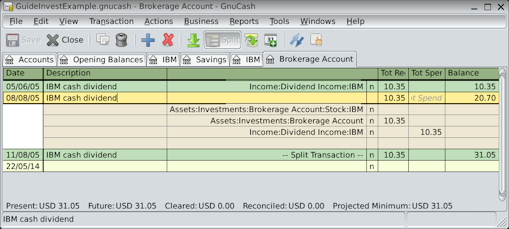
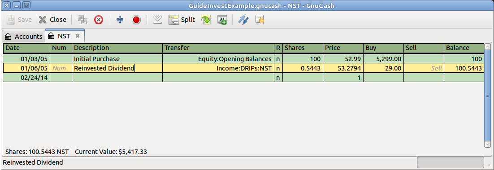
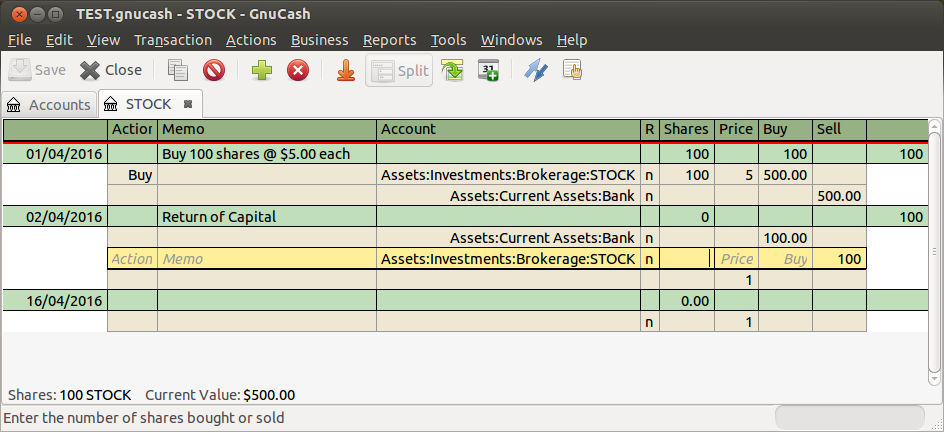
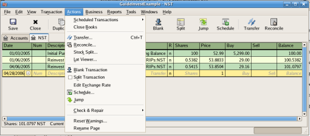
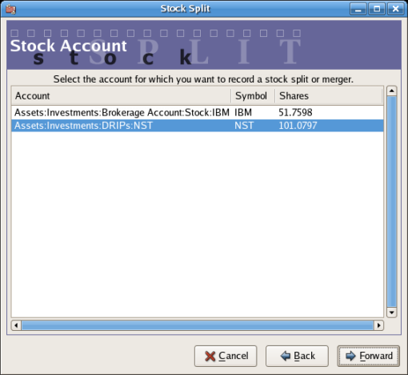
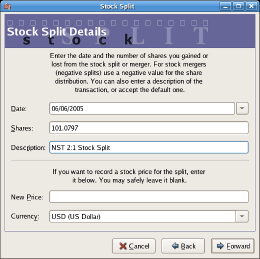
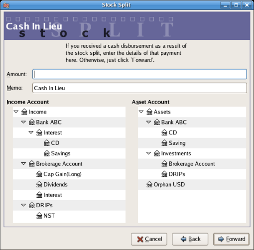
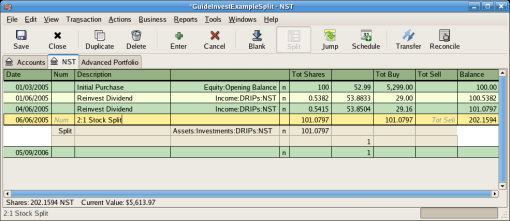
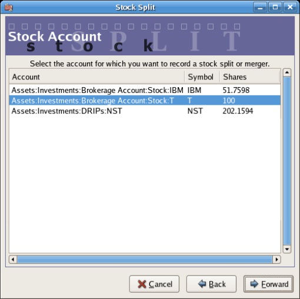
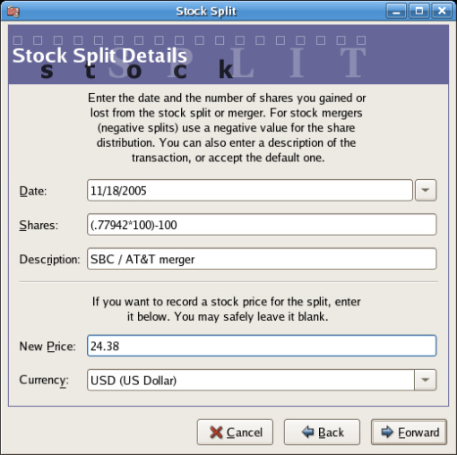
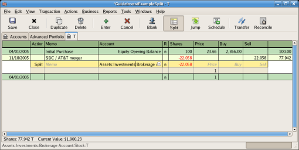
