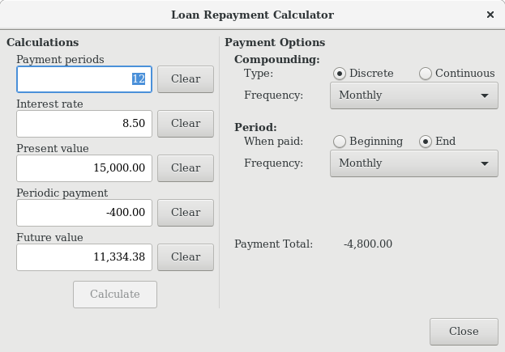
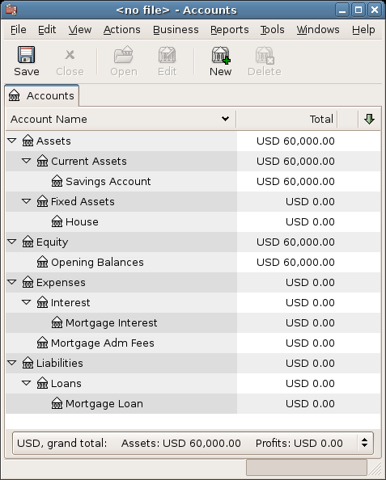
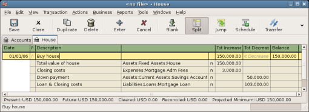
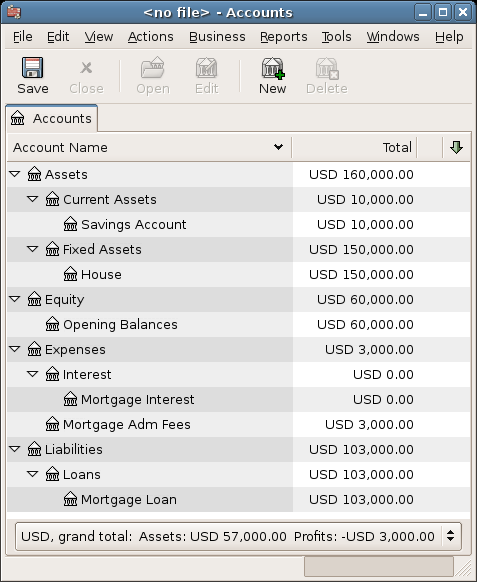
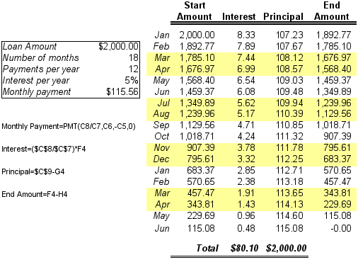
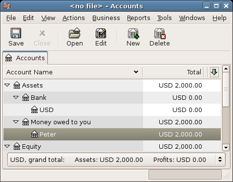
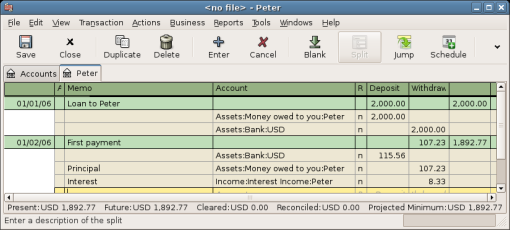
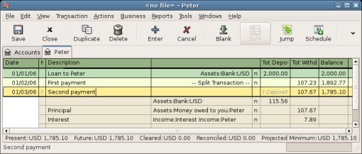
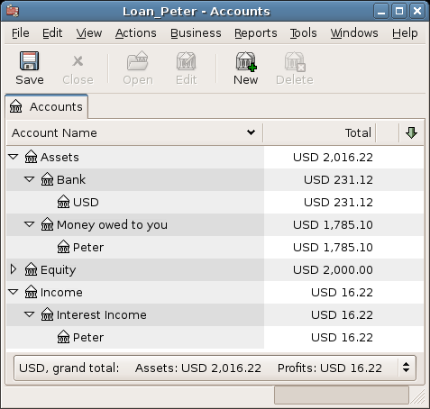

.. _chapter_loans:

Loans
=====

This chapter explains how to manage your loans with GnuCash.

.. _loans_concepts1:

Basic Concepts
--------------

A loan is defined as a financial transaction in which someone pays for
the use of someone else’s money. There are many familiar examples of
loans: credits cards, auto loans, house mortgages, or a business loan.

.. _loans_conceptsterms2:

Terminology
~~~~~~~~~~~

Before discussing tracking loan in GnuCash specifically, it will be
helpful to present a glossary of terminology. The terms presented below
represent some of the basic concepts found concerning loans. It is a
good idea to become familiar with these terms, or at least, refer back
to this list if you encounter an unfamiliar word in the later sections.

-  *Amortization* - the repayment plan which will insure that a loan is
   eventually paid off, typically utilizing equal valued monthly
   payments. These payments are usually split into principal and
   interest, where the amount of principal per payment increases (and
   interest decreases) as the amortization period elapses.

-  *Borrower* - the person or company that receives the money from a
   loan.

-  *Default* - when a borrower fails to repay a loan according to the
   terms agreed upon with the lender.

-  *Deferment* - a temporary delay in the repayment of a loan.

-  *Delinquency* - is the term that refers to late payments.

-  *Disbursement* - amount of the loan paid to the borrower. Some loans
   have multiple disbursements, meaning the borrower does not receive
   the full amount of the loan at one time.

-  *Interest* - the expense charged by the lender to the borrower for
   the use of the money loaned. This is typically expressed in terms of
   a yearly percentage charged on the principal borrowed, known as the
   *Annual Percentage Rate* or APR.

-  *Lender* - the company or person who lends money to a borrower.

-  *Loan Fee* - a processing fee removed from the principal at the time
   the borrower receives a loan.

-  *Principal* - the original amount of the loan, or the amount of the
   original loan that is still owed. When you make a monthly payment on
   a loan, part of the money pays the interest, and part pays the
   principal.

-  *Promissory Note* - the legal agreement between the borrower and
   lender concerning the loan.

.. _loans_accounts1:

Setting Up Accounts
-------------------

When a borrower obtains a loan, it is usually with the intention to make
a purchase of something of value. In fact, most loans require the
borrower to buy some predetermined asset, such as a house. This asset is
insurance against the borrower defaulting on the loan. There are, of
course, examples of loans which do not necessarily have an associated
high value asset, such as educational loans.

For the account structure presented here, we will assume the loan was
used to purchase a compensating asset.

A loan is a liability, the interest you accrue on the loan is an
on-going expense, and any administrative fees you may have to pay would
be another expense. The thing purchased with the money from a loan is an
asset. With these parameters, we can now present a basic loan account
structure:

::

   Basic Loan Account Structure

   -Asset
       -Current Assets
           -Savings Account
       -Fixed Assets
           -Asset Purchased
   -Liability
      -Loans
          -Mortgage Loan
   -Expenses
      -Interest
          -Mortgage Interest
      -Mortgage Adm Fees
     

GnuCash has a number of predefined loan account hierarchies available,
including Car Loans and Home Mortgage Loans. To access these predefined
account structures, click on Actions > New Account Hierarchy... and
select the loan types in which you are interested.

.. _loans_calcs1:

Calculations
------------

Determining loan amortization schedules, periodic payment amounts, total
payment value, or interest rates can be somewhat complex. To help
facilitate these kinds of calculations, GnuCash has a built-in Loan
Repayment Calculator. To access the calculator, go to Tools > Loan
Repayment Calculator.

|Loan Repayment Calculator|

The Loan Repayment Calculator can be used to calculate any one of the
parameters: Payment Periods, Interest Rate, Present Value, Periodic
Payment, or Future Value given that the other 4 have been defined. You
will also need to specify the compounding and payment methods.

-  *Payment Periods* - the number of payment periods.

-  *Interest Rate* - the nominal interest rate of the loan, ie: the
   yearly interest rate.

-  *Present Value* - the present value of the loan, ie: current amount
   owed on the loan.

-  *Periodic Payment* - the amount to pay per period.

-  *Future Value* - the future value of the loan, ie: the amount owed
   after all payment periods are over.

-  *Compounding* - two interest compounding methods exist, discrete or
   continuous. For discrete compounding select the compounding frequency
   from the popup menu with a range from yearly to daily.

-  *Payments* - the popup menu allows you to select the payment
   frequency with a range from yearly to daily. You can also select
   whether your payments occur at the beginning or end of the period.
   Payments made at the beginning of the payment period have interest
   applied to the payment as well as any previous money paid or money
   still owed.

.. _loans_calcsexample1_2:

Example: Monthly Payments
~~~~~~~~~~~~~~~~~~~~~~~~~

What is your monthly payment on a $100000 30 year loan at a fixed rate
of 4% compounded monthly?

This scenario is shown in the example image above. To perform this
calculation, set Payment Periods to 360 (12 months x 30 years), Interest
Rate to 4, Present Value to 100000, leave Periodic Payment empty and set
Future Value to 0 (you do not want to owe anything at the end of the
loan). Compounding is Monthly, Payments are Monthly, assume End of
Period Payments, and Discrete Compounding. Now, click on the Calculate
button next to the Periodic Payment area. You should see $-477.42.

Answer: You must make monthly payments of 477.42.

.. _loans_calcsexample2_2:

Example: Length of Loan
~~~~~~~~~~~~~~~~~~~~~~~

How long will you be paying back a $20000 loan at 10% fixed rate
interest compounded monthly if you pay $500 per month?

To perform this calculation, leave Payment Periods empty, set Interest
Rate to *10*, Present Value to *20000*, Periodic Payment is *-500*, and
Future Value is *0* (you do not want to owe anything at the end of the
loan). Compounding is *Monthly*, Payments are *Monthly*, assume End of
Period payments, and Discrete Compounding. Now, click on the Calculate.
You should see 49 in the Payment Periods field.

Answer: You will pay off the loan in 4 years and 1 month (49 months).

.. _loans_calcsdetails2:

Advanced: Calculation Details
~~~~~~~~~~~~~~~~~~~~~~~~~~~~~

In order to discuss the mathematical formulas used by the Loan Repayment
Calculator, we first must define some variables. n == number of payment
periods %i == nominal interest rate, NAR, charged PV == Present Value
PMT == Periodic Payment FV == Future Value CF == Compounding Frequency
per year PF == Payment Frequency per year Normal values for CF and PF
are: 1 == annual 2 == semi-annual 3 == tri-annual 4 == quaterly 6 ==
bi-monthly 12 == monthly 24 == semi-monthly 26 == bi-weekly 52 == weekly
360 == daily 365 == daily

.. _loans_calcsdetails_i2:

Converting between nominal and effective interest rate
^^^^^^^^^^^^^^^^^^^^^^^^^^^^^^^^^^^^^^^^^^^^^^^^^^^^^^

When a solution for n, PV, PMT or FV is required, the nominal interest
rate (i) must first be converted to the effective interest rate per
payment period (ieff). This rate, ieff, is then used to compute the
selected variable. When a solution for i is required, the computation
produces the effective interest rate (ieff). Thus, we need functions
which convert from i to ieff, and from ieff to i.

::

   To convert from i to ieff, the following expressions are used:
   Discrete Interest:     ieff = (1 + i/CF)^(CF/PF) - 1
   Continuous Interest: ieff = e^(i/PF) - 1 = exp(i/PF) - 1

   To convert from ieff to i, the following expressions are used:
   Discrete Interst:      i = CF*[(1+ieff)^(PF/CF) - 1]
   Continuous Interest: i = ln[(1+ieff)^PF]

.. note::

   In the equations below for the financial transaction, all interest
   rates are the effective interest rate, “ieff”. For the sake of
   brevity, the symbol will be shortened to just “i”.

.. _loans_calcsdetails_basic2:

The basic financial equation
^^^^^^^^^^^^^^^^^^^^^^^^^^^^

One equation fundamentally links all the 5 variables. This is known as
the fundamental financial equation:

::

   PV*(1 + i)^n + PMT*(1 + iX)*[(1+i)^n - 1]/i + FV = 0

     Where: X = 0 for end of period payments, and
            X = 1 for beginning of period payments

From this equation, functions which solve for the individual variables
can be derived. For a detailed explanation of the derivation of this
equation, see the comments in the file src/calculation/fin.c from the
GnuCash source code. The A, B, and C variables are defined first, to
make the later equations simpler to read.

::

   A = (1 + i)^n - 1
   B = (1 + iX)/i
   C = PMT*B

   n = ln[(C - FV)/(C + PV)]/ln((1 + i)
   PV = -[FV + A*C]/(A + 1)
   PMT = -[FV + PV*(A + 1)]/[A*B]
   FV = -[PV + A*(PV + C)] 

   The solution for interest is broken into two cases.
   The simple case for when  PMT == 0 gives the solution:
   i = [FV/PV]^(1/n) - 1

The case where PMT != 0 is fairly complex and will not be presented
here. Rather than involving an exactly solvable function, determining
the interest rate when PMT !=0 involves an iterative process. Please see
the src/calculation/fin.c source file for a detailed explanation.

.. _loans_calcsdetails_ex2:

Example: Monthly Payments
^^^^^^^^^^^^^^^^^^^^^^^^^

Let’s recalculate `Example: Monthly
Payments <#loans_calcsexample1_2>`__, this time using the mathematical
formulas rather than the Loan Repayment Calculator. What is your monthly
payment on a $100000 30 year loan at a fixed rate of 4% compounded
monthly?

First, let’s define the variables: n = (30*12) = 360, PV = 100000, PMT =
unknown, FV = 0, i = 4%=4/100=0.04, CF = PF = 12, X = 0 (end of payment
periods).

The second step is to convert the nominal interest rate (i) to the
effective interest rate (ieff). Since the interest rate is compounded
monthly, it is discrete, and we use: ieff = (1 + i/CF)^(CF/PF) - 1,
which gives ieff = (1 + 0.04/12)^(12/12) - 1, thus ieff = 1/300 =
0.0033333.

Now we can calculate A and B. A = (1 + i)^n - 1 = (1 + 1/300)^360 - 1 =
2.313498. B = (1 + iX)/i = (1 + (1/300)*0)/(1/300) = 300.

With A and B, we can calculate PMT. PMT = -[FV + PV*(A + 1)]/[A*B] = -[0
+ 100000*(2.313498 + 1)] / [2.313498 \* 300] = -331349.8 / 694.0494 =
-477.415296 = -477.42.

Answer: You must make monthly payments of 477.42.

.. _loans_mortgage1:

House Mortgage (How-To)
-----------------------

A house mortgage can be setup using the account structure present in
`Setting Up Accounts <#loans_accounts1>`__.

As an example, assume you have $60k in you bank account, and you buy a
$150k house. The mortgage is charging 6% APR, and has administrative
fees (closing costs, etc) of 3%. You decide to put $50k down, and thus
will need to borrow $103k, which will give you $100 after the closing
costs are paid (3% of $100k).

Your accounts before borrowing the money:

|Accounts Before Receiving Loan|

The purchase of the house is recorded with a split transaction in the
*Assets:House* account, with $50k coming from the bank (IE: your down
payment), and $100k coming from the Mortgage. You can place the $3k
closing costs in the same split, and we increase the house loan to $103k
to include the closing costs as well.

.. table:: Buying a House Split Transaction

   =============================== ======== ========
   Account                         Increase Decrease
   Assets:Fixed Assets:House       $150,000 
   Assets:Current Assets:Bank               $50,000
   Liabilities:Loans:Mortgage Loan          $103,000
   Expenses:Mortgage Adm Fees      $3000    
   =============================== ======== ========

The split will look like this in the *Assets:Fixed Assets:House*
Account:

|Mortgage Split Transaction|

Which will give a Chart of Accounts like this:

|Mortgage Accounts|

.. _loans_personalLoanToSomeOne:

A Personal Loan to a friend (How-To)
------------------------------------

It is not always you are borrowing money from the bank, sometimes you
borrow money from your family, or perhaps even lend money to a friend.
This How-To chapter will describe one way to handle lending money to a
friend.

We are basing this How-To on the following generic account structure.

::

   -Asset
      -Bank
           -Bank Account
      -Money owed to you
           -Person
   -Income
      -Interest Income
           -Person
     

This example will show how to track a personal loan of 2,000 USD
(default currency) to your friend Peter

.. _loans_personalLoanToSomeOne_loan:

Loan Specifications
~~~~~~~~~~~~~~~~~~~

Peter wants to borrow $2,000 dollars from you and plans to pay you back
monthly for the next 18 months. Since he is your friend, (but not that
close) you both agree on a yearly interest rate of 5%.

In summary we have the below details. Peter’s loan details:

-  Pinciple Amount - $2,000

-  Term - 18 months with 12 payments per year

-  Annual Percentage Rate: 5%

-  Monthly Payment : ??

So how do you calculate the Monthly Payment?

You have a number of different options, like paper and pen, Linux
Calculator, Open Office’s Calc module, but the easiest is to use GnuCash
`Loan Repayment Calculator <#loans_calcs1>`__. This tells you that the
Monthly Payment should be $115.56.

But you need to know how much of this is Interest and how much is
Principal to be able to do a proper bookkeeping. For this you need a
more powerful tool, something like the Calc module in OpenOffice.org,
and in particular the PMT function.

|Calculation of Private Loan details|

.. _loans_personalLoanToSomeOne_accounts:

Accounts for the loan
~~~~~~~~~~~~~~~~~~~~~

Let’s start with the following accounts (all accounts have the same
currency, in this case USD)

::

   Assets:Bank:USD
   Assets:Money owed to you:Peter
   Income:Interest Income:Peter
   Equity:Opening Balances:USD
     

.. _loans_personalLoanToSomeOne_InitialSetup:

Lending the money
~~~~~~~~~~~~~~~~~

When you have lent money to your friend, you have in fact moved money
from an Asset account (like Bank, Checking or similar) to your Asset
account *Money owed to you*. To record this you enter the following
transaction into the *Assets:Money owed to you:Friend* account.

.. table:: Personal loan to a Friend

   =============================== ======== ========
   Account                         Increase Decrease
   Assets:Money owed to you:Friend $2,000   
   Assets:Bank:USD                          $2,000
   =============================== ======== ========

|Lended money|

.. _loans_personalLoanToSomeOne_FirstPayment:

Receiving first payment
~~~~~~~~~~~~~~~~~~~~~~~

When the first payment ($115.56) is received, you will need to determine
how much is for the principal loan, and how much is for the loan
interest.

-  Outstanding loan amount this period = $2,000

-  Payment per month = $115.56

-  Payment breakdown

-  5%/12 \* $2,000 = $8.33 Interest

-  $115.56 - $8.33 = $107.23 Principal

This can be translated to the following GnuCash entry

|First payment|

The balance on Peter’s loan is now $2,000 - $107.23 = $1,892.77

.. _loans_personalLoanToSomeOne_SecondPayment:

Receiving second payment
~~~~~~~~~~~~~~~~~~~~~~~~

When the second payment ($115.56) is received, you will again need to
determine how much is for the principal loan, and how much is for the
loan interest.

-  Outstanding loan amount this period = $1,892.77

-  Payment per month = $115.56

-  Payment breakdown

-  5%/12 \* $1,892.77 = $7.89 Interest

-  $115.56 - $7.89 = $107.67 Principal

This can be translated to the following GnuCash entry

|Second payment|

The balance on Peter’s loan is now $1,892.77 - $107.67 = $1,785.10

The Chart of accounts looks now like this

|Chart of Accounts after second payment|

As you can see, the interest varies for every month, as well as the
principal amount. So for every payment you receive you need to calculate
the proper amounts for your various split entries.

The interest amount will be less and less for every payment (since it is
calculated on a smaller loan amount all the time), until the last
payment where it is more or less 0. Please review the Figure of Detailed
view over private loan to Peter for more details

.. _loans_CarLoan:

Automobile Loan (How-To)
------------------------

The Automobile Loan, or in common terms, Car Loan, is treated more or
less exactly as the House loan. The only difference is different
accounts, and different interest rates.

Basic Car Loan Account Structure -Asset -Current Assets -Savings Account
-Fixed Assets -Car -Liability -Loans -Car Loan -Expenses -Interest -Car
Loan Interest -Car Loan Adm Fees

For more information, please check `House Mortgage
(How-To) <#loans_mortgage1>`__

.. _loans_Reconciling:

Reconciling with the Loan Statements (How-To)
---------------------------------------------

Reconciling a loan statement is no different from reconciling a bank or
credit card statement.

During the period you should have recorded all the various loan related
transactions, and every one of them are touching the
Liability:Loans:Loan account. For instance, paying off a bit of the loan
decreases your *Bank Account,* and increases the *Loan account*, *Loan
Interest* as well as perhaps *Loan administration fee*.

With the loan statement in your hands, open the Loan account, start the
reconcile assistant, and tick of all the various transaction you have
recorded. When you have finished, the reconciling difference should be
0, and if it is not, then you will have to go through the account and
compare it with the loan statement to find the difference. When you have
reached a 0 in difference, then your loan account is reconciled and you
can finish the Reconcile assistant.

For more information on how to Reconcile, please check
`??? <#txns-reconcile1>`__

Selling a house or a car (How-To)
---------------------------------

When you will record the selling of your house in GnuCash you have some
different options. Here we will go through two of them, one in which you
only recorded the purchase amount, and now the selling amount. The other
where you have followed the ups and downs on the property market and
registered various Unrealized gains over the time.

Simple Transaction
~~~~~~~~~~~~~~~~~~

In this way you only record the proper sale amount.

Let’s work through two samples of selling a house, one with a profit,
and one with a loss. If you want to sell a car instead, just substitute
the house account with a car account.

-Assets -Fixed Assets -House -Current Assets -Saving -Income -Capital
Gains Long -House

-  You bought a house for $300,000 once upon a time, and now managed to
   sell it for $600,000. How do you record this?

   To record this you need to increase our bank account with the $600k,
   and decrease some other accounts with $600k. The house account only
   contains $300k which is what you bought it for, so you move this
   amount to your bank account. That means you are lacking $300k. This
   amount you fetch from the *Income:Captial Gains Long:House* account.
   The split transaction you enter into your *bank* account
   (*Assets:Current Assets:Saving*) should look like this.

   .. table:: Selling an asset (house) with a profit

      =============================== ======== ========
      Account                         Increase Decrease
      Assets:Current Assets:Saving    $600,000 
      Assets:Fixed Assets:House                $300,000
      Income:Capital Gains Long:House          $300,000
      =============================== ======== ========

-  You bought a house for $300,000 once upon a time, but due to a newly
   created airport, could only sell it for $230,000. How do you record
   this?

   To record this you need to increase your bank account with the $230k,
   and decrease some other accounts with $230k. The house account
   contains $300k which is more than what you sold it for. So let’s move
   $230k of it to your bank account. After this you have $70k remaining
   in your house account which needs to be removed. You move it to our
   *Income:Capital Gains Long:House* account, which will indicate a
   loss. The split transaction you enter into your *house* account
   (*Assets:Fixed Assets:House*) should look like this.

   .. table:: Selling an asset (house) with a loss

      =============================== ======== ========
      Account                         Increase Decrease
      Assets:Fixed Assets:House                $300,000
      Assets:Current Assets:Saving    $230,000 
      Income:Capital Gains Long:House $70,000  
      =============================== ======== ========

A More Complex Transaction
~~~~~~~~~~~~~~~~~~~~~~~~~~

In this example, we will touch a little on some more complicated
accounting principles. For more details on this subject, please check
:ref:`chapter_capgain`

Here we will only touch on the case when you have accurately estimated
the current value of your house. For the other cases (over-, and
under-estimated), please check :ref:`chapter_capgain`.

-Assets -Fixed Assets -House -Cost -Unrealized Gain -Current Assets
-Saving -Income -Realized Gain -House -Unrealized Gain -House

You bought a house for $300,000 once upon a time, and over the years
kept a close look on the market and updated your records with the
estimated current value of your house. At the time you want to sell it,
you have determined that the current market value is $600,000.

The difference between $600,000 (estimated market value) and $300,000
(purchase value) is the current Unrealized Gain value. Therefore you
have a total of $300,000 in your *Assets:Fixed Assets:House:Unrealized
Gain* account

How do you record this sell transaction?

To record this you need to increase your bank account with the $600k,
and decrease some other accounts with $600k. You must first change from
unrealized gain to realized gain for your *Income* accounts. Lastly you
need to transfer the full amounts from the *Assets:Fixed Assets:House*
sub-accounts.

The transaction you enter into your *Income:Realized Gain:House* account
account should look like this.

.. table:: Selling an asset (house) with a profit

   ============================ ======== ========
   Account                      Increase Decrease
   Income:Realized Gain:House   $300,000 
   Income:Unrealized Gain:House          $300,000
   ============================ ======== ========

The transaction you enter into your *Assets:Current Assets:Saving*
account should look like this.

.. table:: Selling an asset (house) with a profit 2

   ========================================= ======== ========
   Account                                   Increase Decrease
   Assets:Current Assets:Saving              $600,000 
   Assets:Fixed Assets:House:Cost                     $300,000
   Assets:Fixed Assets:House:Unrealized Gain          $300,000
   ========================================= ======== ========

After having recorded these transactions you see that your House Asset
have a value of 0, your Savings account have increased with $600,000,
and lastly, the *Income:Realized Gain* have increased to $300,000.

