.. _chapter_txns:

Transactions
============

This chapter will give you the basic information you need to understand
and use transactions in GnuCash. Whereas accounts are the framework and
structure of a chart of accounts, transactions are the data which fills
each account.

.. _txns-concepts1:

Basic Concepts
--------------

A *transaction* in a double entry accounting system such as GnuCash is
an exchange between at least 2 accounts. Thus, a single transaction must
always consist of at least two parts, a *from* and a *to* account. The
*from* account is transferring value to the *to* account. Accountants
call these parts of a transaction *Ledger Entries*. In GnuCash, they are
called *Splits*.

A split identifies the account to which it refers, the amount of money
specifically moved to or from that account, and can contain a few other
specific pieces of information if needed. GnuCash supports multiple
splits in a single transaction, and the splits can move money into or
out of the involved accounts arbitrarily.

For example, you receive a paycheck and deposit it into your savings
account at the bank. The *transaction* that occurs is that your bank
savings account (an asset) received money from your income account. Two
accounts are affected, and in this case there is a net increase in your
equity.

Working with transactions in GnuCash is performed using what is known as
the *account register*. Every account you create has an account
register. It will appear familiar to you as it looks very similar to the
log used to track checkbooks.

The account register is explained in the upcoming section, `The Account
Register <#txns-register-oview>`__.

.. _txns-register-oview:

The Account Register
--------------------

The *account register* is the window that allows you to view or edit
preexisting transactions, or add new transactions for a particular
account. To open an account register from the Account Tree, double-click
the account name, right click the account name and select Open Account
from the menu, or use the Open button on the toolbar. GnuCash will
display the account register window.

.. _txns-registers-features2:

Features of the Account Register
~~~~~~~~~~~~~~~~~~~~~~~~~~~~~~~~

The *Titlebar* of the account register displays the account name. Below
the *Titlebar*, the *Menubar* displays the menu items available within
the account register, and the *Toolbar* contains handy buttons that help
you work with the account register.

At the bottom left of the register window, GnuCash displays helpful
messages as you move about the register. To the right, you can see the
current account balance and the total of cleared splits.

.. _txns-regstyle1:

Choosing a Register Style
~~~~~~~~~~~~~~~~~~~~~~~~~

GnuCash offers several options for viewing your registers. The default
style is Basic Ledger mode, which displays only the summary of splits
affecting the current account. This is the style that most closely
resembles other popular personal financial packages. You can choose a
different register style from the View menu. There are two other view
modes:

-  View > Auto-Split Ledger style expands the current transaction
   automatically. As you highlight a new transaction in the register,
   the transaction automatically expands to show all splits.

-  View > Transaction Journal style shows all splits for all
   transactions in the register, which is more like an accounting
   journal.

All styles permit you to view your data in either single-line or
double-line format. Select View > Double Line, and you will see your
transaction line expand to two register lines. Double-line mode will
also display the transaction-level Notes field.

Below are screenshots that demonstrate how the Basic Ledger and
Transaction Journal views differ.

For this example, let’s assume that you have purchased 3 pair of Jeans
for $1,000, and have recorded the purchase as a split transaction with
each pair entered on a separate split.

The below screenshots illustrate the different view modes.

First let’s view the Jeans transaction from your checking account:

|3 Jeans purchases|

Now, let’s open the *Expenses:Clothes* account, and look at it in Basic
view.

|A jump to the Expenses:Clothes account|

Three entries appear here, but there was only the single split entry in
the checking account. Further examination shows that each row has a
different amount, $200, $300, and $500. This demonstrates that each row
in this view reflects a single split from the original transaction.

Changing to Transaction Journal mode will display only the original
split transaction.

|A jump to the Expenses:Clothes account|

.. _txns-shortcuts1:

Using Entry Shortcuts
~~~~~~~~~~~~~~~~~~~~~

GnuCash provides several time-saving shortcuts for entering your data.
When you type the first few characters of a description that you have
used before, the QuickFill feature automatically fills in the rest of
the transaction as you last entered it. When you type in the first
characters of an account name in either the Transfer field of the
transaction line or the Account field of the split line, QuickFill will
automatically complete the name from your account list. It also helps
you with entering sub-accounts in these fields: simply type the first
characters of the parent account name followed by a : (colon) and the
first characters of the sub-account name. For example, to enter
*Assets:Checking*, you might type ``A:C`` and let GnuCash fill in the
rest.

.. warning::

   Because : is the account separator symbol, you can not use it in your
   account names.

.. tip::

   If you really need the colon in your account names, you can select
   another symbol by Edit > Preferences > Accounts.

Register keyboard shortcuts also save you time, and GnuCash provides
several of them. In the date field, you can type:

-  + or = to increment the date and - or \_ to decrement the date

-  ] or } to increment the month and [ or { to decrement the month

-  M or m to enter the first date of the month

-  H or h to enter the last date of the month

-  Y or y to enter the first date of the year

-  R or r to enter the last date of the year

-  T or t to enter today’s date

.. tip::

   These date shortcuts not only work in the account register but
   everywhere you can enter a date.

.. tip::

   Specifically for dates there's another way you can save time: you can
   enter partial dates. For example if you only enter one number,
   GnuCash will interpret it as the day in the current month of the
   current year. If you only enter a day and month, GnuCash will
   automatically append the year. The default this to take such a date
   in a sliding window starting 11 months before the current month. This
   means that if you enter 1/5 (January 5th) as date while the current
   date is in December 2015, the date will be completed as 1/5/16. This
   default can be changed via Edit > Preferences > Date/Time. You can
   change it to either always evaluate a date in the current calendar
   year or change the start of the sliding window.

In the Num field of the transaction line, you can type + to increment
the transaction number from the last one you typed in. Typing - will
decrement the number. This will also work in the Action field of the
split line, if you choose to enter split numbers there. The Action field
also supports QuickFill - if you type the first characters of a common
action (such as Deposit), GnuCash will fill in the rest.

The Transfer field supports QuickFill of account names. You can start
typing an account name and GnuCash will fill in the remaining part of
the name. Typing the separator character at any time will complete the
current level of the account name, leaving the cursor positioned to
start the next level of account name. For example, typing A:C the
standard set of account names will complete to the *Assets:Checking*
account. You can also type the Menu or Ctrl+Down keys in this field to
pop up a list of all account names.

In any of the amount fields, you can use a built-in calculator. Simply
type in the first value, followed by +, -, \*, or /, then type in the
second value. GnuCash will perform the calculation and return the
resulting value to the amount field when you press the Tab key.

All of the menu items have access keys defined, and these are marked by
underlined characters in the menu names. Press Alt + [underlined
character] to bring up the menu, then select an item by typing its
underlined character. For example, typing +Alt+ +A+ brings up the
Actions menu, then typing P will split the transaction. A few of the
menu items also have shortcut keys that immediately invoke the command
(typically using the Ctrl key). These shortcuts are listed next to the
item.

To move around the register, use these keys to save time:

-  Tab to move to the next field, +Shift+ +Tab+ to move to the previous
   field

-  Home to move to the beginning of the field, End to move to the end of
   the field

-  Enter or ↓ to move to the next transaction, ↑ to move to the previous
   transaction

-  Page Up to move up one screen, Page
                   Down to move down one screen

-  +Shift+ +Page Up+ to go to the first transaction, +Shift+ +Page Down+
   to go to the last transaction

In the Reconcile window you can use these keyboard shortcuts:

-  Tab moves to the next box and Shift+Tab moves to the previous box

-  Space bar toggles the status between reconciled and not reconciled

-  ↑ and ↓ navigate through the entries within the current box

.. _txns-registers-txntypes:

Simple vs. Split Transactions
-----------------------------

Every transaction in GnuCash has at least two splits, but a transaction
can have more than two splits. A transaction with only two splits is
called a *simple transaction*, since it only involves the current
account and a single remote account. A transaction with three or more
accounts is called a *split transaction*.

When the register is in Basic view, you will see a summary of the splits
affecting the current account. For a simple transaction, the Transfer
column will display the other account from which money is *transferred*.
For a split transaction, the Transfer column will display -- Split
Transaction --. You can see the individual splits of each transaction by
clicking the Split button in the *Toolbar* while selecting the
appropriate transaction.

For split transactions, the first line of the transaction is the
*transaction line*. It contains a Date, optional Num (such as a check
number), transaction Description, total amount affecting the current
account (Tot Deposit here), and updated account Balance after the
current transaction. Note that in the expanded view, the Transfer column
heading disappears, and there is no account name listed in that field.
This line shows you only a summary of the transaction’s effect on the
current account. For more detailed information, you need to look at the
individual splits that make up the transaction.

.. note::

   An account register displays a transaction when that transaction has
   a split assigned to the account. If a given transaction has more than
   one split assigned to the account, then in Basic and Auto-Split
   views, that transaction will appear in the register one time for each
   split assigned to that account. In Transaction Journal view, such a
   transaction will only appear once in the register.

The partial lines below the transaction line are the *split lines*, and
they are separated by gray lines. As you highlight one of the split
lines, the column headings change to show the split-related fields:

|How split headings change|

Each split contains an optional Action, or type of split, which you can
either type in or choose from a pull-down list. The split also contains
an optional Memo which describes the split. Each split affects an
Account, which can be selected from a pull-down list of your accounts.
The R field indicates whether the split has been reconciled. The last
two columns show the amount of the split and whether money is coming
into or going out of the account.

As we discussed in `??? <#basics-accounting1>`__, total debits
(left-column entries) must equal total credits (right-column entries)
for each transaction. In the example shown above, the total debits equal
the total credits, so this transaction is balanced. If you notice, the
transaction line contains the same debit amount as the Checking split
line. Why is this shown twice? Because the transaction line is merely a
*summary* of the transaction’s effect on the current account. The same
transaction in a different account will have a different transaction
line, one that shows the effect on that particular account. You can see
this by highlighting another split line and clicking the Jump button on
the *Toolbar*.

In this example, if you jump to the *Income:Salary* account, GnuCash
brings up the same transaction in the *Income:Salary* - Register:

|A jump to the Income:Salary account|

Note that the transaction line total now summarizes the effect on the
*Income:Salary* account instead of the *Checking Account*, because you
are looking at the *Income:Salary* account register. The splits are
exactly the same, but the transaction line now reflects the credit to
the *Income:Salary* account.

.. _txns-registers-twoaccount2:

Simple Transaction Example
~~~~~~~~~~~~~~~~~~~~~~~~~~

Starting with the chart of accounts we created in the previous chapter
``gcashdata_3``, double click on the Checking asset account. Let’s add a
simple transaction to the checking account. When you first create your
accounts in GnuCash, it is common to start them off with an initial
balance.

In the first transaction row, enter a date (eg: March, 1, 2006), a
description (eg: “Opening Balance”), click on the Transfer pop-up menu
and select *Equity:Opening Balances*, add a deposit value of $1000, and
press the Enter key. The account register should now appear similar to
this figure:

|The Checking Account - Register|

Setting the starting balances of an account is an example of a simple
two account transaction. In this case, affecting the *Assets:Checking*
and the *Equity:Opening Balances* accounts.

As another example of a simple 2 account transaction, add another
transaction to describe the purchase of $45.21 worth of groceries. From
within the *Assets:Checking* account, you would set Transfer to
*Expenses:Groceries*. The account register should now appear:

|The Checking Account - Register|

.. _txns-registers-multiaccount2:

Split Transaction Example
~~~~~~~~~~~~~~~~~~~~~~~~~

The need for 3 or more splits in a transaction occurs when you need to
split either the “from” or the “to” account in a transaction into
multiple accounts. The classic example of this is when you receive a
paycheck. Your take home pay from a paycheck will typically be less than
your net pay, with the difference being due to taxes, retirement account
payments, and/or other items. Thus, the single transaction of you
receiving a paycheck involves other accounts besides simply
*Assets:Checking* and *Income:Salary*.

To add the paycheck split transaction from the\ *Assets:Checking*
account register window, click on a new transaction line and click
Split. Note that if you have set your register view to Auto-Split or
Transaction Journal, the splits will be opened for you. Enter the
description of this transaction on the first line(e.g. “Employers R
Us”). In the split lines below this, enter the various splits that make
up this transaction, one by one. To enter the splits, first choose the
account, then enter the amount by which to change the account. Keep in
mind that when in an asset account register, amounts entered in the left
column increase the account balance, while amounts entered in the right
column decrease the balance (for more about this, see
`??? <#basics-transactions2>`__). Tab or click the next split line and
repeat the process. Note that if you are using the keyboard to navigate
the transaction, use Tab to move from field to field, as using Enter
will commit the transaction and create splits to an Imbalance account.

.. note::

   When creating a transaction in GnuCash, splits can be entered in any
   order. However, when the transaction is closed (either when leaving
   the transaction, or when pressing the Enter key), all debit splits
   will jump ahead of all credit splits.

In this example, choose the deposit account (*Assets:Checking*) and then
enter the amount that is being deposited into it (e.g. $670). Follow
this by entering the amounts for the various taxes:
*Expenses:Taxes:Federal* account, $180; *Expenses:Taxes:Medicare*
account, $90; and *Expenses:Taxes:Social Security* account, $60.
Finally, enter the gross total of your paycheck ($1,000 in this example)
as a withdrawal transfer from *Income:Salary*.

The final split should look like
`figure_title <#txns-register-multiaccount>`__. Remember to press Enter
after finishing the entry. But you should also know that when you press
Enter, the split view will be “folded” back into a simplified
transaction view. The splits are still there; you just have to click
Split to view them. See `Features of the Account
Register <#txns-registers-features2>`__ for details.

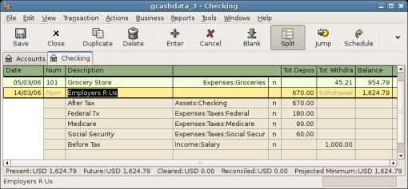

   Entering a split transaction

.. _txns-reconcile1:

Reconciliation
--------------

Once transactions have been entered into GnuCash, it is important to
verify that they agree with the records of your financial institution.
This verification process is known as **reconciliation**, and it is key
to determine whether your records are accurate. Most commonly, you will
check transactions against bank statements, although you can use this
process to verify any transaction.

GnuCash keeps track of the reconciliation status of each transaction.
The reconciliation status of a transaction is shown by the
reconciliation R field in a register: *y* indicates that a transaction
has been reconciled, *n* indicates that it has not, and *c* indicates
that it has been cleared, but not reconciled. A split marked cleared
signifies that you got some kind of confirmation that the institution
accepted the order (e.g. you have the restaurant's receipt for your
credit card purchase). You can toggle the reconciliation status between
*n* and *c* by clicking in the R field; you can set it to *y* by using
`Reconcile windows <#txns-reconcile-window2>`__.

At the bottom of the account window, there are (among others) two
running balances (the cleared and reconciled balance), and the total
balance. The former balances should correspond to how much money the
bank thinks you have in your account, while the latter includes
outstanding transactions.

For example, when you write a check for something, you should enter the
transaction into GnuCash. The reconciliation R field of the transaction
will initially contain n (new). Your new entry will contribute to the
total balance, but not to the cleared and reconciled balance. Later, if
you got some confirmation that the check has been cashed, you might
click on the transaction’s R field to change it to *c* (cleared). When
you do this, the cleared balance will change to include this amount.
When the bank statement arrives, you can then compare it to what you’ve
recorded in GnuCash by opening the reconciliation window. There, you
will be able to change the R field to *y* (reconciled).

.. note::

   You cannot reconcile directly in a register window by clicking in the
   *R* field. You must use the reconciliation window. Once a transaction
   has been marked *reconciled*, it can no longer be easily changed
   without breaking the `Starting Balance <#rec-start-blnc>`__ of the
   next reconciliation.

.. warning::

   It is important to understand that reconciliation is done for a given
   date, and when you reconcile an account based on a statement from a
   given date, you are reconciling **all transactions prior to that
   date**. Therefore, if you add or modify transactions that predate
   your last reconciliation, your **reconciled** balances will be thrown
   off.

.. _txns-reconcile-window2:

Reconcile windows
~~~~~~~~~~~~~~~~~

The reconciliation windows are used to reconcile a GnuCash account with
a statement that a bank or other institution has sent you.
Reconciliation is useful not only to double-check your records against
those of your bank, but also to get a better idea of outstanding
transactions, e.g. uncashed checks.

To use the reconciliation windows, select an account from the account
tree and click on Actions > Reconcile. A window like the one below will
appear in which you can enter the reconcile information.

|Reconcile Window|

In the initial reconcile window, some Reconcile Information need to be
entered.

Statement Date
   The date of the statement you will be reconciling against.

   .. tip::

      Click on the down arrow in the right of this field to open a
      calendar

Starting Balance
   This is a non-editable item which displays the balance from the
   previous reconciliation. It should match the starting balance in your
   statement.

   .. warning::

      Sometimes, the opening balance in GnuCash does not match that
      found on your statement. This can happen the first time you
      reconcile your account or when a previously-reconciled transaction
      is de-reconciled or deleted.

   .. note::

      The first time you reconcile your account, the starting balance
      will be 0.00, thus probably not the *opening balance* of your
      account. When you reconcile the account, the *opening balance* for
      the account will be included in the reconciliation, and the result
      should balance.

   .. tip::

      In the case when a previously-reconciled transaction is
      accidentally de-reconciled, you can simply re-reconcile the
      transaction along with the transactions on the current statement,
      and the result should balance.

      The case of accidentally deleting a previously-reconciled
      transaction presents more of a challenge; if you cannot determine
      what was deleted and restore it to the register, you will have to
      create a dummy transaction to get the reconciliation to finish.

   .. caution::

      While the latter case does not matter for your private accounting,
      you should have a really good explanation for your auditors, if
      you are the accountant of a club or a company.

Ending Balance
   This field should be filled with the ending balance as it appears in
   the statement.

   .. note::

      GnuCash automatically fills this field with the Present balance as
      shown in the lower part of the account’s register.

Include Sub-accounts
   Check this option if you want to include in the reconciliation the
   transactions that belongs to the sub-accounts of the currently
   selected account. Note that all sub-accounts must be in the same
   commodity as the parent for the option to be enabled.

Enter Interest Payment
   Clicking this button opens a new window that allow you to enter an
   interest transaction to the account to be reconciled.

   .. tip::

      The Interest Payment window might be opened automatically when you
      start a reconciliation for an account of the type *Bank*,
      *Credit*, *Mutual*, *Asset*, *Receivable*, *Payable*, and
      *Liability*. If you want to disable this behavior for any of the
      previous accounts, go to the Register tab of the GnuCash
      Preferences and uncheck the Automatic interest transfer option.
      Alternatively, to disable this behavior only for the selected
      account, press the No Auto Interest Payments for this Account
      button in the Interest Payment window.

Then, click on the Ok button, and you will see the transactions listing
reconcile window:

|Reconcile Window|

The two panes called Funds In and Funds Out, lists all the unreconciled
transactions that belongs to the account that is going to be reconciled.
The R columns show whether the transactions have been reconciled.

Now, examine each item on the bank statement, and look for the matching
item in the Reconcile window.

If you cannot find a transaction, then perhaps you forgot to enter it,
or did not know that the transaction had happened. You can use the New
button on the *Toolbar*, or the Transaction > New menu item in the menu,
to open a register window and enter the missing transaction. The new
item will appear in the Reconcile window when you press the Enter button
in the register after entering the transaction.

When you find the item in the Reconcile window, compare the amount in
the item to the amount on the statement. If they disagree, you may have
made an error when you entered the transaction in GnuCash. You can use
the Edit button on the *Toolbar*, or the Transaction > Edit item, to
open a register window and correct the transaction.

If the amounts agree, click on the item in the Reconcile window. A check
mark wil appear in the R column aside the selected transaction. GnuCash
will automatically update the amounts in the lower right summary pane.

.. tip::

   You can use the up/down arrow keys to scroll to the item, the space
   key to mark the item as reconciled and the Tab key to switch panes.

You then repeat this for each item that appears on the bank statement,
verifying that the amounts match with the amounts in GnuCash, and
marking off transactions in GnuCash as they are reconciled.

.. tip::

   You can check or uncheck the reconcile status of all transactions in
   either pane by clicking on a transaction in the required pane then
   clicking Ctrl-A followed by space. This will toggle the reconcile
   status of all transactions in the pane to either checked or unchecked
   state. This procedure can be repeated to achieve the desired status
   for the transactions in the pane.

At the bottom of the Reconcile window there is a Difference field, which
should show 0.00 when you are done reconciling. If it shows some other
value, then either you have missed transactions, or some amounts may be
incorrect in GnuCash. (Or, less likely, the bank may have made an
error.)

.. note::

   Under some circumstances, it may be difficult or impossible to
   determine why an account will not reconcile. If you are unable to
   correct the discrepancy between your books and a statement, GnuCash
   includes a Balance button on the *Toolbar* that will automatically
   create a balancing entry for you in the amount that cannot be
   reconciled.

   To use this, carry out the full reconciliation (marking all
   transactions that you can identify) and then click this button.
   GnuCash will create a balancing entry for the remaining discrepancy
   that uses the *Special Accounts:Orphan-XXX* account (where "XXX"
   represents your currency). The Reconcile window will close;
   re-opening it will allow you to check the newly-created balancing
   entry and finish the process.

When you have marked off all the items on the bank statement and the
difference is 0.00, press the Finish button on the *Toolbar* or select
Reconcile > Finish from the menu. The Reconcile window will close. In
the register window, the R field of the reconciled transactions will
change to *y*.

In this case, we have not received all the information yet, so we simply
press the Postpone button, so we can continue at a later stage. Observe
that the R column indicates we cleared (*c*) two transactions. They have
not been reconciled yet, but we have verified these two transactions so
they have been marked as cleared. If you look at the *Statusbar* at the
bottom of the account register, you will see a summary of what has been
reconciled and what has been cleared (Cleared:USD 954.79 Reconciled:USD
0.00)

|Checking account|

.. _txns-sxn1:

Scheduled Transactions
----------------------

Scheduled transactions are made to help entering repetitive money
operations, like subscriptions, insurances or taxes. By using scheduled
transactions, you only have to enter the concerned transaction once, set
a few parameters like start date, frequency and a little description,
and then GnuCash will tell you whenever a scheduled transaction is ready
to be created, and create it for you.

In this howto, we’ll take a monthly Internet subscription of 20 USD as
example, which is taken on the 28th of each month.

In GnuCash, there are two ways of creating scheduled transactions, `from
the ledger <#txns-sxn-ledger2>`__ or from the `Scheduled Transactions
Editor <#txns-sxn-editor2>`__.

.. _txns-sxn-ledger2:

Creating from the Ledger
~~~~~~~~~~~~~~~~~~~~~~~~

Enter the first occurrence of your to-schedule transaction in the
ledger. In the Transfer field for this transaction, type
*Expenses:Internet* as shown in the next screenshot.

|Step one creating scheduled transaction from the ledger|

.. note::

   Since we did not create the *Expenses:Internet* account, GnuCash will
   prompt us to create it.

Then you right click on your transaction and select Schedule...

|Step two creating scheduled transaction from the ledger|

A window like this will appear:

|Step three creating scheduled transaction from the ledger|

Let’s fill the values, we know that the subscription is taken on the
28th each month, and the next one is for next month (since we entered
the one for this month manually) :

|Filling in data to a scheduled transaction|

Click the OK button, and the transaction will be scheduled. GnuCash now
has memorized this scheduled transaction and on the 28th of next month,
it will pop up a window asking if it should create it (see far below for
a screenshot of this window).

.. _txns-sxn-editor2:

Creating from the Editor
~~~~~~~~~~~~~~~~~~~~~~~~

Another way of entering a scheduled transaction is from the Scheduled
Transaction Editor, it may be faster if we have several scheduled
transactions to create at once.

From the main accounts windows, select Actions > Scheduled Transactions
> Scheduled Transaction Editor from the *Menubar*. A new Scheduled
Transactions tab will be opened in the current GnuCash window as shown
above:

|Empty Scheduled Transactions tab|

This tab contains a list, now empty, of all the scheduled transactions.
Let’s create a new one by clicking on the New button in the *Toolbar*. A
window like the one below will pop up:

|Edit Scheduled Transaction window, Overview tab|

First, let’s enter a name for this new scheduled transaction in the top
of the window.

.. note::

   This name will only identify the transaction in the Edit Scheduled
   Transaction window, it will never appear in the ledger.

In the Options pane of the Overview tab you have four options:

Enable
   Sets the status of the scheduled transaction.

Create automatically
   If enabled, will insert this transaction in the ledger without asking
   you before (see below). If needed, you can be advised when the
   transaction is entered by checking the Notify me when created option.

Create in advance
   Sets how many days in advance the transaction will be created.

Remind in advance
   Sets how many days in advance a reminder is presented. This can be
   used, for example, when you have to pay something by check, and a
   reminder one week before allows you to send your check before the
   deadline.

The Occurences pane allows you to tell GnuCash that this scheduled
transaction won’t last for ever. For example if you are repaying a loan,
you can enter the loan end date or the number of occurences left.

Select now the Frequency tab in the Edit Scheduled Transaction window.
Here you can set the time-related options of the transaction.

|Edit Scheduled Transaction window, Frequency tab|

Frequency
   Sets the basic frequency of the transaction, with options for once,
   daily, weekly, semi-monthly and monthly. In this example, this is set
   to monthly.

   .. note::

      It is possible to set a transaction to occur at intervals *other*
      than those listed in the Frequency list, by changing the setting
      in the Every control (see below).

Start Date
   Sets when the transaction will begin. In the example, this would be
   set to the start of the next month.

Every
   This option allows you to schedule transactions by multiplies of the
   value in Frequency. For example, to create a transaction that runs
   every 3 weeks, set Frequency to Weeks and Every to 3.

On the and Except on weekends
   Sets the day of the month that the transaction is scheduled, and
   controls what GnuCash will do when the day occurs on a weekend day.

.. note::

   We know that the subscription is taken on the 28th each month, so the
   Start date will be November 1, 2003 (assuming November is the next
   month), the Frequency will be Monthly, it will be taken every month
   on the 28th. Since in our example the internet subscription is
   automatically taken from the account, we have no need to create it in
   advance, nor give an end date.

When the elements on this tab are filled in, GnuCash will highlights the
calendar below to indicate when future transactions will be run.

Finally select the Template Transaction tab and enter your transaction
in the lower part as you would do in the ledger, with the only
difference of having no date.

Now, you should have a window like this:

|Edit Scheduled Transaction window, Template Transaction tab|

Remember to click on the Enter icon, to validate and enter the
transaction.

Now click OK, it takes you to the Scheduled Transactions tab, now
showing one item in the Transactions list:

|Entered scheduled transaction|

.. tip::

   If you click in the calendar part on the first day of one month, a
   small window, following your mouse, will show you what is planned for
   this day. To make the small window disappear again, just click in it
   one more time.

You can now close the Scheduled Transaction tab, and save your work.

.. note::

   What comes below is just an illustration, and is not meant to be
   entered into the GnuCash database at this stage. As per this example,
   the below dialogs will appear when the scheduled transaction is
   supposed to run.

From now on, when GnuCash is launched and a scheduled transaction is
scheduled or need to be entered, you may see a Since Last Run... window
summarizing the scheduled transactions operations (Reminder, To-Create
etc... a better description of each option can be found in the GnuCash
manual):

|Scheduled transaction popup reminder|

You can click on the Status column to change the scheduled transaction
status if needed. Then just click on Ok to close the Since Last Run...
window and to apply the pending operations. Select Cancel to skip
entering in the ledger the pending operations.

If the Status field was set to To-Create, then if you take a look in
your bank account register, you’ll see the transaction has been created:

.. tip::

   If you enable the Review created transactions option in the lower
   right of the Since Last Run... window, GnuCash will open, after
   pressing Ok, the register tab of each account where the scheduled
   transactions were entered automatically.

.. note::

   If you entered the transaction for 28 of April at this stage, then
   please *revert back* to the last saved GnuCash file by selecting File
   > Open and choosing the previously saved ``gcashdata_3`` GnuCash
   file.

.. _txns-puttoget1:

Putting It All Together
-----------------------

In the previous sections of this chapter the concepts and mechanics of
working with transactions in GnuCash have been discussed. This section
will expand upon the chart of accounts initially built in the previous
chapter, by setting some opening balances, adding transactions and a
scheduled transaction.

.. _txns-puttoget-openfile:

Open GnuCash file
~~~~~~~~~~~~~~~~~

Start with opening the previous datafile we stored,
``gcashdata_3emptyAccts``, and store it as ``gcashdata_4`` directly. The
main window should look something like this:

|Starting point for Putting It All Together|

.. _txns-puttoget-open2:

Opening Balances
~~~~~~~~~~~~~~~~

As shown earlier in `Simple Transaction
Example <#txns-registers-twoaccount2>`__ with the *Assets:Checking*
account, the starting balances in an account are typically assigned to a
special account called *Equity:Opening Balance*. To start filling in
this chart of account, begin by setting the starting balances for the
accounts. Assume that there is $1000 in the savings account and $500
charged on the credit card.

1. Open the *Assets:Savings* account register. Select View from the menu
   and check to make sure you are in Basic Ledger style. You will view
   your transactions in the other modes later, but for now let’s enter a
   basic transaction using the basic default style.

2. From the *Assets:Savings* account register window, enter a basic 2
   account transaction to set your starting balance to $1000,
   transferred from *Equity:Opening Balance*. Remember, basic
   transactions transfer money from a source account to a destination
   account. Record the transaction (press the Enter key, or click on the
   Enter icon).

3. From the *Assets:Checking* account register window, enter a basic 2
   account transaction to set your starting balance to $1000,
   transferred from *Equity:Opening Balance*.

4. From the *Liabilities:Visa* account register window, enter a basic 2
   account transaction to set your starting balance to $500, transferred
   from *Equity:Opening Balance*. This is done by entering the $500 as a
   charge in the *Visa* account (or decrease in the *Opening Balance*
   account), since it is money you borrowed. Record the transaction
   (press the Enter key, or click on the Enter icon).

You should now have 3 accounts with opening balances set.
*Assets:Checking*, *Assets:Savings*, and *Liabilities:Visa*.

|Chart accounts after setting opening balance|

.. _txns-puttoget-add2:

Additional Transaction Examples
~~~~~~~~~~~~~~~~~~~~~~~~~~~~~~~

Now add some more transactions to simulate a month’s expenses. During
the month, $78 is spent on electricity, $45 on phone, and $350 on rent.
All paid by check. We also spent $45.21 on groceries, received $670 as
salary, and paid our Internet bill this month. Finally, let’s move $100
from the savings account to the checking account.

1. Open the *Expenses:Electricity* account register and enter a simple 2
   account transaction to pay the $78 electrical bill at the end of the
   current month (eg: March 28, 2006). Enter a description (eg: Light
   Company) and the check number (eg: 102). The Transfer account should
   be *Assets:Checking*.

2. Open the *Assets:Checking* account register and enter a simple 2
   account transaction to pay the $45 phone bill at the end of the
   current month (eg: March 28, 2006). Enter a description (eg: Phone
   Company Name) and the check number (eg: 103). The Transfer account
   should be *Expenses:Phone*. Notice that you can enter expense
   transactions from either the credit side (the expense accounts) or
   the debit side (the asset account).

3. Open the *Expenses:Rent* account register and enter a simple 2
   account transaction to pay the $350 in rent at the end of the current
   month (eg: March 28, 2006). Enter a description (eg: April Rent) and
   the check number (eg: 104). The Transfer account should be
   *Assets:Checking*.

4. Duplicate this transaction using the Duplicate button in the
   *Toolbar*. Start by clicking on the current rent transaction, and
   click on the Duplicate icon. Enter the transaction date a month out
   in the future (eg: April 28, 2006), and notice the blue line
   separator that GnuCash uses to separate future transactions from
   current ones. In this way, you can enter transactions before they
   occur.

   You could also set up a scheduled transaction to pay your rent, since
   the value of the rent is likely to be constant for the foreseeable
   future.

   -  Start by clicking on the current (April 28) rent transaction, and
      click on the Schedule icon

   -  Change to Monthly, change description if needed and press OK

5. To transfer money from your savings account to your checking account,
   open the *Assets:Savings* account register, add a new transaction
   setting the Transfer to *Assets:Checking* in the amount of $100 (date
   6 March, 2006).

6. As another example of a simple 2 account transaction, add another
   transaction to describe the purchase of $45.21 worth of groceries on
   5 of March. From within the *Assets:Checking* account, you would set
   Transfer to *Expenses:Groceries*. The account register should now
   appear:

7. To add a paycheck transaction from the *Assets:Checking* account
   register window, click on a new transaction line, and click on Split.
   First enter the description of this transaction on the first line
   (eg: “Employers R Us”), as well as the date (14 March). In the
   “split” line below this, enter the deposit into *Assets:Checking*
   (eg:$670). Follow this with the various tax deposits
   (*Assets:Checking* (eg: $670), *Expenses:Taxes:Federal* account (eg:
   $180), *Expenses:Taxes:Medicare* account (eg: $90), and
   *Expenses:Taxes:Social Security* account (eg: $60)) and lastly the
   gross total of your paycheck (eg: $1000) as a withdrawal transfer
   from *Income:Salary*.

8. You also need to pay for your Internet subscription of 20 USD on the
   28th.

|Chart accounts after setting all the various transactions|

.. _txns-puttoget-save:

Save file
~~~~~~~~~

Before we go to the report section, let’s save the GnuCash data file
(``gcashdata_4``).

.. _txns-puttoget-reports:

Reports
~~~~~~~

But only having data available on the computer screen will not make your
accountant happy, therefore GnuCash comes with a large number of highly
customizable reports.

Let’s have a look at a Cash Flow, and a Transaction Report.

1. First let’s have a look at the Cash Flow report for the month of
   March.

   Select the cash flow report from Reports > Income & Expense > Cash
   Flow.

   |Cash Flow report for the month of March|

   To get this customized report, right click in the report and choose
   Report Options. Then set the time period, and specify which accounts
   you want in the report.

2. Now let’s have a look at corresponding transaction report for the
   Checking account.

   Select the transaction report from Reports > Transaction Report.

   |Transaction Report for the Checking account during March|

3. Now let’s change the transaction report to only show the various
   Expenses accounts.

   |Transaction Report for the Expenses accounts during March|

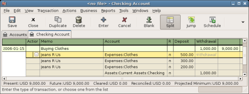
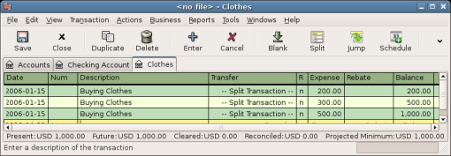
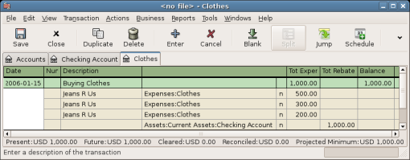
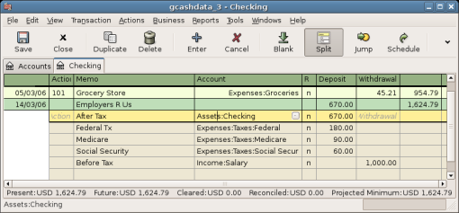
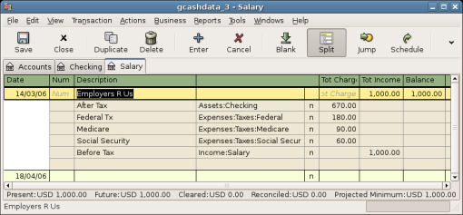
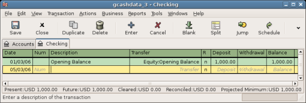
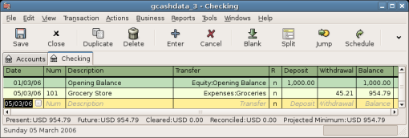
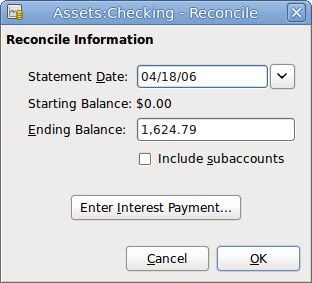
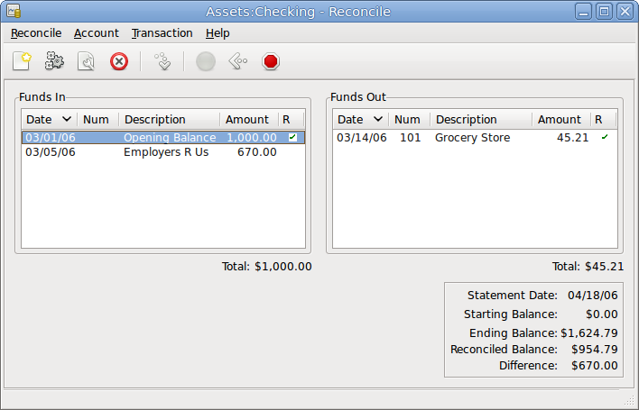
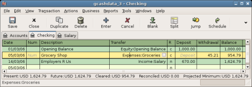
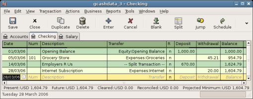
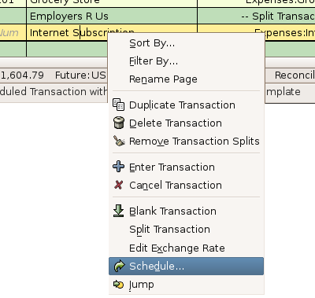
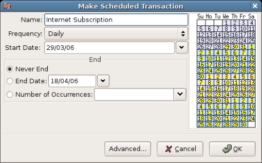
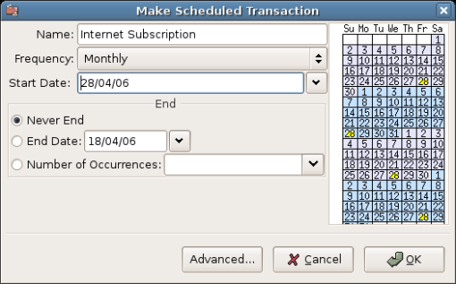
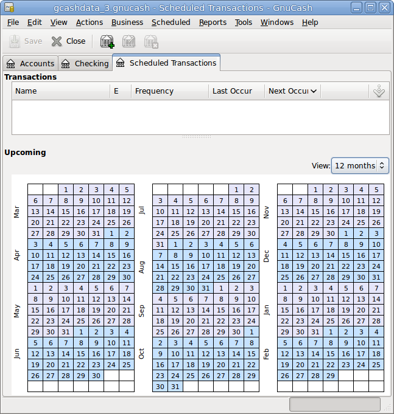
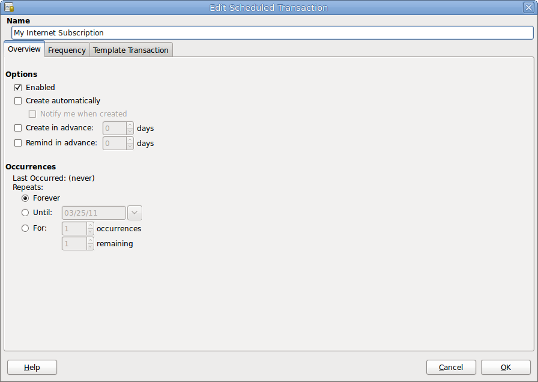
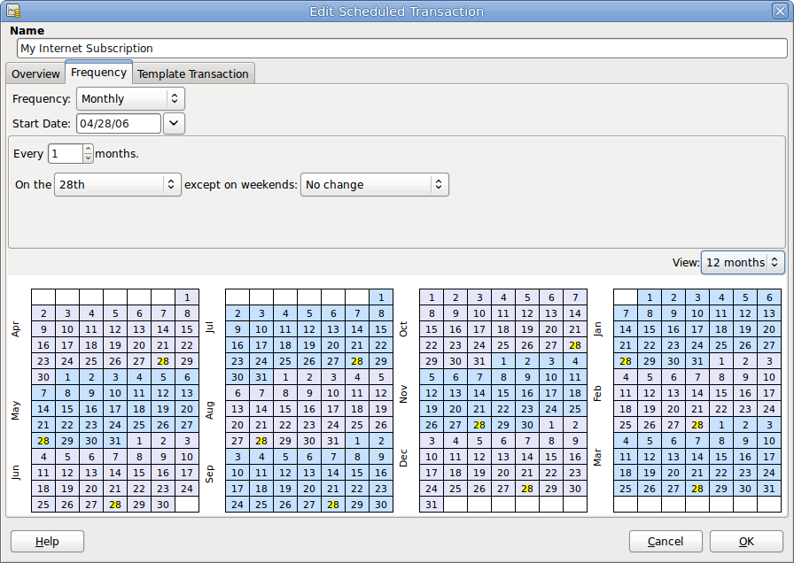
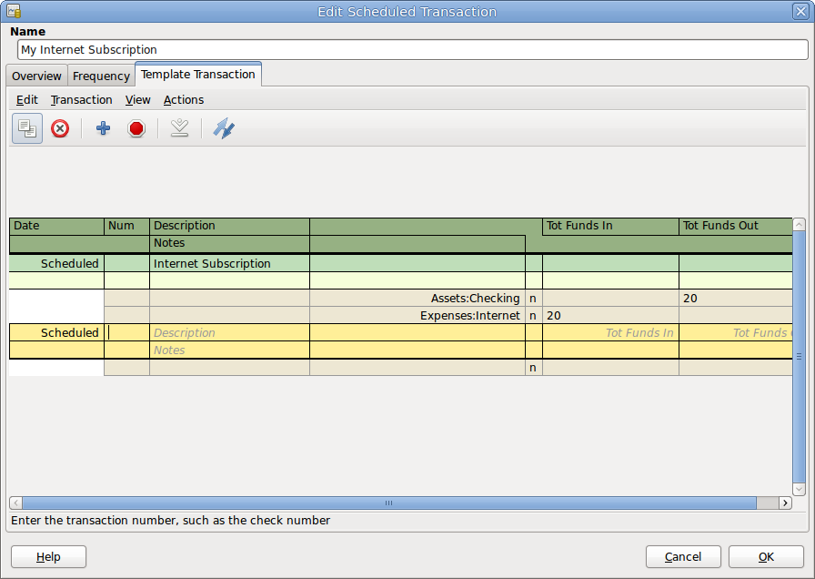
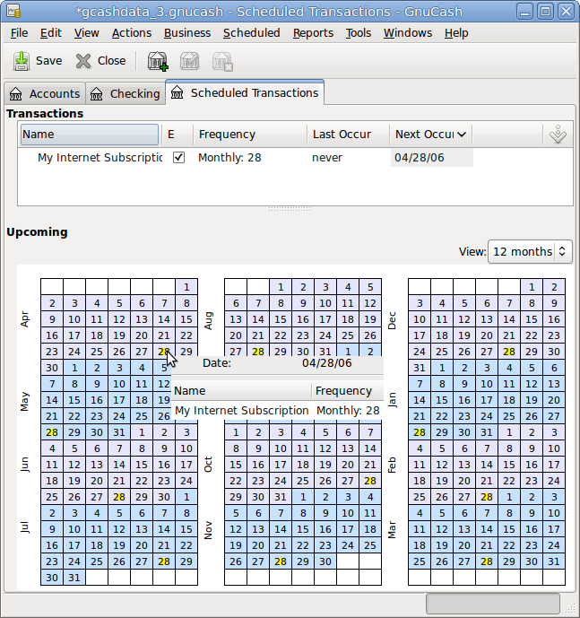
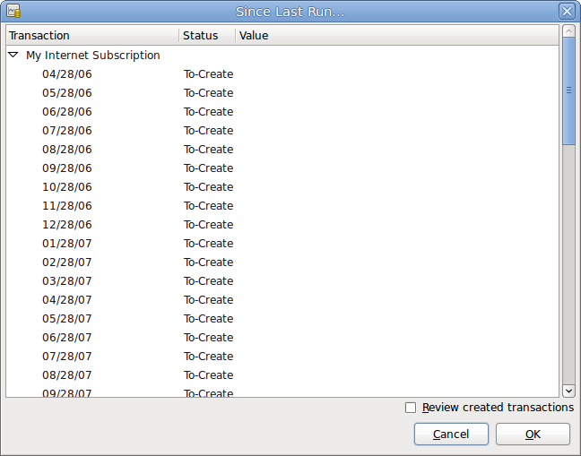
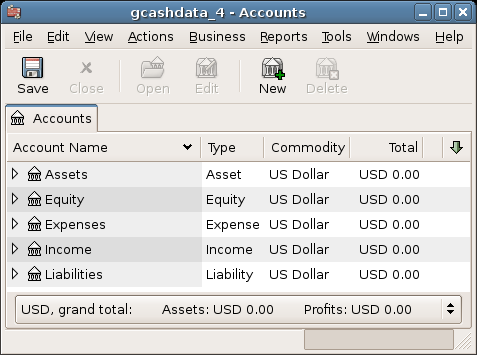
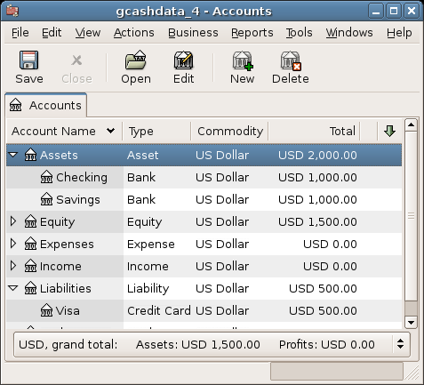
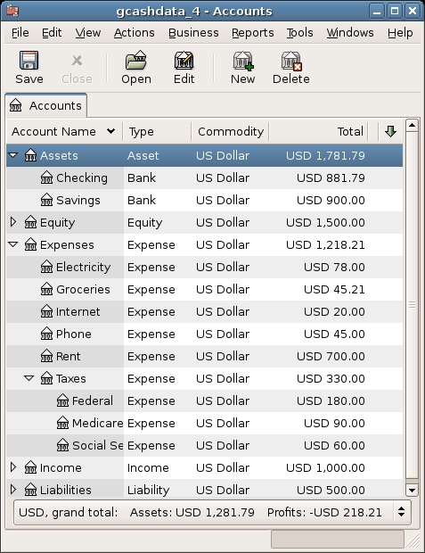
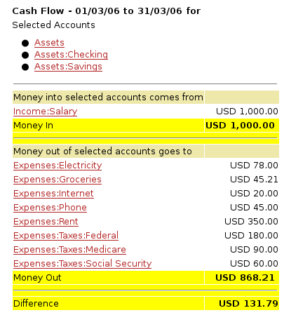
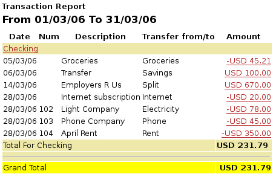
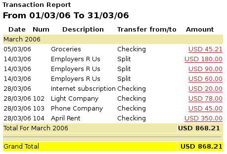
