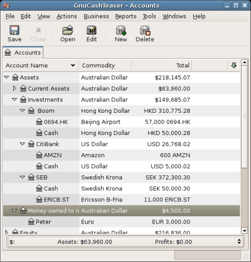

GnuCash Tutorial and Concepts Guide
===================================

.. warning:: This version of the Guide on ReadTheDocs.org is
   an unofficial work in progress. Please go to https://www.gnucash.org/viewdoc.phtml?rev=3&lang=C&doc=guide
   for the official documentation.

.. _chapter_oview:

GnuCash is the personal finance software package made for you. It is
versatile enough to keep track of all your financial information, from
the simple to the very complex. It is one of the few financial software
packages that supports global currencies, and it is the only open-source
program of its kind. Best of all, GnuCash is easy to learn and use!

So, what can GnuCash do for you? It can keep track of your personal
finances in as much detail as you prefer. If you are just starting out,
use GnuCash to keep track of your checkbook. You may then decide to
track cash as well as credit card purchases to better determine where
your money is being spent. When you start investing, you can use GnuCash
to help monitor your portfolio. Buying a vehicle or a home? GnuCash will
help you plan the investment and track loan payments. If your financial
records span the globe, GnuCash provides all the multiple-currency
support you need.

|GnuCash Chart of Accounts - Teaser|

While GnuCash is well suited for personal finances, it is also powerful
enough for business use. There are many business features, from
integrated accounts receivable and payable systems, to tax table
construction. You will find these and the many other business features
surprisingly powerful and easy to use.

.. _oview-features1:

Features
--------

.. _oview-featureseasy2:

Easy to Use
~~~~~~~~~~~

Within a matter of minutes you will be able to enter your personal
finance information and generate color graphs that represent your
financial status. If you can use the register in the back of your
checkbook - you can use GnuCash! Type directly into the register, tab
between fields, and use quick-fill to automatically complete
transactions. The interface is customizable from within the application
itself.

-  *Easy to Use Menus*: GnuCash menus conform to the GNOME Human
   Interface Guidelines. This means that they are simple and similar in
   appearance to many other GNOME applications.

-  *Documentation*: GnuCash has built-in Help and extensive User’s Guide
   documentation.

-  *Import Methods*: GnuCash supports many ways to input transactions
   besides manual entry. If you can access your bank accounts on-line,
   this is especially useful, as most banks and credit card companies
   support one of the following import methods. You will spend less time
   entering data and more time analyzing results.

   -  *Quicken Import File (QIF)*: Import Quicken QIF style files, a
      popular file format with many commercial personal finance software
      packages.

   -  *Open Financial Exchange (OFX)*: GnuCash has been the first free
      software application to support the Open Financial Exchange
      protocol. Many financial institutions are moving towards this
      format.

   -  *Home Banking Computer Interface (HBCI)*: GnuCash has been the
      first free software application to support the German Home Banking
      Computer Interface protocol. This protocol includes statement
      download, initiates bank transfers, and makes direct debits
      possible.

-  *Reports*: GnuCash comes with over 30 prebuilt reports, including
   Account Summary, Income, Expenses, Transaction Report, Balance Sheet,
   Profit&Loss, Portfolio Valuation, and many others. Reports support
   graphical views of the data, including pie charts, bar charts, and
   scatter plots. The reports can be exported to HTML files, and are
   easily customized.

-  *Scheduled Transactions*: GnuCash now has the ability to
   automatically create and enter transactions, or remind you when these
   transactions are due, giving you the choice of entering, postponing
   or removing the automated transaction.

-  *Mortgage and Loan Repayment Assistant*: Used to set up a variable
   payment loan scheduled transaction.

-  *Easy Account Reconciliation*: Integrated reconciliation makes
   reconciling your GnuCash accounts with statements simple and
   effective.

-  *Multi-platform Compatibility*: GnuCash is supported on a variety of
   platforms and operating systems. The list of fully supported
   operating systems (and platforms) is for

   GnuCash 3.10
      GNU/Linux (x86, x86_64), FreeBSD (x86, x86_64), OpenBSD (x86,
      x86_64), Apple MacOS (64-bit Intel), and Microsoft Windows
      (Windows 7 and later).

   GnuCash ≤ 2.6.21
      Apple MacOS (32-bit Intel, PPC) and Microsoft Windows (XP and
      Vista).

   GnuCash ≤ 2.2.9
      Microsoft Windows (2000).

   Previous versions of GnuCash
      have been known to work with SGI IRIX (MIPS), IBM AIX 4.1.5
      (RS/6000), Unixware 7 (Intel), SCO OpenServer 5.0.4 (Intel), and
      Solaris (Sparc) but their current status is unknown.

.. _oview-featuresinvest2:

Tracks Your Investments
~~~~~~~~~~~~~~~~~~~~~~~

GnuCash includes a number of investment features that allow you to track
all your investments. With GnuCash you can track stocks individually
(one per account) or in a portfolio of accounts (a group of accounts
that can be displayed together).

GnuCash supports online stock and mutual fund quotes. This means you no
longer need to look up stock prices one at a time. The process can be
automated, and you can see the latest value of your stocks.

.. _oview-featuresintl2:

International Support
~~~~~~~~~~~~~~~~~~~~~

GnuCash is truly an application that works with and understands users
from all around the world. There are many built-in features to
facilitate interaction with the international world we live in today.

-  *Native Languages*: GnuCash has been translated into 56 languages.
   The best ones, with over 90% translated, are Croatian, German,
   Hebrew, Portuguese, Spanish, and Ukrainian. Almost as good, with over
   80% translated, are Catalan, Dutch, Japanese, Latvian, Russian,
   Serbian, and Turkish.  [1]_

-  *International Format Handling*: GnuCash understands that different
   countries display the date and numbers differently. You are able to
   work with the date and number formats you are accustomed to.

-  *Multiple Currencies and Currency Trading*: Multiple currencies are
   supported and can be bought and sold (traded). Currency movements
   between accounts remain fully balanced if "Trading Accounts" is
   enabled.

-  *On-line exchange rates*: With GnuCash, you no longer need look up
   your exchange rates one at a time. The process can be automated, to
   always present you with the account values converted to your
   preferred currency using the latest exchange rates.

.. _oview-featuresbus2:

Business Support
~~~~~~~~~~~~~~~~

GnuCash has many features to support the needs of the business
accounting community.

-  *Accounts Receivable/Payable*: GnuCash has an integrated Accounts
   Receivable and Accounts Payable system. You can track Customers,
   Vendors, Invoicing and Bill Payment, and use different Tax and
   Billing Terms in a small business.

-  *Depreciation*: GnuCash can track depreciation of capital assets.

-  *Reports*: GnuCash offers a wide variety of ready-to-use business
   reports.

.. _oview-featuresaccounting2:

Accounting Features
~~~~~~~~~~~~~~~~~~~

For those knowledgeable in accounting, here is a list of GnuCash’s
accounting features.

-  *Double Entry*: Every transaction must debit one account and credit
   others by an equal amount. This ensures the “books balance” - that
   the difference between income and expense exactly equals the sum of
   all bank, cash, stock and other assets.

-  *Split Transactions*: A single transaction can be split into several
   pieces to record taxes, fees, and other compound entries.

-  *Chart of Accounts*: A master account can have a hierarchy of detail
   accounts underneath it. This allows similar account types such as
   Cash, Bank, or Stock to be grouped into a master account such as
   “Assets”.

-  *General Journal*: One register window can display multiple accounts
   at the same time. This eases the trouble of tracking down
   typing/entry errors. It also provides a convenient way of viewing a
   portfolio of many stocks, by showing all transactions in that
   portfolio.

-  *Income/Expense Account Types (Categories)*: These categorize your
   cash flow and, when used properly with the double-entry feature, will
   provide an accurate Profit&Loss statement.

.. _oview-about1:

About this Book
---------------

This manual’s goal is to save you time. It will get you started using
GnuCash as quickly as possible.

Each chapter follows a simple format. A chapter begins with a “Concepts”
discussion which introduces general themes and terminology, addressed
and used within that chapter. “How-To” sections, which address specific
procedures follow. Finally, a “Putting It All Together” section ends the
chapter by giving detailed, concrete examples.

Beginning users will find the “Concepts” sections very helpful. They
provide a reference for good ways to track your finances, and serve as a
general introduction to financial background and terminology.
Experienced users can flip to the “How-To” sections to quickly scan
procedures. These sections provide to-the-point steps for accomplishing
specific tasks. The “Putting It All Together” sections present
real-world examples in the form of a tutorial. Beginning with creation
of a file in :ref:`chapter_basics`, each successive chapter builds
on the previous chapter’s tutorial.

This manual is organized into 3 main parts:

-  *Getting Started*

.. toctree::
   :maxdepth: 2
   :caption: Getting Started
   :hidden:

   guide/C/ch_basics.rst
   guide/C/ch_accts.rst
   guide/C/ch_txns.rst
   guide/C/ch_importing.rst
   guide/C/ch_configuring.rst

-  *Managing Personal Finances*

.. toctree::
   :maxdepth: 2
   :caption: Managing Personal Finances
   :hidden:

   guide/C/ch_cbook.rst
   guide/C/ch_expenses.rst
   guide/C/ch_cc.rst
   guide/C/ch_loans.rst
   guide/C/ch_invest.rst
   guide/C/ch_reports.rst
   guide/C/ch_capgain.rst
   guide/C/ch_currency.rst

-  *Managing Business Finances*

.. toctree::
   :maxdepth: 2
   :caption: Managing Business Finances
   :hidden:

   guide/C/ch_bus_features.rst
   guide/C/ch_budgets.rst
   guide/C/ch_oth_assets.rst
   guide/C/ch_dep.rst
   guide/C/ch_python_bindings.rst
   guide/C/ch_import_business_data.rst

.. toctree::
   :maxdepth: 1
   :caption: Appendicies
   :hidden:

   guide/C/gnc-glossary.rst
   guide/C/appendixa.rst
   guide/C/appendixb.rst
   guide/C/appendixc.rst
   guide/C/appendixd.rst
   guide/C/fdl-appendix.rst

*Getting Started* provides you with the most basic information needed to
begin using GnuCash. The chapters in this section explain concepts that
are fundamental to using GnuCash. New users of GnuCash should
familiarize themselves with the information in these chapters to get you
up and running:

-  `Overview <#chapter_oview>`__ - (this chapter) gives a general
   overview of GnuCash

-  :ref:`chapter_basics` - gives users a very brief introduction to
   accounting principles, and then provides information about how
   GnuCash structures its data. There is also information on basic
   interface elements in GnuCash. Finally, this chapter explains how
   GnuCash stores and manages your data.

-  :ref:`chapter_accts` - gives further information about accounts
   and how to organize them.

-  :ref:`chapter_txns` - gives basic information about transactions
   and how to enter them.

*Managing Personal Finances* addresses common applications and features
of GnuCash in greater detail. You will see more specific cases, based on
frequently asked questions about applying GnuCash to everyday
situations. Here are the applications and features covered in this part:

-  :ref:`chapter_cbook`

-  :ref:`chapter_cc`

-  :ref:`chapter_loans`

-  :ref:`chapter_invest`

-  :ref:`chapter_capgain`

-  :ref:`chapter_currency`

*Managing Business Finances* discusses the use of GnuCash in business
accounting:

-  :ref:`chapter_bus_features`

-  :ref:`chapter_budgets`

-  :ref:`chapter_other_assets`

-  :ref:`chapter_dep`

-  :ref:`ch_python_bindings`

-  :ref:`ch_import_bus_data`

This manual also includes several appendices, which contains extra
information you might want to know:

-  :ref:`gnc-gloss` - Glossary of terms used in GnuCash

-  :ref:`appendixa` - Guide for former Quicken, MS Money or other
   QIF users

-  :ref:`appendixb`

-  :ref:`appendixc`

-  :ref:`appendixd`

-  :ref:`fdl`

Last, but not least, a glossary and index help you quickly locate
topics.

.. _more_help:

Getting More Help
-----------------

GnuCash offers help in many ways, including the `Tip of the
Day <#basics-tip2>`__, context help, a website, a wiki, the mailing
lists, and IRC chat.

.. _online_help:

Context Help
~~~~~~~~~~~~

The context help provides detailed instructions for using GnuCash's
menus, windows, and controls. To open online help, select Help >
Contents.

The GnuCash Help window also acts as a simple web browser, so you can
pull up a website for additional information. You can open any website
under this window by clicking the Open *Toolbar* button and then typing
in the URL. Use the Back, Forward, Reload, Stop, and Print buttons as
you would in a standard browser.

.. _website:

GnuCash Website
~~~~~~~~~~~~~~~

The `GnuCash <http://www.gnucash.org>`__ website contains helpful
information about the program and about any updates to it. It also
contains links to other online resources.

.. _wiki:

GnuCash Wiki
~~~~~~~~~~~~

An immense amount of less-formal documenation, both of GnuCash itself
and its maintenance and development may be found in the `GnuCash
Wiki <https://wiki.gnucash.org/wiki>`__; the `Frequently Asked
Questions <https://wiki.gnucash.org/wiki/FAQ>`__ page should be a first
stop whenever you encounter difficulty using GnuCash.

.. _on-line-assistance:

GnuCash On-line Assistance
~~~~~~~~~~~~~~~~~~~~~~~~~~

**Mailing List**

The primary source of user support is the `user mailing
list <mailto:gnucash-user@gnucash.org>`__. If you prefer a web
forum-like presentation, you can use it via
`Nabble <http://gnucash.1415818.n4.nabble.com/GnuCash-User-f1415819.html>`__.
One must
`subscribe <https://lists.gnucash.org/mailman/listinfo/gnucash-user>`__
before posting, even if using Nabble.

**IRC**

Several of the developers monitor the #gnucash channel at irc.gnome.org.
They're usually doing something else, too, and of course aren't always
at their computers. Log in, ask your question, and stay logged in; it
may be several hours before your question is noticed and responded to.
To see if you missed anything `check the IRC
logs <https://code.gnucash.org/logs>`__.

The `GnuCash website <http://www.gnucash.org>`__ has more details on
these channels. You will also find pointers there to additional useful
resources such as the GnuCash wiki and bug tracking system.

Topic Search
~~~~~~~~~~~~

The online manual also provides a search function. To search for a
particular topic, click the Search tab at the bottom of the help window
and type in your topic in the field provided. Click the Search button to
complete your search. A list of choices should appear in the box below,
clicking a choice will bring up its text on the right.

.. _oview-install1:

Installation
------------

Installation of GnuCash is usually simple.

The `GnuCash download page <http://www.gnucash.org/download.phtml>`__
contains detailed instructions on how to install GnuCash for each
operating system supported.

.. [1]
   If you want to create or improve the translation of your language see
   ` <https://wiki.gnucash.org/wiki/Translation>`__.

